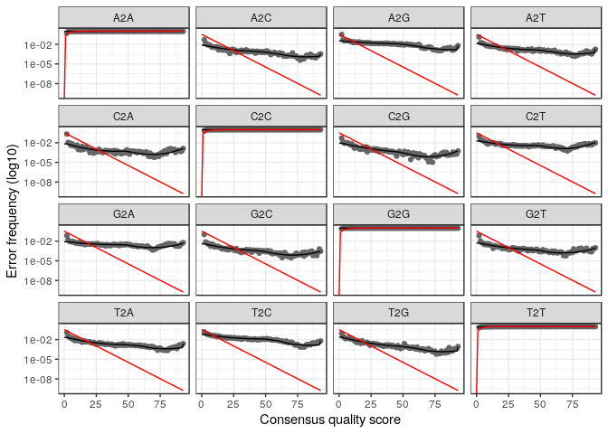
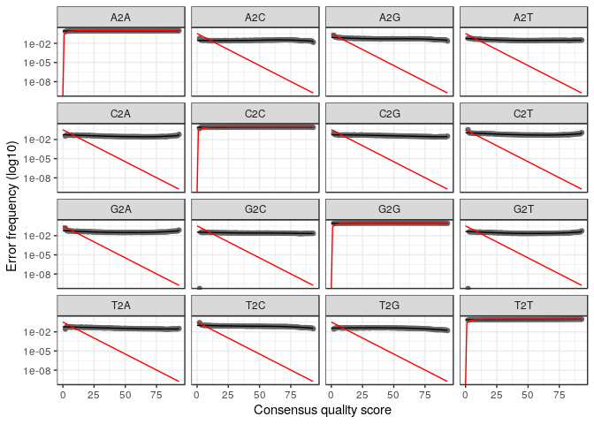

<!-- README.md is generated from README.Rmd. Please edit that file -->

# tzara

<!-- badges: start -->

[](https://github.com/brendanf/tzara/actions)
[](https://codecov.io/gh/brendanf/tzara?branch=master)
<!-- badges: end -->

To reduce computational complexity,
[dada2](https://benjjneb.github.io/dada2/index.html) only uses
non-singletons as seeds for denoising. For this strategy to work, each
true sequence must be represented by at least two identical reads.
Especially with long amplicons, the probability of two reads having
exactly the same errors is much lower than the probability of being
error-free, so in practice this means that each true sequence must have
two error-free reads. This becomes problematic for rare sequences in
long amplicon libraries.

Tzara (named after [Tristan
Tzara](https://en.wikipedia.org/wiki/Tristan_Tzara), a central figure in
the Dada art movement, who described the [“cut-up”
technique](https://en.wikipedia.org/wiki/Cut-up_technique) for poetry)
implements an alternative method for dealing with long reads: - Cut
reads of the targeted region into smaller domains using hidden Markov
models (via [Hmmer](https://hmmer.org)) or covariance models (via
[Infernal](http://eddylab.org/infernal/)) - Use dada2 to separately
denoise each sub-region/domain - Concatenate denoised sequences for the
different domains which originated in the same read to get denoised
sequences for the full read

There are also methods for deeper chimera checking and attempting to
preserve information from reads which dada2 was unable to successfully
map to a read.

## Installation

`tzara` is yet available from CRAN or Bioconductor, but you can install
the latest github version using:

``` r
remotes::install_github("brendanf/tzara")
```

## Example

For the example, we will conduct all analysis in a temporary directory.
In your own analysis, use your own project directory.

``` r
root_dir <- "temp"
```

### Example data

`dada2`, and thus `tzara`, use statistical methods which require many
sequences for meaningful results. This typically means that an analysis
with realistic diversity takes several hours to run. For this example,
we will use simulated data with only six true unique sequences and two
samples with 1000 reads each.

If you are using this document as a template for your own analysis, you
can skip this section; start with your own demultiplexed sequences, with
primers and adapters removed.

There are three sample sequences, belonging to three diferent genera.

``` r
library(tzara)
tzara_sample
#>   A DNAStringSet instance of length 3
#>     width seq                                               names               
#> [1]  1444 GGAAGGATCATTACCGAGTGAGG...ACCATCTAGTAGCTGGTTCCTGC Penicillium
#> [2]  1638 GGAAGGATCATTATTGAATTATG...ACCATCTAGTAGCTGGTTCCTGC Agaricus
#> [3]  1540 GGAAGGATCATTATCGAAACAGC...ACCATCTAGTAGCTGGCTCCTGC Inocybe
```

To verify our ability to find variants that differ by only one base pair
in ITS2, we will create a hypothetical variant of each sequence by
changing one of the bases in ITS2.

First, mark the original sequences with an “`A`”

``` r
originals <- tzara_sample
names(originals) <- paste0(names(originals), "A")
originals
#>   A DNAStringSet instance of length 3
#>     width seq                                               names               
#> [1]  1444 GGAAGGATCATTACCGAGTGAGG...ACCATCTAGTAGCTGGTTCCTGC PenicilliumA
#> [2]  1638 GGAAGGATCATTATTGAATTATG...ACCATCTAGTAGCTGGTTCCTGC AgaricusA
#> [3]  1540 GGAAGGATCATTATCGAAACAGC...ACCATCTAGTAGCTGGCTCCTGC InocybeA
```

Now make the variants; base 480 is in ITS2 of all three. After checking
the current base at that position (none of them are “`G`”), change it to
“`G`”.

``` r
variants <- tzara_sample
names(variants) <- paste0(names(variants), "B")
Biostrings::subseq(variants, 480, 480)
#>   A DNAStringSet instance of length 3
#>     width seq                                               names               
#> [1]     1 A                                                 PenicilliumB
#> [2]     1 C                                                 AgaricusB
#> [3]     1 T                                                 InocybeB
Biostrings::subseq(variants, 480, 480) <- "G"
Biostrings::subseq(variants, 480, 480)
#>   A DNAStringSet instance of length 3
#>     width seq                                               names               
#> [1]     1 G                                                 PenicilliumB
#> [2]     1 G                                                 AgaricusB
#> [3]     1 G                                                 InocybeB
```

We will now simulate some random sequencing errors for these reads,
using the distribution of quality scores from 1000 sequences from the
original data. Substitution errors for each simulated read are generated
with the probability implied by the quality score at each base. This is
the best possible situation for `dada2`, because the quality scores are
perfectly calibrated, and there are no PCR errors (which do not show up
in quality scores).

``` r
simulate_errors <- function(true_seq, qual_prof, prefix = NULL) {
   n <- length(true_seq)
   seq <- strsplit(as.character(true_seq), "")
   slen <- vapply(seq, length, 1L)
   # concatenate the whole thing as one character vector
   seq <- unlist(seq)
   # convert to numbers
   seq <- match(seq, c("A", "C", "G", "T")) - 1L
   
   # choose a quality profile for each sequence
   qual <- lapply(
       sample.int(nrow(qual_prof), length(slen), replace = TRUE),
       function(x) qual_prof[x,]
   )
   # choose quality scores for each base
   qual <- mapply(sample, size = slen, prob = qual,
                  MoreArgs = list(x = colnames(qual_prof), replace = TRUE))
   qual <- vapply(qual, paste, "", collapse = "")
   qual <- Biostrings::PhredQuality(qual)
   prob <- as(qual, "NumericList")
   prob <- unlist(as.list(prob))
   
   # determine which bases have substitution errors
   error <- which(rbinom(prob, size = 1, prob = prob) == 1)
   # randomly change the bases
   if (length(error) > 0) {
      seq[error] <- (seq[error] + sample(1:3, length(error), replace = TRUE)) %% 4
   }
   # convert back to bases
   seq <- c("A", "C", "G", "T")[seq + 1L]
   
   # Split back into individual sequence and scores 
   groups <- rep(seq_along(slen), times = slen)
   seq <- vapply(split(seq, groups), paste, "", collapse = "")
   names(seq) <- paste0(prefix, "read", seq_len(n))
   names(qual) <- names(seq)
   Biostrings::QualityScaledDNAStringSet(seq, qual)
}
```

We will have 900 of each original sequence, and 100 of its single-base
variant, for a total of 3000 sequences. They are divided randomly into
two samples of 1500 reads each.

``` r
reads <- c(rep(originals, c(900, 450, 225)), rep(variants, c(100, 50, 25)))
reads <- simulate_errors(reads, quality_profile, paste0(names(reads), "_"))
reads <- split(sample(reads), rep(paste0("Sample", 1:2), 875))
```

Save the reads into a “`demux`” directory, as though we had just
demultiplexed and trimmed them.

``` r
demux_dir <- file.path(root_dir, "demux")
if (!dir.exists(demux_dir)) dir.create(demux_dir, recursive = TRUE)
for (r in names(reads)) {
    Biostrings::writeQualityScaledXStringSet(
        reads[[r]],
        filepath = file.path(demux_dir, paste0(r, ".fastq.gz")),
        compress = "gzip"
    )
}
```

### Region extraction

Region extraction can be performed using
[`ITSx`](https://microbiology.se/software/itsx/), which can separate an
rDNA sequence into SSU, ITS1, 5.8S, ITS2, and LSU regions using hidden
markov models (HMMs), or by using
[`LSUx`](https://github.com/brendanf/LSUx), which does not, in its
current version, separate SSU from ITS1, but which also divides LSU into
alternating conserved and variable regions.

The example data is from amplicons generated using the primers ITS1 and
LR5, so they include only about 12 bp of SSU, but approximately 850 bp
of LSU. Running `ITSx` would fail to detect such a short fragment of
SSU, and keep LSU in one region, which would be a bit long for `dada2`.
Instead, we will use `LSUx`.

These commands install the R packages `inferrnal` (with two “r”’s
required by `LSUx`), `LSUx`, and `tzara` if they are not already
present. To run this notebook, you will also need to install
[Infernal](http://eddylab.org/software/infernal/) (with one “r”,
required by `inferrnal`).

``` r
if (!requireNamespace("remotes")) install.packages("remotes")
#> Loading required namespace: remotes
if (!requireNamespace("inferrnal")) remotes::install_github("brendanf/inferrnal")
#> Loading required namespace: inferrnal
if (!requireNamespace("LSUx")) remotes::install_github("brendanf/LSUx")
#> Loading required namespace: LSUx
if (!requireNamespace("tzara")) remotes::install_github("brendanf/tzara")
```

`LSUx` uses covariance models to identify the different regions of LSU.
The default uses a model of 5.8S to identify the 5’ end of the LSU
secondary structure (which includes 5.8S), and then a model of the full
32S precursor RNA to identify features within LSU. It is more
computationally efficient to use a truncated model, which ends at the
location of the 3’ primer used in the study. Such truncated models can
be generated by the `LSUx` function `truncate_alignment()`, followed by
the `inferrnal` function `cmbuild()`. However, for the case of LR5, the
primer used to generate the sample data, the required CM is included
with `LSUx`.

``` r
cm <- system.file(file.path("extdata", "fungi_32S_LR5.cm"), package = "LSUx")
```

We now loop through all of our input files, and use `LSUx::lsux()` to
find the start and end points of each region in each read. Then, we
extract each of the regions with `tzara::extract_region()`, and put each
region in its own directory.

This took my development computer about 1 minute on 8 cpus.

``` r
region_dir <- file.path(root_dir, "region")
dir.create(region_dir, showWarnings = FALSE)
for (f in list.files(demux_dir, full.names = TRUE)) {
    pos <- LSUx::lsux(f, cm_32S = cm, ITS1 = TRUE, global = TRUE, quiet = TRUE)
    regions <- unique(pos$region)
    for (r in regions) {
        dir.create(file.path(region_dir, r), showWarnings = FALSE)
        region_file <- file.path(region_dir, r, basename(f))
        if (file.exists(region_file)) next()
        tzara::extract_region(
            f,
            positions = pos,
            region = r,
            outfile = region_file
        )
    }
}
```

`LSUx` names the variable regions of LSU according to the V numbers of
Raué et al. (1988), which can be used for both prokaryotes and
eukaryotes. Eukaryotic studies usually use the D numbers of Michot et
al. (1984). Eukaryotic ITS2 corresponds to V1, so V2 *sensu* Raué is D1
*sensu* Michot. Conserved regions between the variable regions are
numbered LSU1, LSU2, LSU3, etc.

``` r
regions <- list.files(region_dir, pattern = "[A_Z0-9_]+", full.names = FALSE)
regions
#>  [1] "5_8S" "ITS1" "ITS2" "LSU1" "LSU2" "LSU3" "LSU4" "V2"   "V3"   "V4"
```

### Quality filtering

Quality filtering can be performed using the standard `dada2` methods.
However, it is helpful to use different parameters for the different
regions, especially maximum and minimum length. Note that the conserved
regions can have much tighter length limits than the variable regions.

``` r
filter_dir <- file.path(root_dir, "filter")
dir.create(filter_dir, showWarnings = FALSE)
maxLen <- c(
    ITS1   = 500,
    `5_8S` = 175,
    ITS2   = 500,
    LSU1   = 120,
    V2     = 200,
    LSU2   = 175,
    V3     = 1000,
    LSU3   = 60,
    V4     = 500,
    LSU4   = 175
)

minLen <- c(
    ITS1   = 50,
    `5_8S` = 125,
    ITS2   = 50,
    LSU1   = 90,
    V2     = 125,
    LSU2   = 150,
    V3     = 50,
    LSU3   = 30,
    V4     = 50,
    LSU4   = 150
)

for (r in regions) {
    region_fastq <- list.files(file.path(region_dir, r), full.names = TRUE)
    filter_fastq <- file.path(filter_dir, r, basename(region_fastq))
    dada2::filterAndTrim(
        region_fastq,
        filter_fastq,
        truncQ = 0,
        minLen = minLen[r],
        maxLen = maxLen[r],
        maxN = 0,
        maxEE = 3,
        verbose = TRUE
    )
}
#> Overwriting file:/home/brendan/projects/tzara/temp/filter/5_8S/pb_500_001-A7.fastq.gz
#> Read in 547, output 508 (92.9%) filtered sequences.
#> Overwriting file:/home/brendan/projects/tzara/temp/filter/5_8S/pb_500_001-B1.fastq.gz
#> Read in 1074, output 985 (91.7%) filtered sequences.
#> Overwriting file:/home/brendan/projects/tzara/temp/filter/5_8S/pb_500_001-B2.fastq.gz
#> Read in 689, output 629 (91.3%) filtered sequences.
#> Overwriting file:/home/brendan/projects/tzara/temp/filter/5_8S/pb_500_001-B3.fastq.gz
#> Read in 436, output 397 (91.1%) filtered sequences.
#> Overwriting file:/home/brendan/projects/tzara/temp/filter/5_8S/pb_500_001-B4.fastq.gz
#> Read in 818, output 746 (91.2%) filtered sequences.
#> Overwriting file:/home/brendan/projects/tzara/temp/filter/5_8S/pb_500_001-B5.fastq.gz
#> Read in 210, output 188 (89.5%) filtered sequences.
#> Overwriting file:/home/brendan/projects/tzara/temp/filter/5_8S/pb_500_001-B6.fastq.gz
#> Read in 458, output 413 (90.2%) filtered sequences.
#> Overwriting file:/home/brendan/projects/tzara/temp/filter/5_8S/pb_500_001-B7.fastq.gz
#> Read in 1045, output 954 (91.3%) filtered sequences.
#> Overwriting file:/home/brendan/projects/tzara/temp/filter/5_8S/pb_500_001-C1.fastq.gz
#> Read in 1153, output 1051 (91.2%) filtered sequences.
#> Overwriting file:/home/brendan/projects/tzara/temp/filter/5_8S/pb_500_001-C2.fastq.gz
#> Read in 970, output 889 (91.6%) filtered sequences.
#> Overwriting file:/home/brendan/projects/tzara/temp/filter/5_8S/pb_500_001-C3.fastq.gz
#> Read in 1087, output 1006 (92.5%) filtered sequences.
#> Overwriting file:/home/brendan/projects/tzara/temp/filter/5_8S/pb_500_001-C4.fastq.gz
#> Read in 1196, output 1100 (92%) filtered sequences.
#> Overwriting file:/home/brendan/projects/tzara/temp/filter/5_8S/pb_500_001-C5.fastq.gz
#> Read in 206, output 189 (91.7%) filtered sequences.
#> Overwriting file:/home/brendan/projects/tzara/temp/filter/5_8S/pb_500_001-C6.fastq.gz
#> Read in 1182, output 1076 (91%) filtered sequences.
#> Overwriting file:/home/brendan/projects/tzara/temp/filter/5_8S/pb_500_001-C7.fastq.gz
#> Read in 1226, output 1122 (91.5%) filtered sequences.
#> Overwriting file:/home/brendan/projects/tzara/temp/filter/5_8S/pb_500_001-C8.fastq.gz
#> Read in 794, output 727 (91.6%) filtered sequences.
#> Overwriting file:/home/brendan/projects/tzara/temp/filter/5_8S/pb_500_001-D1.fastq.gz
#> Read in 962, output 859 (89.3%) filtered sequences.
#> Overwriting file:/home/brendan/projects/tzara/temp/filter/5_8S/pb_500_001-D2.fastq.gz
#> Read in 1012, output 931 (92%) filtered sequences.
#> Overwriting file:/home/brendan/projects/tzara/temp/filter/5_8S/pb_500_001-D3.fastq.gz
#> Read in 279, output 261 (93.5%) filtered sequences.
#> Overwriting file:/home/brendan/projects/tzara/temp/filter/5_8S/pb_500_001-D4.fastq.gz
#> Read in 469, output 436 (93%) filtered sequences.
#> Overwriting file:/home/brendan/projects/tzara/temp/filter/5_8S/pb_500_001-D5.fastq.gz
#> Read in 883, output 819 (92.8%) filtered sequences.
#> Overwriting file:/home/brendan/projects/tzara/temp/filter/5_8S/pb_500_001-D6.fastq.gz
#> Read in 1273, output 1159 (91%) filtered sequences.
#> Overwriting file:/home/brendan/projects/tzara/temp/filter/5_8S/pb_500_001-D7.fastq.gz
#> Read in 1340, output 1244 (92.8%) filtered sequences.
#> Overwriting file:/home/brendan/projects/tzara/temp/filter/5_8S/pb_500_001-D8.fastq.gz
#> Read in 649, output 599 (92.3%) filtered sequences.
#> Overwriting file:/home/brendan/projects/tzara/temp/filter/5_8S/pb_500_001-E1.fastq.gz
#> Read in 1048, output 977 (93.2%) filtered sequences.
#> Overwriting file:/home/brendan/projects/tzara/temp/filter/5_8S/pb_500_001-E2.fastq.gz
#> Read in 1076, output 986 (91.6%) filtered sequences.
#> Overwriting file:/home/brendan/projects/tzara/temp/filter/5_8S/pb_500_001-E3.fastq.gz
#> Read in 1190, output 1093 (91.8%) filtered sequences.
#> Overwriting file:/home/brendan/projects/tzara/temp/filter/5_8S/pb_500_001-E4.fastq.gz
#> Read in 1338, output 1232 (92.1%) filtered sequences.
#> Overwriting file:/home/brendan/projects/tzara/temp/filter/5_8S/pb_500_001-E5.fastq.gz
#> Read in 347, output 327 (94.2%) filtered sequences.
#> Overwriting file:/home/brendan/projects/tzara/temp/filter/5_8S/pb_500_001-E6.fastq.gz
#> Read in 702, output 643 (91.6%) filtered sequences.
#> Overwriting file:/home/brendan/projects/tzara/temp/filter/5_8S/pb_500_001-E7.fastq.gz
#> Read in 1401, output 1292 (92.2%) filtered sequences.
#> Overwriting file:/home/brendan/projects/tzara/temp/filter/5_8S/pb_500_001-E8.fastq.gz
#> Read in 907, output 849 (93.6%) filtered sequences.
#> Overwriting file:/home/brendan/projects/tzara/temp/filter/5_8S/pb_500_001-E9.fastq.gz
#> Read in 1490, output 1351 (90.7%) filtered sequences.
#> Overwriting file:/home/brendan/projects/tzara/temp/filter/5_8S/pb_500_001-F1.fastq.gz
#> Read in 1175, output 1068 (90.9%) filtered sequences.
#> Overwriting file:/home/brendan/projects/tzara/temp/filter/5_8S/pb_500_001-F2.fastq.gz
#> Read in 1080, output 977 (90.5%) filtered sequences.
#> Overwriting file:/home/brendan/projects/tzara/temp/filter/5_8S/pb_500_001-F3.fastq.gz
#> Read in 1034, output 939 (90.8%) filtered sequences.
#> Overwriting file:/home/brendan/projects/tzara/temp/filter/5_8S/pb_500_001-F4.fastq.gz
#> Read in 639, output 580 (90.8%) filtered sequences.
#> Overwriting file:/home/brendan/projects/tzara/temp/filter/5_8S/pb_500_001-F5.fastq.gz
#> Read in 781, output 707 (90.5%) filtered sequences.
#> Overwriting file:/home/brendan/projects/tzara/temp/filter/5_8S/pb_500_001-F6.fastq.gz
#> Read in 938, output 866 (92.3%) filtered sequences.
#> Overwriting file:/home/brendan/projects/tzara/temp/filter/5_8S/pb_500_001-F7.fastq.gz
#> Read in 1039, output 963 (92.7%) filtered sequences.
#> Overwriting file:/home/brendan/projects/tzara/temp/filter/5_8S/pb_500_001-F8.fastq.gz
#> Read in 789, output 708 (89.7%) filtered sequences.
#> Overwriting file:/home/brendan/projects/tzara/temp/filter/5_8S/pb_500_001-G1.fastq.gz
#> Read in 7, output 7 (100%) filtered sequences.
#> Overwriting file:/home/brendan/projects/tzara/temp/filter/5_8S/pb_500_001-G2.fastq.gz
#> Read in 903, output 827 (91.6%) filtered sequences.
#> Overwriting file:/home/brendan/projects/tzara/temp/filter/5_8S/pb_500_001-G3.fastq.gz
#> Read in 1185, output 1087 (91.7%) filtered sequences.
#> Overwriting file:/home/brendan/projects/tzara/temp/filter/5_8S/pb_500_001-G4.fastq.gz
#> Read in 767, output 701 (91.4%) filtered sequences.
#> Overwriting file:/home/brendan/projects/tzara/temp/filter/5_8S/pb_500_001-G5.fastq.gz
#> Read in 471, output 430 (91.3%) filtered sequences.
#> Overwriting file:/home/brendan/projects/tzara/temp/filter/5_8S/pb_500_001-G6.fastq.gz
#> Read in 1271, output 1170 (92.1%) filtered sequences.
#> Overwriting file:/home/brendan/projects/tzara/temp/filter/5_8S/pb_500_001-G7.fastq.gz
#> Read in 1057, output 962 (91%) filtered sequences.
#> Overwriting file:/home/brendan/projects/tzara/temp/filter/5_8S/pb_500_001-G8.fastq.gz
#> Read in 891, output 812 (91.1%) filtered sequences.
#> Overwriting file:/home/brendan/projects/tzara/temp/filter/5_8S/pb_500_001-G9.fastq.gz
#> Read in 1275, output 1161 (91.1%) filtered sequences.
#> Overwriting file:/home/brendan/projects/tzara/temp/filter/5_8S/pb_500_001-H1.fastq.gz
#> Read in 1013, output 927 (91.5%) filtered sequences.
#> Overwriting file:/home/brendan/projects/tzara/temp/filter/5_8S/pb_500_001-H2.fastq.gz
#> Read in 1209, output 1110 (91.8%) filtered sequences.
#> Overwriting file:/home/brendan/projects/tzara/temp/filter/5_8S/pb_500_001-H3.fastq.gz
#> Read in 1424, output 1283 (90.1%) filtered sequences.
#> Overwriting file:/home/brendan/projects/tzara/temp/filter/5_8S/pb_500_001-H4.fastq.gz
#> Read in 872, output 796 (91.3%) filtered sequences.
#> Overwriting file:/home/brendan/projects/tzara/temp/filter/5_8S/pb_500_001-H5.fastq.gz
#> Read in 286, output 263 (92%) filtered sequences.
#> Overwriting file:/home/brendan/projects/tzara/temp/filter/5_8S/pb_500_001-H6.fastq.gz
#> Read in 1535, output 1415 (92.2%) filtered sequences.
#> Overwriting file:/home/brendan/projects/tzara/temp/filter/5_8S/pb_500_001-H7.fastq.gz
#> Read in 974, output 898 (92.2%) filtered sequences.
#> Overwriting file:/home/brendan/projects/tzara/temp/filter/5_8S/pb_500_001-H8.fastq.gz
#> Read in 527, output 483 (91.7%) filtered sequences.
#> Overwriting file:/home/brendan/projects/tzara/temp/filter/5_8S/pb_500_001-H9.fastq.gz
#> Read in 653, output 603 (92.3%) filtered sequences.
#> Overwriting file:/home/brendan/projects/tzara/temp/filter/5_8S/pb_500_002-B1.fastq.gz
#> Read in 2036, output 1918 (94.2%) filtered sequences.
#> Overwriting file:/home/brendan/projects/tzara/temp/filter/5_8S/pb_500_002-B2.fastq.gz
#> Read in 1972, output 1811 (91.8%) filtered sequences.
#> Overwriting file:/home/brendan/projects/tzara/temp/filter/5_8S/pb_500_002-B3.fastq.gz
#> Read in 1754, output 1642 (93.6%) filtered sequences.
#> Overwriting file:/home/brendan/projects/tzara/temp/filter/5_8S/pb_500_002-C1.fastq.gz
#> Read in 1996, output 1863 (93.3%) filtered sequences.
#> Overwriting file:/home/brendan/projects/tzara/temp/filter/5_8S/pb_500_002-C2.fastq.gz
#> Read in 1831, output 1713 (93.6%) filtered sequences.
#> Overwriting file:/home/brendan/projects/tzara/temp/filter/5_8S/pb_500_002-C3.fastq.gz
#> Read in 1682, output 1586 (94.3%) filtered sequences.
#> Overwriting file:/home/brendan/projects/tzara/temp/filter/5_8S/pb_500_002-D1.fastq.gz
#> Read in 2010, output 1892 (94.1%) filtered sequences.
#> Overwriting file:/home/brendan/projects/tzara/temp/filter/5_8S/pb_500_002-D2.fastq.gz
#> Read in 1859, output 1744 (93.8%) filtered sequences.
#> Overwriting file:/home/brendan/projects/tzara/temp/filter/5_8S/pb_500_002-D3.fastq.gz
#> Read in 2125, output 1971 (92.8%) filtered sequences.
#> Overwriting file:/home/brendan/projects/tzara/temp/filter/5_8S/pb_500_002-D4.fastq.gz
#> Read in 2130, output 1991 (93.5%) filtered sequences.
#> Overwriting file:/home/brendan/projects/tzara/temp/filter/5_8S/pb_500_002-D6.fastq.gz
#> Read in 40, output 38 (95%) filtered sequences.
#> Overwriting file:/home/brendan/projects/tzara/temp/filter/5_8S/pb_500_002-E1.fastq.gz
#> Read in 2292, output 2112 (92.1%) filtered sequences.
#> Overwriting file:/home/brendan/projects/tzara/temp/filter/5_8S/pb_500_002-E2.fastq.gz
#> Read in 2034, output 1902 (93.5%) filtered sequences.
#> Overwriting file:/home/brendan/projects/tzara/temp/filter/5_8S/pb_500_002-E3.fastq.gz
#> Read in 2198, output 2039 (92.8%) filtered sequences.
#> Overwriting file:/home/brendan/projects/tzara/temp/filter/5_8S/pb_500_002-E6.fastq.gz
#> Read in 7, output 7 (100%) filtered sequences.
#> Overwriting file:/home/brendan/projects/tzara/temp/filter/5_8S/pb_500_002-E7.fastq.gz
#> Read in 2337, output 2179 (93.2%) filtered sequences.
#> Overwriting file:/home/brendan/projects/tzara/temp/filter/5_8S/pb_500_002-F1.fastq.gz
#> Read in 2283, output 2115 (92.6%) filtered sequences.
#> Overwriting file:/home/brendan/projects/tzara/temp/filter/5_8S/pb_500_002-F2.fastq.gz
#> Read in 1934, output 1816 (93.9%) filtered sequences.
#> Overwriting file:/home/brendan/projects/tzara/temp/filter/5_8S/pb_500_002-F3.fastq.gz
#> Read in 1796, output 1670 (93%) filtered sequences.
#> Overwriting file:/home/brendan/projects/tzara/temp/filter/5_8S/pb_500_002-F6.fastq.gz
#> Read in 10, output 10 (100%) filtered sequences.
#> Overwriting file:/home/brendan/projects/tzara/temp/filter/5_8S/pb_500_002-G1.fastq.gz
#> Read in 2252, output 2080 (92.4%) filtered sequences.
#> Overwriting file:/home/brendan/projects/tzara/temp/filter/5_8S/pb_500_002-G2.fastq.gz
#> Read in 1463, output 1359 (92.9%) filtered sequences.
#> Overwriting file:/home/brendan/projects/tzara/temp/filter/5_8S/pb_500_002-G3.fastq.gz
#> Read in 1861, output 1726 (92.7%) filtered sequences.
#> Overwriting file:/home/brendan/projects/tzara/temp/filter/5_8S/pb_500_002-H1.fastq.gz
#> Read in 1445, output 1350 (93.4%) filtered sequences.
#> Overwriting file:/home/brendan/projects/tzara/temp/filter/5_8S/pb_500_002-H2.fastq.gz
#> Read in 1736, output 1629 (93.8%) filtered sequences.
#> Overwriting file:/home/brendan/projects/tzara/temp/filter/5_8S/pb_500_002-H3.fastq.gz
#> Read in 1789, output 1666 (93.1%) filtered sequences.
#> Overwriting file:/home/brendan/projects/tzara/temp/filter/5_8S/pb_500_002-H4.fastq.gz
#> Read in 2015, output 1872 (92.9%) filtered sequences.
#> Read in 875, output 786 (89.8%) filtered sequences.
#> Read in 875, output 773 (88.3%) filtered sequences.
#> Overwriting file:/home/brendan/projects/tzara/temp/filter/ITS1/pb_500_001-A7.fastq.gz
#> Read in 547, output 515 (94.1%) filtered sequences.
#> Overwriting file:/home/brendan/projects/tzara/temp/filter/ITS1/pb_500_001-B1.fastq.gz
#> Read in 1074, output 876 (81.6%) filtered sequences.
#> Overwriting file:/home/brendan/projects/tzara/temp/filter/ITS1/pb_500_001-B2.fastq.gz
#> Read in 692, output 561 (81.1%) filtered sequences.
#> Overwriting file:/home/brendan/projects/tzara/temp/filter/ITS1/pb_500_001-B3.fastq.gz
#> Read in 436, output 380 (87.2%) filtered sequences.
#> Overwriting file:/home/brendan/projects/tzara/temp/filter/ITS1/pb_500_001-B4.fastq.gz
#> Read in 819, output 718 (87.7%) filtered sequences.
#> Overwriting file:/home/brendan/projects/tzara/temp/filter/ITS1/pb_500_001-B5.fastq.gz
#> Read in 210, output 170 (81%) filtered sequences.
#> Overwriting file:/home/brendan/projects/tzara/temp/filter/ITS1/pb_500_001-B6.fastq.gz
#> Read in 458, output 385 (84.1%) filtered sequences.
#> Overwriting file:/home/brendan/projects/tzara/temp/filter/ITS1/pb_500_001-B7.fastq.gz
#> Read in 1046, output 936 (89.5%) filtered sequences.
#> Overwriting file:/home/brendan/projects/tzara/temp/filter/ITS1/pb_500_001-C1.fastq.gz
#> Read in 1153, output 949 (82.3%) filtered sequences.
#> Overwriting file:/home/brendan/projects/tzara/temp/filter/ITS1/pb_500_001-C2.fastq.gz
#> Read in 972, output 809 (83.2%) filtered sequences.
#> Overwriting file:/home/brendan/projects/tzara/temp/filter/ITS1/pb_500_001-C3.fastq.gz
#> Read in 1087, output 919 (84.5%) filtered sequences.
#> Overwriting file:/home/brendan/projects/tzara/temp/filter/ITS1/pb_500_001-C4.fastq.gz
#> Read in 1196, output 1030 (86.1%) filtered sequences.
#> Overwriting file:/home/brendan/projects/tzara/temp/filter/ITS1/pb_500_001-C5.fastq.gz
#> Read in 206, output 174 (84.5%) filtered sequences.
#> Overwriting file:/home/brendan/projects/tzara/temp/filter/ITS1/pb_500_001-C6.fastq.gz
#> Read in 1182, output 1040 (88%) filtered sequences.
#> Overwriting file:/home/brendan/projects/tzara/temp/filter/ITS1/pb_500_001-C7.fastq.gz
#> Read in 1226, output 1090 (88.9%) filtered sequences.
#> Overwriting file:/home/brendan/projects/tzara/temp/filter/ITS1/pb_500_001-C8.fastq.gz
#> Read in 794, output 679 (85.5%) filtered sequences.
#> Overwriting file:/home/brendan/projects/tzara/temp/filter/ITS1/pb_500_001-D1.fastq.gz
#> Read in 962, output 799 (83.1%) filtered sequences.
#> Overwriting file:/home/brendan/projects/tzara/temp/filter/ITS1/pb_500_001-D2.fastq.gz
#> Read in 1013, output 864 (85.3%) filtered sequences.
#> Overwriting file:/home/brendan/projects/tzara/temp/filter/ITS1/pb_500_001-D3.fastq.gz
#> Read in 279, output 247 (88.5%) filtered sequences.
#> Overwriting file:/home/brendan/projects/tzara/temp/filter/ITS1/pb_500_001-D4.fastq.gz
#> Read in 469, output 399 (85.1%) filtered sequences.
#> Overwriting file:/home/brendan/projects/tzara/temp/filter/ITS1/pb_500_001-D5.fastq.gz
#> Read in 883, output 770 (87.2%) filtered sequences.
#> Overwriting file:/home/brendan/projects/tzara/temp/filter/ITS1/pb_500_001-D6.fastq.gz
#> Read in 1273, output 1077 (84.6%) filtered sequences.
#> Overwriting file:/home/brendan/projects/tzara/temp/filter/ITS1/pb_500_001-D7.fastq.gz
#> Read in 1340, output 1197 (89.3%) filtered sequences.
#> Overwriting file:/home/brendan/projects/tzara/temp/filter/ITS1/pb_500_001-D8.fastq.gz
#> Read in 650, output 566 (87.1%) filtered sequences.
#> Overwriting file:/home/brendan/projects/tzara/temp/filter/ITS1/pb_500_001-E1.fastq.gz
#> Read in 1048, output 926 (88.4%) filtered sequences.
#> Overwriting file:/home/brendan/projects/tzara/temp/filter/ITS1/pb_500_001-E2.fastq.gz
#> Read in 1076, output 917 (85.2%) filtered sequences.
#> Overwriting file:/home/brendan/projects/tzara/temp/filter/ITS1/pb_500_001-E3.fastq.gz
#> Read in 1190, output 998 (83.9%) filtered sequences.
#> Overwriting file:/home/brendan/projects/tzara/temp/filter/ITS1/pb_500_001-E4.fastq.gz
#> Read in 1338, output 1162 (86.8%) filtered sequences.
#> Overwriting file:/home/brendan/projects/tzara/temp/filter/ITS1/pb_500_001-E5.fastq.gz
#> Read in 347, output 308 (88.8%) filtered sequences.
#> Overwriting file:/home/brendan/projects/tzara/temp/filter/ITS1/pb_500_001-E6.fastq.gz
#> Read in 703, output 595 (84.6%) filtered sequences.
#> Overwriting file:/home/brendan/projects/tzara/temp/filter/ITS1/pb_500_001-E7.fastq.gz
#> Read in 1401, output 1251 (89.3%) filtered sequences.
#> Overwriting file:/home/brendan/projects/tzara/temp/filter/ITS1/pb_500_001-E8.fastq.gz
#> Read in 907, output 787 (86.8%) filtered sequences.
#> Overwriting file:/home/brendan/projects/tzara/temp/filter/ITS1/pb_500_001-E9.fastq.gz
#> Read in 1490, output 1167 (78.3%) filtered sequences.
#> Overwriting file:/home/brendan/projects/tzara/temp/filter/ITS1/pb_500_001-F1.fastq.gz
#> Read in 1175, output 981 (83.5%) filtered sequences.
#> Overwriting file:/home/brendan/projects/tzara/temp/filter/ITS1/pb_500_001-F2.fastq.gz
#> Read in 1080, output 916 (84.8%) filtered sequences.
#> Overwriting file:/home/brendan/projects/tzara/temp/filter/ITS1/pb_500_001-F3.fastq.gz
#> Read in 1034, output 876 (84.7%) filtered sequences.
#> Overwriting file:/home/brendan/projects/tzara/temp/filter/ITS1/pb_500_001-F4.fastq.gz
#> Read in 639, output 532 (83.3%) filtered sequences.
#> Overwriting file:/home/brendan/projects/tzara/temp/filter/ITS1/pb_500_001-F5.fastq.gz
#> Read in 781, output 680 (87.1%) filtered sequences.
#> Overwriting file:/home/brendan/projects/tzara/temp/filter/ITS1/pb_500_001-F6.fastq.gz
#> Read in 938, output 805 (85.8%) filtered sequences.
#> Overwriting file:/home/brendan/projects/tzara/temp/filter/ITS1/pb_500_001-F7.fastq.gz
#> Read in 1039, output 930 (89.5%) filtered sequences.
#> Overwriting file:/home/brendan/projects/tzara/temp/filter/ITS1/pb_500_001-F8.fastq.gz
#> Read in 789, output 680 (86.2%) filtered sequences.
#> Overwriting file:/home/brendan/projects/tzara/temp/filter/ITS1/pb_500_001-G1.fastq.gz
#> Read in 7, output 6 (85.7%) filtered sequences.
#> Overwriting file:/home/brendan/projects/tzara/temp/filter/ITS1/pb_500_001-G2.fastq.gz
#> Read in 904, output 759 (84%) filtered sequences.
#> Overwriting file:/home/brendan/projects/tzara/temp/filter/ITS1/pb_500_001-G3.fastq.gz
#> Read in 1185, output 1013 (85.5%) filtered sequences.
#> Overwriting file:/home/brendan/projects/tzara/temp/filter/ITS1/pb_500_001-G4.fastq.gz
#> Read in 767, output 638 (83.2%) filtered sequences.
#> Overwriting file:/home/brendan/projects/tzara/temp/filter/ITS1/pb_500_001-G5.fastq.gz
#> Read in 474, output 408 (86.1%) filtered sequences.
#> Overwriting file:/home/brendan/projects/tzara/temp/filter/ITS1/pb_500_001-G6.fastq.gz
#> Read in 1271, output 1065 (83.8%) filtered sequences.
#> Overwriting file:/home/brendan/projects/tzara/temp/filter/ITS1/pb_500_001-G7.fastq.gz
#> Read in 1057, output 914 (86.5%) filtered sequences.
#> Overwriting file:/home/brendan/projects/tzara/temp/filter/ITS1/pb_500_001-G8.fastq.gz
#> Read in 891, output 760 (85.3%) filtered sequences.
#> Overwriting file:/home/brendan/projects/tzara/temp/filter/ITS1/pb_500_001-G9.fastq.gz
#> Read in 1275, output 1077 (84.5%) filtered sequences.
#> Overwriting file:/home/brendan/projects/tzara/temp/filter/ITS1/pb_500_001-H1.fastq.gz
#> Read in 1013, output 868 (85.7%) filtered sequences.
#> Overwriting file:/home/brendan/projects/tzara/temp/filter/ITS1/pb_500_001-H2.fastq.gz
#> Read in 1214, output 1037 (85.4%) filtered sequences.
#> Overwriting file:/home/brendan/projects/tzara/temp/filter/ITS1/pb_500_001-H3.fastq.gz
#> Read in 1424, output 1164 (81.7%) filtered sequences.
#> Overwriting file:/home/brendan/projects/tzara/temp/filter/ITS1/pb_500_001-H4.fastq.gz
#> Read in 872, output 729 (83.6%) filtered sequences.
#> Overwriting file:/home/brendan/projects/tzara/temp/filter/ITS1/pb_500_001-H5.fastq.gz
#> Read in 286, output 252 (88.1%) filtered sequences.
#> Overwriting file:/home/brendan/projects/tzara/temp/filter/ITS1/pb_500_001-H6.fastq.gz
#> Read in 1535, output 1284 (83.6%) filtered sequences.
#> Overwriting file:/home/brendan/projects/tzara/temp/filter/ITS1/pb_500_001-H7.fastq.gz
#> Read in 974, output 848 (87.1%) filtered sequences.
#> Overwriting file:/home/brendan/projects/tzara/temp/filter/ITS1/pb_500_001-H8.fastq.gz
#> Read in 527, output 468 (88.8%) filtered sequences.
#> Overwriting file:/home/brendan/projects/tzara/temp/filter/ITS1/pb_500_001-H9.fastq.gz
#> Read in 653, output 553 (84.7%) filtered sequences.
#> Overwriting file:/home/brendan/projects/tzara/temp/filter/ITS1/pb_500_002-B1.fastq.gz
#> Read in 2036, output 1791 (88%) filtered sequences.
#> Overwriting file:/home/brendan/projects/tzara/temp/filter/ITS1/pb_500_002-B2.fastq.gz
#> Read in 1974, output 1623 (82.2%) filtered sequences.
#> Overwriting file:/home/brendan/projects/tzara/temp/filter/ITS1/pb_500_002-B3.fastq.gz
#> Read in 1754, output 1595 (90.9%) filtered sequences.
#> Overwriting file:/home/brendan/projects/tzara/temp/filter/ITS1/pb_500_002-C1.fastq.gz
#> Read in 2002, output 1667 (83.3%) filtered sequences.
#> Overwriting file:/home/brendan/projects/tzara/temp/filter/ITS1/pb_500_002-C2.fastq.gz
#> Read in 1831, output 1617 (88.3%) filtered sequences.
#> Overwriting file:/home/brendan/projects/tzara/temp/filter/ITS1/pb_500_002-C3.fastq.gz
#> Read in 1682, output 1473 (87.6%) filtered sequences.
#> Overwriting file:/home/brendan/projects/tzara/temp/filter/ITS1/pb_500_002-D1.fastq.gz
#> Read in 2010, output 1764 (87.8%) filtered sequences.
#> Overwriting file:/home/brendan/projects/tzara/temp/filter/ITS1/pb_500_002-D2.fastq.gz
#> Read in 1859, output 1604 (86.3%) filtered sequences.
#> Overwriting file:/home/brendan/projects/tzara/temp/filter/ITS1/pb_500_002-D3.fastq.gz
#> Read in 2125, output 1842 (86.7%) filtered sequences.
#> Overwriting file:/home/brendan/projects/tzara/temp/filter/ITS1/pb_500_002-D4.fastq.gz
#> Read in 2130, output 1846 (86.7%) filtered sequences.
#> Overwriting file:/home/brendan/projects/tzara/temp/filter/ITS1/pb_500_002-D6.fastq.gz
#> Read in 40, output 33 (82.5%) filtered sequences.
#> Overwriting file:/home/brendan/projects/tzara/temp/filter/ITS1/pb_500_002-E1.fastq.gz
#> Read in 2292, output 1936 (84.5%) filtered sequences.
#> Overwriting file:/home/brendan/projects/tzara/temp/filter/ITS1/pb_500_002-E2.fastq.gz
#> Read in 2034, output 1783 (87.7%) filtered sequences.
#> Overwriting file:/home/brendan/projects/tzara/temp/filter/ITS1/pb_500_002-E3.fastq.gz
#> Read in 2198, output 1978 (90%) filtered sequences.
#> Overwriting file:/home/brendan/projects/tzara/temp/filter/ITS1/pb_500_002-E6.fastq.gz
#> Read in 7, output 7 (100%) filtered sequences.
#> Overwriting file:/home/brendan/projects/tzara/temp/filter/ITS1/pb_500_002-E7.fastq.gz
#> Read in 2337, output 1892 (81%) filtered sequences.
#> Overwriting file:/home/brendan/projects/tzara/temp/filter/ITS1/pb_500_002-F1.fastq.gz
#> Read in 2283, output 1936 (84.8%) filtered sequences.
#> Overwriting file:/home/brendan/projects/tzara/temp/filter/ITS1/pb_500_002-F2.fastq.gz
#> Read in 1936, output 1717 (88.7%) filtered sequences.
#> Overwriting file:/home/brendan/projects/tzara/temp/filter/ITS1/pb_500_002-F3.fastq.gz
#> Read in 1796, output 1553 (86.5%) filtered sequences.
#> Overwriting file:/home/brendan/projects/tzara/temp/filter/ITS1/pb_500_002-F6.fastq.gz
#> Read in 10, output 7 (70%) filtered sequences.
#> Overwriting file:/home/brendan/projects/tzara/temp/filter/ITS1/pb_500_002-G1.fastq.gz
#> Read in 2253, output 1895 (84.1%) filtered sequences.
#> Overwriting file:/home/brendan/projects/tzara/temp/filter/ITS1/pb_500_002-G2.fastq.gz
#> Read in 1463, output 1308 (89.4%) filtered sequences.
#> Overwriting file:/home/brendan/projects/tzara/temp/filter/ITS1/pb_500_002-G3.fastq.gz
#> Read in 1861, output 1666 (89.5%) filtered sequences.
#> Overwriting file:/home/brendan/projects/tzara/temp/filter/ITS1/pb_500_002-H1.fastq.gz
#> Read in 1445, output 1243 (86%) filtered sequences.
#> Overwriting file:/home/brendan/projects/tzara/temp/filter/ITS1/pb_500_002-H2.fastq.gz
#> Read in 1736, output 1561 (89.9%) filtered sequences.
#> Overwriting file:/home/brendan/projects/tzara/temp/filter/ITS1/pb_500_002-H3.fastq.gz
#> Read in 1789, output 1545 (86.4%) filtered sequences.
#> Overwriting file:/home/brendan/projects/tzara/temp/filter/ITS1/pb_500_002-H4.fastq.gz
#> Read in 2015, output 1759 (87.3%) filtered sequences.
#> Read in 875, output 732 (83.7%) filtered sequences.
#> Read in 875, output 734 (83.9%) filtered sequences.
#> Overwriting file:/home/brendan/projects/tzara/temp/filter/ITS2/pb_500_001-A7.fastq.gz
#> Read in 547, output 499 (91.2%) filtered sequences.
#> Overwriting file:/home/brendan/projects/tzara/temp/filter/ITS2/pb_500_001-B1.fastq.gz
#> Read in 1074, output 928 (86.4%) filtered sequences.
#> Overwriting file:/home/brendan/projects/tzara/temp/filter/ITS2/pb_500_001-B2.fastq.gz
#> Read in 689, output 575 (83.5%) filtered sequences.
#> Overwriting file:/home/brendan/projects/tzara/temp/filter/ITS2/pb_500_001-B3.fastq.gz
#> Read in 436, output 384 (88.1%) filtered sequences.
#> Overwriting file:/home/brendan/projects/tzara/temp/filter/ITS2/pb_500_001-B4.fastq.gz
#> Read in 818, output 703 (85.9%) filtered sequences.
#> Overwriting file:/home/brendan/projects/tzara/temp/filter/ITS2/pb_500_001-B5.fastq.gz
#> Read in 210, output 175 (83.3%) filtered sequences.
#> Overwriting file:/home/brendan/projects/tzara/temp/filter/ITS2/pb_500_001-B6.fastq.gz
#> Read in 458, output 407 (88.9%) filtered sequences.
#> Overwriting file:/home/brendan/projects/tzara/temp/filter/ITS2/pb_500_001-B7.fastq.gz
#> Read in 1045, output 933 (89.3%) filtered sequences.
#> Overwriting file:/home/brendan/projects/tzara/temp/filter/ITS2/pb_500_001-C1.fastq.gz
#> Read in 1153, output 988 (85.7%) filtered sequences.
#> Overwriting file:/home/brendan/projects/tzara/temp/filter/ITS2/pb_500_001-C2.fastq.gz
#> Read in 970, output 807 (83.2%) filtered sequences.
#> Overwriting file:/home/brendan/projects/tzara/temp/filter/ITS2/pb_500_001-C3.fastq.gz
#> Read in 1087, output 959 (88.2%) filtered sequences.
#> Overwriting file:/home/brendan/projects/tzara/temp/filter/ITS2/pb_500_001-C4.fastq.gz
#> Read in 1196, output 1051 (87.9%) filtered sequences.
#> Overwriting file:/home/brendan/projects/tzara/temp/filter/ITS2/pb_500_001-C5.fastq.gz
#> Read in 206, output 182 (88.3%) filtered sequences.
#> Overwriting file:/home/brendan/projects/tzara/temp/filter/ITS2/pb_500_001-C6.fastq.gz
#> Read in 1182, output 1051 (88.9%) filtered sequences.
#> Overwriting file:/home/brendan/projects/tzara/temp/filter/ITS2/pb_500_001-C7.fastq.gz
#> Read in 1226, output 1091 (89%) filtered sequences.
#> Overwriting file:/home/brendan/projects/tzara/temp/filter/ITS2/pb_500_001-C8.fastq.gz
#> Read in 794, output 674 (84.9%) filtered sequences.
#> Overwriting file:/home/brendan/projects/tzara/temp/filter/ITS2/pb_500_001-D1.fastq.gz
#> Read in 962, output 816 (84.8%) filtered sequences.
#> Overwriting file:/home/brendan/projects/tzara/temp/filter/ITS2/pb_500_001-D2.fastq.gz
#> Read in 1012, output 882 (87.2%) filtered sequences.
#> Overwriting file:/home/brendan/projects/tzara/temp/filter/ITS2/pb_500_001-D3.fastq.gz
#> Read in 279, output 244 (87.5%) filtered sequences.
#> Overwriting file:/home/brendan/projects/tzara/temp/filter/ITS2/pb_500_001-D4.fastq.gz
#> Read in 465, output 406 (87.3%) filtered sequences.
#> Overwriting file:/home/brendan/projects/tzara/temp/filter/ITS2/pb_500_001-D5.fastq.gz
#> Read in 883, output 782 (88.6%) filtered sequences.
#> Overwriting file:/home/brendan/projects/tzara/temp/filter/ITS2/pb_500_001-D6.fastq.gz
#> Read in 1272, output 1106 (86.9%) filtered sequences.
#> Overwriting file:/home/brendan/projects/tzara/temp/filter/ITS2/pb_500_001-D7.fastq.gz
#> Read in 1340, output 1180 (88.1%) filtered sequences.
#> Overwriting file:/home/brendan/projects/tzara/temp/filter/ITS2/pb_500_001-D8.fastq.gz
#> Read in 649, output 575 (88.6%) filtered sequences.
#> Overwriting file:/home/brendan/projects/tzara/temp/filter/ITS2/pb_500_001-E1.fastq.gz
#> Read in 1048, output 942 (89.9%) filtered sequences.
#> Overwriting file:/home/brendan/projects/tzara/temp/filter/ITS2/pb_500_001-E2.fastq.gz
#> Read in 1076, output 917 (85.2%) filtered sequences.
#> Overwriting file:/home/brendan/projects/tzara/temp/filter/ITS2/pb_500_001-E3.fastq.gz
#> Read in 1190, output 1035 (87%) filtered sequences.
#> Overwriting file:/home/brendan/projects/tzara/temp/filter/ITS2/pb_500_001-E4.fastq.gz
#> Read in 1338, output 1200 (89.7%) filtered sequences.
#> Overwriting file:/home/brendan/projects/tzara/temp/filter/ITS2/pb_500_001-E5.fastq.gz
#> Read in 347, output 319 (91.9%) filtered sequences.
#> Overwriting file:/home/brendan/projects/tzara/temp/filter/ITS2/pb_500_001-E6.fastq.gz
#> Read in 704, output 613 (87.1%) filtered sequences.
#> Overwriting file:/home/brendan/projects/tzara/temp/filter/ITS2/pb_500_001-E7.fastq.gz
#> Read in 1401, output 1257 (89.7%) filtered sequences.
#> Overwriting file:/home/brendan/projects/tzara/temp/filter/ITS2/pb_500_001-E8.fastq.gz
#> Read in 907, output 801 (88.3%) filtered sequences.
#> Overwriting file:/home/brendan/projects/tzara/temp/filter/ITS2/pb_500_001-E9.fastq.gz
#> Read in 1490, output 1291 (86.6%) filtered sequences.
#> Overwriting file:/home/brendan/projects/tzara/temp/filter/ITS2/pb_500_001-F1.fastq.gz
#> Read in 1175, output 1031 (87.7%) filtered sequences.
#> Overwriting file:/home/brendan/projects/tzara/temp/filter/ITS2/pb_500_001-F2.fastq.gz
#> Read in 1080, output 943 (87.3%) filtered sequences.
#> Overwriting file:/home/brendan/projects/tzara/temp/filter/ITS2/pb_500_001-F3.fastq.gz
#> Read in 1034, output 890 (86.1%) filtered sequences.
#> Overwriting file:/home/brendan/projects/tzara/temp/filter/ITS2/pb_500_001-F4.fastq.gz
#> Read in 639, output 548 (85.8%) filtered sequences.
#> Overwriting file:/home/brendan/projects/tzara/temp/filter/ITS2/pb_500_001-F5.fastq.gz
#> Read in 781, output 692 (88.6%) filtered sequences.
#> Overwriting file:/home/brendan/projects/tzara/temp/filter/ITS2/pb_500_001-F6.fastq.gz
#> Read in 938, output 826 (88.1%) filtered sequences.
#> Overwriting file:/home/brendan/projects/tzara/temp/filter/ITS2/pb_500_001-F7.fastq.gz
#> Read in 1038, output 926 (89.2%) filtered sequences.
#> Overwriting file:/home/brendan/projects/tzara/temp/filter/ITS2/pb_500_001-F8.fastq.gz
#> Read in 789, output 688 (87.2%) filtered sequences.
#> Overwriting file:/home/brendan/projects/tzara/temp/filter/ITS2/pb_500_001-G1.fastq.gz
#> Read in 7, output 5 (71.4%) filtered sequences.
#> Overwriting file:/home/brendan/projects/tzara/temp/filter/ITS2/pb_500_001-G2.fastq.gz
#> Read in 904, output 745 (82.4%) filtered sequences.
#> Overwriting file:/home/brendan/projects/tzara/temp/filter/ITS2/pb_500_001-G3.fastq.gz
#> Read in 1185, output 1014 (85.6%) filtered sequences.
#> Overwriting file:/home/brendan/projects/tzara/temp/filter/ITS2/pb_500_001-G4.fastq.gz
#> Read in 767, output 657 (85.7%) filtered sequences.
#> Overwriting file:/home/brendan/projects/tzara/temp/filter/ITS2/pb_500_001-G5.fastq.gz
#> Read in 471, output 400 (84.9%) filtered sequences.
#> Overwriting file:/home/brendan/projects/tzara/temp/filter/ITS2/pb_500_001-G6.fastq.gz
#> Read in 1271, output 1120 (88.1%) filtered sequences.
#> Overwriting file:/home/brendan/projects/tzara/temp/filter/ITS2/pb_500_001-G7.fastq.gz
#> Read in 1057, output 915 (86.6%) filtered sequences.
#> Overwriting file:/home/brendan/projects/tzara/temp/filter/ITS2/pb_500_001-G8.fastq.gz
#> Read in 891, output 789 (88.6%) filtered sequences.
#> Overwriting file:/home/brendan/projects/tzara/temp/filter/ITS2/pb_500_001-G9.fastq.gz
#> Read in 1275, output 1100 (86.3%) filtered sequences.
#> Overwriting file:/home/brendan/projects/tzara/temp/filter/ITS2/pb_500_001-H1.fastq.gz
#> Read in 1013, output 895 (88.4%) filtered sequences.
#> Overwriting file:/home/brendan/projects/tzara/temp/filter/ITS2/pb_500_001-H2.fastq.gz
#> Read in 1210, output 1057 (87.4%) filtered sequences.
#> Overwriting file:/home/brendan/projects/tzara/temp/filter/ITS2/pb_500_001-H3.fastq.gz
#> Read in 1424, output 1163 (81.7%) filtered sequences.
#> Overwriting file:/home/brendan/projects/tzara/temp/filter/ITS2/pb_500_001-H4.fastq.gz
#> Read in 872, output 757 (86.8%) filtered sequences.
#> Overwriting file:/home/brendan/projects/tzara/temp/filter/ITS2/pb_500_001-H5.fastq.gz
#> Read in 286, output 257 (89.9%) filtered sequences.
#> Overwriting file:/home/brendan/projects/tzara/temp/filter/ITS2/pb_500_001-H6.fastq.gz
#> Read in 1535, output 1342 (87.4%) filtered sequences.
#> Overwriting file:/home/brendan/projects/tzara/temp/filter/ITS2/pb_500_001-H7.fastq.gz
#> Read in 974, output 870 (89.3%) filtered sequences.
#> Overwriting file:/home/brendan/projects/tzara/temp/filter/ITS2/pb_500_001-H8.fastq.gz
#> Read in 527, output 471 (89.4%) filtered sequences.
#> Overwriting file:/home/brendan/projects/tzara/temp/filter/ITS2/pb_500_001-H9.fastq.gz
#> Read in 653, output 564 (86.4%) filtered sequences.
#> Overwriting file:/home/brendan/projects/tzara/temp/filter/ITS2/pb_500_002-B1.fastq.gz
#> Read in 2036, output 1834 (90.1%) filtered sequences.
#> Overwriting file:/home/brendan/projects/tzara/temp/filter/ITS2/pb_500_002-B2.fastq.gz
#> Read in 1972, output 1679 (85.1%) filtered sequences.
#> Overwriting file:/home/brendan/projects/tzara/temp/filter/ITS2/pb_500_002-B3.fastq.gz
#> Read in 1754, output 1595 (90.9%) filtered sequences.
#> Overwriting file:/home/brendan/projects/tzara/temp/filter/ITS2/pb_500_002-C1.fastq.gz
#> Read in 1996, output 1779 (89.1%) filtered sequences.
#> Overwriting file:/home/brendan/projects/tzara/temp/filter/ITS2/pb_500_002-C2.fastq.gz
#> Read in 1831, output 1649 (90.1%) filtered sequences.
#> Overwriting file:/home/brendan/projects/tzara/temp/filter/ITS2/pb_500_002-C3.fastq.gz
#> Read in 1682, output 1492 (88.7%) filtered sequences.
#> Overwriting file:/home/brendan/projects/tzara/temp/filter/ITS2/pb_500_002-D1.fastq.gz
#> Read in 2009, output 1805 (89.8%) filtered sequences.
#> Overwriting file:/home/brendan/projects/tzara/temp/filter/ITS2/pb_500_002-D2.fastq.gz
#> Read in 1859, output 1641 (88.3%) filtered sequences.
#> Overwriting file:/home/brendan/projects/tzara/temp/filter/ITS2/pb_500_002-D3.fastq.gz
#> Read in 2125, output 1902 (89.5%) filtered sequences.
#> Overwriting file:/home/brendan/projects/tzara/temp/filter/ITS2/pb_500_002-D4.fastq.gz
#> Read in 2130, output 1837 (86.2%) filtered sequences.
#> Overwriting file:/home/brendan/projects/tzara/temp/filter/ITS2/pb_500_002-D6.fastq.gz
#> Read in 40, output 35 (87.5%) filtered sequences.
#> Overwriting file:/home/brendan/projects/tzara/temp/filter/ITS2/pb_500_002-E1.fastq.gz
#> Read in 2291, output 1915 (83.6%) filtered sequences.
#> Overwriting file:/home/brendan/projects/tzara/temp/filter/ITS2/pb_500_002-E2.fastq.gz
#> Read in 2031, output 1775 (87.4%) filtered sequences.
#> Overwriting file:/home/brendan/projects/tzara/temp/filter/ITS2/pb_500_002-E3.fastq.gz
#> Read in 2198, output 1965 (89.4%) filtered sequences.
#> Overwriting file:/home/brendan/projects/tzara/temp/filter/ITS2/pb_500_002-E6.fastq.gz
#> Read in 7, output 7 (100%) filtered sequences.
#> Overwriting file:/home/brendan/projects/tzara/temp/filter/ITS2/pb_500_002-E7.fastq.gz
#> Read in 2337, output 2086 (89.3%) filtered sequences.
#> Overwriting file:/home/brendan/projects/tzara/temp/filter/ITS2/pb_500_002-F1.fastq.gz
#> Read in 2283, output 2042 (89.4%) filtered sequences.
#> Overwriting file:/home/brendan/projects/tzara/temp/filter/ITS2/pb_500_002-F2.fastq.gz
#> Read in 1934, output 1714 (88.6%) filtered sequences.
#> Overwriting file:/home/brendan/projects/tzara/temp/filter/ITS2/pb_500_002-F3.fastq.gz
#> Read in 1796, output 1591 (88.6%) filtered sequences.
#> Overwriting file:/home/brendan/projects/tzara/temp/filter/ITS2/pb_500_002-F6.fastq.gz
#> Read in 10, output 9 (90%) filtered sequences.
#> Overwriting file:/home/brendan/projects/tzara/temp/filter/ITS2/pb_500_002-G1.fastq.gz
#> Read in 2252, output 1814 (80.6%) filtered sequences.
#> Overwriting file:/home/brendan/projects/tzara/temp/filter/ITS2/pb_500_002-G2.fastq.gz
#> Read in 1463, output 1313 (89.7%) filtered sequences.
#> Overwriting file:/home/brendan/projects/tzara/temp/filter/ITS2/pb_500_002-G3.fastq.gz
#> Read in 1861, output 1684 (90.5%) filtered sequences.
#> Overwriting file:/home/brendan/projects/tzara/temp/filter/ITS2/pb_500_002-H1.fastq.gz
#> Read in 1445, output 1287 (89.1%) filtered sequences.
#> Overwriting file:/home/brendan/projects/tzara/temp/filter/ITS2/pb_500_002-H2.fastq.gz
#> Read in 1736, output 1577 (90.8%) filtered sequences.
#> Overwriting file:/home/brendan/projects/tzara/temp/filter/ITS2/pb_500_002-H3.fastq.gz
#> Read in 1789, output 1547 (86.5%) filtered sequences.
#> Overwriting file:/home/brendan/projects/tzara/temp/filter/ITS2/pb_500_002-H4.fastq.gz
#> Read in 2014, output 1784 (88.6%) filtered sequences.
#> Read in 875, output 774 (88.5%) filtered sequences.
#> Read in 875, output 762 (87.1%) filtered sequences.
#> Overwriting file:/home/brendan/projects/tzara/temp/filter/LSU1/pb_500_001-A7.fastq.gz
#> Read in 547, output 519 (94.9%) filtered sequences.
#> Overwriting file:/home/brendan/projects/tzara/temp/filter/LSU1/pb_500_001-B1.fastq.gz
#> Read in 1074, output 1019 (94.9%) filtered sequences.
#> Overwriting file:/home/brendan/projects/tzara/temp/filter/LSU1/pb_500_001-B2.fastq.gz
#> Read in 690, output 655 (94.9%) filtered sequences.
#> Overwriting file:/home/brendan/projects/tzara/temp/filter/LSU1/pb_500_001-B3.fastq.gz
#> Read in 436, output 407 (93.3%) filtered sequences.
#> Overwriting file:/home/brendan/projects/tzara/temp/filter/LSU1/pb_500_001-B4.fastq.gz
#> Read in 818, output 768 (93.9%) filtered sequences.
#> Overwriting file:/home/brendan/projects/tzara/temp/filter/LSU1/pb_500_001-B5.fastq.gz
#> Read in 210, output 192 (91.4%) filtered sequences.
#> Overwriting file:/home/brendan/projects/tzara/temp/filter/LSU1/pb_500_001-B6.fastq.gz
#> Read in 458, output 433 (94.5%) filtered sequences.
#> Overwriting file:/home/brendan/projects/tzara/temp/filter/LSU1/pb_500_001-B7.fastq.gz
#> Read in 1045, output 995 (95.2%) filtered sequences.
#> Overwriting file:/home/brendan/projects/tzara/temp/filter/LSU1/pb_500_001-C1.fastq.gz
#> Read in 1153, output 1078 (93.5%) filtered sequences.
#> Overwriting file:/home/brendan/projects/tzara/temp/filter/LSU1/pb_500_001-C2.fastq.gz
#> Read in 970, output 915 (94.3%) filtered sequences.
#> Overwriting file:/home/brendan/projects/tzara/temp/filter/LSU1/pb_500_001-C3.fastq.gz
#> Read in 1087, output 1040 (95.7%) filtered sequences.
#> Overwriting file:/home/brendan/projects/tzara/temp/filter/LSU1/pb_500_001-C4.fastq.gz
#> Read in 1196, output 1132 (94.6%) filtered sequences.
#> Overwriting file:/home/brendan/projects/tzara/temp/filter/LSU1/pb_500_001-C5.fastq.gz
#> Read in 206, output 192 (93.2%) filtered sequences.
#> Overwriting file:/home/brendan/projects/tzara/temp/filter/LSU1/pb_500_001-C6.fastq.gz
#> Read in 1182, output 1116 (94.4%) filtered sequences.
#> Overwriting file:/home/brendan/projects/tzara/temp/filter/LSU1/pb_500_001-C7.fastq.gz
#> Read in 1226, output 1151 (93.9%) filtered sequences.
#> Overwriting file:/home/brendan/projects/tzara/temp/filter/LSU1/pb_500_001-C8.fastq.gz
#> Read in 794, output 744 (93.7%) filtered sequences.
#> Overwriting file:/home/brendan/projects/tzara/temp/filter/LSU1/pb_500_001-D1.fastq.gz
#> Read in 962, output 908 (94.4%) filtered sequences.
#> Overwriting file:/home/brendan/projects/tzara/temp/filter/LSU1/pb_500_001-D2.fastq.gz
#> Read in 1012, output 960 (94.9%) filtered sequences.
#> Overwriting file:/home/brendan/projects/tzara/temp/filter/LSU1/pb_500_001-D3.fastq.gz
#> Read in 279, output 272 (97.5%) filtered sequences.
#> Overwriting file:/home/brendan/projects/tzara/temp/filter/LSU1/pb_500_001-D4.fastq.gz
#> Read in 469, output 441 (94%) filtered sequences.
#> Overwriting file:/home/brendan/projects/tzara/temp/filter/LSU1/pb_500_001-D5.fastq.gz
#> Read in 883, output 844 (95.6%) filtered sequences.
#> Overwriting file:/home/brendan/projects/tzara/temp/filter/LSU1/pb_500_001-D6.fastq.gz
#> Read in 1273, output 1208 (94.9%) filtered sequences.
#> Overwriting file:/home/brendan/projects/tzara/temp/filter/LSU1/pb_500_001-D7.fastq.gz
#> Read in 1340, output 1275 (95.1%) filtered sequences.
#> Overwriting file:/home/brendan/projects/tzara/temp/filter/LSU1/pb_500_001-D8.fastq.gz
#> Read in 649, output 620 (95.5%) filtered sequences.
#> Overwriting file:/home/brendan/projects/tzara/temp/filter/LSU1/pb_500_001-E1.fastq.gz
#> Read in 1048, output 1000 (95.4%) filtered sequences.
#> Overwriting file:/home/brendan/projects/tzara/temp/filter/LSU1/pb_500_001-E2.fastq.gz
#> Read in 1076, output 1021 (94.9%) filtered sequences.
#> Overwriting file:/home/brendan/projects/tzara/temp/filter/LSU1/pb_500_001-E3.fastq.gz
#> Read in 1190, output 1132 (95.1%) filtered sequences.
#> Overwriting file:/home/brendan/projects/tzara/temp/filter/LSU1/pb_500_001-E4.fastq.gz
#> Read in 1338, output 1276 (95.4%) filtered sequences.
#> Overwriting file:/home/brendan/projects/tzara/temp/filter/LSU1/pb_500_001-E5.fastq.gz
#> Read in 347, output 330 (95.1%) filtered sequences.
#> Overwriting file:/home/brendan/projects/tzara/temp/filter/LSU1/pb_500_001-E6.fastq.gz
#> Read in 704, output 668 (94.9%) filtered sequences.
#> Overwriting file:/home/brendan/projects/tzara/temp/filter/LSU1/pb_500_001-E7.fastq.gz
#> Read in 1401, output 1334 (95.2%) filtered sequences.
#> Overwriting file:/home/brendan/projects/tzara/temp/filter/LSU1/pb_500_001-E8.fastq.gz
#> Read in 907, output 876 (96.6%) filtered sequences.
#> Overwriting file:/home/brendan/projects/tzara/temp/filter/LSU1/pb_500_001-E9.fastq.gz
#> Read in 1490, output 1395 (93.6%) filtered sequences.
#> Overwriting file:/home/brendan/projects/tzara/temp/filter/LSU1/pb_500_001-F1.fastq.gz
#> Read in 1175, output 1101 (93.7%) filtered sequences.
#> Overwriting file:/home/brendan/projects/tzara/temp/filter/LSU1/pb_500_001-F2.fastq.gz
#> Read in 1080, output 1015 (94%) filtered sequences.
#> Overwriting file:/home/brendan/projects/tzara/temp/filter/LSU1/pb_500_001-F3.fastq.gz
#> Read in 1034, output 970 (93.8%) filtered sequences.
#> Overwriting file:/home/brendan/projects/tzara/temp/filter/LSU1/pb_500_001-F4.fastq.gz
#> Read in 639, output 595 (93.1%) filtered sequences.
#> Overwriting file:/home/brendan/projects/tzara/temp/filter/LSU1/pb_500_001-F5.fastq.gz
#> Read in 781, output 746 (95.5%) filtered sequences.
#> Overwriting file:/home/brendan/projects/tzara/temp/filter/LSU1/pb_500_001-F6.fastq.gz
#> Read in 938, output 894 (95.3%) filtered sequences.
#> Overwriting file:/home/brendan/projects/tzara/temp/filter/LSU1/pb_500_001-F7.fastq.gz
#> Read in 1039, output 989 (95.2%) filtered sequences.
#> Overwriting file:/home/brendan/projects/tzara/temp/filter/LSU1/pb_500_001-F8.fastq.gz
#> Read in 789, output 736 (93.3%) filtered sequences.
#> Overwriting file:/home/brendan/projects/tzara/temp/filter/LSU1/pb_500_001-G1.fastq.gz
#> Read in 7, output 7 (100%) filtered sequences.
#> Overwriting file:/home/brendan/projects/tzara/temp/filter/LSU1/pb_500_001-G2.fastq.gz
#> Read in 904, output 865 (95.7%) filtered sequences.
#> Overwriting file:/home/brendan/projects/tzara/temp/filter/LSU1/pb_500_001-G3.fastq.gz
#> Read in 1185, output 1124 (94.9%) filtered sequences.
#> Overwriting file:/home/brendan/projects/tzara/temp/filter/LSU1/pb_500_001-G4.fastq.gz
#> Read in 767, output 725 (94.5%) filtered sequences.
#> Overwriting file:/home/brendan/projects/tzara/temp/filter/LSU1/pb_500_001-G5.fastq.gz
#> Read in 471, output 446 (94.7%) filtered sequences.
#> Overwriting file:/home/brendan/projects/tzara/temp/filter/LSU1/pb_500_001-G6.fastq.gz
#> Read in 1271, output 1211 (95.3%) filtered sequences.
#> Overwriting file:/home/brendan/projects/tzara/temp/filter/LSU1/pb_500_001-G7.fastq.gz
#> Read in 1057, output 1006 (95.2%) filtered sequences.
#> Overwriting file:/home/brendan/projects/tzara/temp/filter/LSU1/pb_500_001-G8.fastq.gz
#> Read in 891, output 834 (93.6%) filtered sequences.
#> Overwriting file:/home/brendan/projects/tzara/temp/filter/LSU1/pb_500_001-G9.fastq.gz
#> Read in 1275, output 1203 (94.4%) filtered sequences.
#> Overwriting file:/home/brendan/projects/tzara/temp/filter/LSU1/pb_500_001-H1.fastq.gz
#> Read in 1013, output 970 (95.8%) filtered sequences.
#> Overwriting file:/home/brendan/projects/tzara/temp/filter/LSU1/pb_500_001-H2.fastq.gz
#> Read in 1210, output 1143 (94.5%) filtered sequences.
#> Overwriting file:/home/brendan/projects/tzara/temp/filter/LSU1/pb_500_001-H3.fastq.gz
#> Read in 1424, output 1334 (93.7%) filtered sequences.
#> Overwriting file:/home/brendan/projects/tzara/temp/filter/LSU1/pb_500_001-H4.fastq.gz
#> Read in 872, output 819 (93.9%) filtered sequences.
#> Overwriting file:/home/brendan/projects/tzara/temp/filter/LSU1/pb_500_001-H5.fastq.gz
#> Read in 286, output 274 (95.8%) filtered sequences.
#> Overwriting file:/home/brendan/projects/tzara/temp/filter/LSU1/pb_500_001-H6.fastq.gz
#> Read in 1535, output 1462 (95.2%) filtered sequences.
#> Overwriting file:/home/brendan/projects/tzara/temp/filter/LSU1/pb_500_001-H7.fastq.gz
#> Read in 974, output 929 (95.4%) filtered sequences.
#> Overwriting file:/home/brendan/projects/tzara/temp/filter/LSU1/pb_500_001-H8.fastq.gz
#> Read in 527, output 505 (95.8%) filtered sequences.
#> Overwriting file:/home/brendan/projects/tzara/temp/filter/LSU1/pb_500_001-H9.fastq.gz
#> Read in 653, output 623 (95.4%) filtered sequences.
#> Overwriting file:/home/brendan/projects/tzara/temp/filter/LSU1/pb_500_002-B1.fastq.gz
#> Read in 2036, output 1948 (95.7%) filtered sequences.
#> Overwriting file:/home/brendan/projects/tzara/temp/filter/LSU1/pb_500_002-B2.fastq.gz
#> Read in 1972, output 1888 (95.7%) filtered sequences.
#> Overwriting file:/home/brendan/projects/tzara/temp/filter/LSU1/pb_500_002-B3.fastq.gz
#> Read in 1754, output 1682 (95.9%) filtered sequences.
#> Overwriting file:/home/brendan/projects/tzara/temp/filter/LSU1/pb_500_002-C1.fastq.gz
#> Read in 1996, output 1922 (96.3%) filtered sequences.
#> Overwriting file:/home/brendan/projects/tzara/temp/filter/LSU1/pb_500_002-C2.fastq.gz
#> Read in 1831, output 1756 (95.9%) filtered sequences.
#> Overwriting file:/home/brendan/projects/tzara/temp/filter/LSU1/pb_500_002-C3.fastq.gz
#> Read in 1682, output 1619 (96.3%) filtered sequences.
#> Overwriting file:/home/brendan/projects/tzara/temp/filter/LSU1/pb_500_002-D1.fastq.gz
#> Read in 2010, output 1948 (96.9%) filtered sequences.
#> Overwriting file:/home/brendan/projects/tzara/temp/filter/LSU1/pb_500_002-D2.fastq.gz
#> Read in 1859, output 1788 (96.2%) filtered sequences.
#> Overwriting file:/home/brendan/projects/tzara/temp/filter/LSU1/pb_500_002-D3.fastq.gz
#> Read in 2125, output 2024 (95.2%) filtered sequences.
#> Overwriting file:/home/brendan/projects/tzara/temp/filter/LSU1/pb_500_002-D4.fastq.gz
#> Read in 2130, output 2044 (96%) filtered sequences.
#> Overwriting file:/home/brendan/projects/tzara/temp/filter/LSU1/pb_500_002-D6.fastq.gz
#> Read in 40, output 36 (90%) filtered sequences.
#> Overwriting file:/home/brendan/projects/tzara/temp/filter/LSU1/pb_500_002-E1.fastq.gz
#> Read in 2292, output 2172 (94.8%) filtered sequences.
#> Overwriting file:/home/brendan/projects/tzara/temp/filter/LSU1/pb_500_002-E2.fastq.gz
#> Read in 2034, output 1946 (95.7%) filtered sequences.
#> Overwriting file:/home/brendan/projects/tzara/temp/filter/LSU1/pb_500_002-E3.fastq.gz
#> Read in 2198, output 2098 (95.5%) filtered sequences.
#> Overwriting file:/home/brendan/projects/tzara/temp/filter/LSU1/pb_500_002-E6.fastq.gz
#> Read in 7, output 7 (100%) filtered sequences.
#> Overwriting file:/home/brendan/projects/tzara/temp/filter/LSU1/pb_500_002-E7.fastq.gz
#> Read in 2337, output 2244 (96%) filtered sequences.
#> Overwriting file:/home/brendan/projects/tzara/temp/filter/LSU1/pb_500_002-F1.fastq.gz
#> Read in 2283, output 2192 (96%) filtered sequences.
#> Overwriting file:/home/brendan/projects/tzara/temp/filter/LSU1/pb_500_002-F2.fastq.gz
#> Read in 1934, output 1856 (96%) filtered sequences.
#> Overwriting file:/home/brendan/projects/tzara/temp/filter/LSU1/pb_500_002-F3.fastq.gz
#> Read in 1796, output 1730 (96.3%) filtered sequences.
#> Overwriting file:/home/brendan/projects/tzara/temp/filter/LSU1/pb_500_002-F6.fastq.gz
#> Read in 10, output 10 (100%) filtered sequences.
#> Overwriting file:/home/brendan/projects/tzara/temp/filter/LSU1/pb_500_002-G1.fastq.gz
#> Read in 2252, output 2147 (95.3%) filtered sequences.
#> Overwriting file:/home/brendan/projects/tzara/temp/filter/LSU1/pb_500_002-G2.fastq.gz
#> Read in 1463, output 1401 (95.8%) filtered sequences.
#> Overwriting file:/home/brendan/projects/tzara/temp/filter/LSU1/pb_500_002-G3.fastq.gz
#> Read in 1861, output 1789 (96.1%) filtered sequences.
#> Overwriting file:/home/brendan/projects/tzara/temp/filter/LSU1/pb_500_002-H1.fastq.gz
#> Read in 1445, output 1377 (95.3%) filtered sequences.
#> Overwriting file:/home/brendan/projects/tzara/temp/filter/LSU1/pb_500_002-H2.fastq.gz
#> Read in 1736, output 1667 (96%) filtered sequences.
#> Overwriting file:/home/brendan/projects/tzara/temp/filter/LSU1/pb_500_002-H3.fastq.gz
#> Read in 1789, output 1722 (96.3%) filtered sequences.
#> Overwriting file:/home/brendan/projects/tzara/temp/filter/LSU1/pb_500_002-H4.fastq.gz
#> Read in 2015, output 1933 (95.9%) filtered sequences.
#> Read in 875, output 826 (94.4%) filtered sequences.
#> Read in 875, output 809 (92.5%) filtered sequences.
#> Overwriting file:/home/brendan/projects/tzara/temp/filter/LSU2/pb_500_001-A7.fastq.gz
#> Read in 547, output 493 (90.1%) filtered sequences.
#> Overwriting file:/home/brendan/projects/tzara/temp/filter/LSU2/pb_500_001-B1.fastq.gz
#> Read in 1074, output 963 (89.7%) filtered sequences.
#> Overwriting file:/home/brendan/projects/tzara/temp/filter/LSU2/pb_500_001-B2.fastq.gz
#> Read in 690, output 618 (89.6%) filtered sequences.
#> Overwriting file:/home/brendan/projects/tzara/temp/filter/LSU2/pb_500_001-B3.fastq.gz
#> Read in 436, output 403 (92.4%) filtered sequences.
#> Overwriting file:/home/brendan/projects/tzara/temp/filter/LSU2/pb_500_001-B4.fastq.gz
#> Read in 814, output 740 (90.9%) filtered sequences.
#> Overwriting file:/home/brendan/projects/tzara/temp/filter/LSU2/pb_500_001-B5.fastq.gz
#> Read in 210, output 180 (85.7%) filtered sequences.
#> Overwriting file:/home/brendan/projects/tzara/temp/filter/LSU2/pb_500_001-B6.fastq.gz
#> Read in 458, output 413 (90.2%) filtered sequences.
#> Overwriting file:/home/brendan/projects/tzara/temp/filter/LSU2/pb_500_001-B7.fastq.gz
#> Read in 1045, output 955 (91.4%) filtered sequences.
#> Overwriting file:/home/brendan/projects/tzara/temp/filter/LSU2/pb_500_001-C1.fastq.gz
#> Read in 1153, output 1029 (89.2%) filtered sequences.
#> Overwriting file:/home/brendan/projects/tzara/temp/filter/LSU2/pb_500_001-C2.fastq.gz
#> Read in 970, output 878 (90.5%) filtered sequences.
#> Overwriting file:/home/brendan/projects/tzara/temp/filter/LSU2/pb_500_001-C3.fastq.gz
#> Read in 1087, output 992 (91.3%) filtered sequences.
#> Overwriting file:/home/brendan/projects/tzara/temp/filter/LSU2/pb_500_001-C4.fastq.gz
#> Read in 1196, output 1090 (91.1%) filtered sequences.
#> Overwriting file:/home/brendan/projects/tzara/temp/filter/LSU2/pb_500_001-C5.fastq.gz
#> Read in 206, output 182 (88.3%) filtered sequences.
#> Overwriting file:/home/brendan/projects/tzara/temp/filter/LSU2/pb_500_001-C6.fastq.gz
#> Read in 1181, output 1054 (89.2%) filtered sequences.
#> Overwriting file:/home/brendan/projects/tzara/temp/filter/LSU2/pb_500_001-C7.fastq.gz
#> Read in 1226, output 1110 (90.5%) filtered sequences.
#> Overwriting file:/home/brendan/projects/tzara/temp/filter/LSU2/pb_500_001-C8.fastq.gz
#> Read in 794, output 716 (90.2%) filtered sequences.
#> Overwriting file:/home/brendan/projects/tzara/temp/filter/LSU2/pb_500_001-D1.fastq.gz
#> Read in 962, output 859 (89.3%) filtered sequences.
#> Overwriting file:/home/brendan/projects/tzara/temp/filter/LSU2/pb_500_001-D2.fastq.gz
#> Read in 1012, output 913 (90.2%) filtered sequences.
#> Overwriting file:/home/brendan/projects/tzara/temp/filter/LSU2/pb_500_001-D3.fastq.gz
#> Read in 279, output 256 (91.8%) filtered sequences.
#> Overwriting file:/home/brendan/projects/tzara/temp/filter/LSU2/pb_500_001-D4.fastq.gz
#> Read in 469, output 418 (89.1%) filtered sequences.
#> Overwriting file:/home/brendan/projects/tzara/temp/filter/LSU2/pb_500_001-D5.fastq.gz
#> Read in 883, output 806 (91.3%) filtered sequences.
#> Overwriting file:/home/brendan/projects/tzara/temp/filter/LSU2/pb_500_001-D6.fastq.gz
#> Read in 1272, output 1158 (91%) filtered sequences.
#> Overwriting file:/home/brendan/projects/tzara/temp/filter/LSU2/pb_500_001-D7.fastq.gz
#> Read in 1340, output 1221 (91.1%) filtered sequences.
#> Overwriting file:/home/brendan/projects/tzara/temp/filter/LSU2/pb_500_001-D8.fastq.gz
#> Read in 649, output 582 (89.7%) filtered sequences.
#> Overwriting file:/home/brendan/projects/tzara/temp/filter/LSU2/pb_500_001-E1.fastq.gz
#> Read in 1048, output 946 (90.3%) filtered sequences.
#> Overwriting file:/home/brendan/projects/tzara/temp/filter/LSU2/pb_500_001-E2.fastq.gz
#> Read in 1076, output 969 (90.1%) filtered sequences.
#> Overwriting file:/home/brendan/projects/tzara/temp/filter/LSU2/pb_500_001-E3.fastq.gz
#> Read in 1190, output 1078 (90.6%) filtered sequences.
#> Overwriting file:/home/brendan/projects/tzara/temp/filter/LSU2/pb_500_001-E4.fastq.gz
#> Read in 1338, output 1237 (92.5%) filtered sequences.
#> Overwriting file:/home/brendan/projects/tzara/temp/filter/LSU2/pb_500_001-E5.fastq.gz
#> Read in 347, output 318 (91.6%) filtered sequences.
#> Overwriting file:/home/brendan/projects/tzara/temp/filter/LSU2/pb_500_001-E6.fastq.gz
#> Read in 704, output 636 (90.3%) filtered sequences.
#> Overwriting file:/home/brendan/projects/tzara/temp/filter/LSU2/pb_500_001-E7.fastq.gz
#> Read in 1401, output 1285 (91.7%) filtered sequences.
#> Overwriting file:/home/brendan/projects/tzara/temp/filter/LSU2/pb_500_001-E8.fastq.gz
#> Read in 907, output 836 (92.2%) filtered sequences.
#> Overwriting file:/home/brendan/projects/tzara/temp/filter/LSU2/pb_500_001-E9.fastq.gz
#> Read in 1490, output 1310 (87.9%) filtered sequences.
#> Overwriting file:/home/brendan/projects/tzara/temp/filter/LSU2/pb_500_001-F1.fastq.gz
#> Read in 1175, output 1058 (90%) filtered sequences.
#> Overwriting file:/home/brendan/projects/tzara/temp/filter/LSU2/pb_500_001-F2.fastq.gz
#> Read in 1080, output 967 (89.5%) filtered sequences.
#> Overwriting file:/home/brendan/projects/tzara/temp/filter/LSU2/pb_500_001-F3.fastq.gz
#> Read in 1034, output 922 (89.2%) filtered sequences.
#> Overwriting file:/home/brendan/projects/tzara/temp/filter/LSU2/pb_500_001-F4.fastq.gz
#> Read in 639, output 582 (91.1%) filtered sequences.
#> Overwriting file:/home/brendan/projects/tzara/temp/filter/LSU2/pb_500_001-F5.fastq.gz
#> Read in 781, output 694 (88.9%) filtered sequences.
#> Overwriting file:/home/brendan/projects/tzara/temp/filter/LSU2/pb_500_001-F6.fastq.gz
#> Read in 938, output 851 (90.7%) filtered sequences.
#> Overwriting file:/home/brendan/projects/tzara/temp/filter/LSU2/pb_500_001-F7.fastq.gz
#> Read in 1039, output 950 (91.4%) filtered sequences.
#> Overwriting file:/home/brendan/projects/tzara/temp/filter/LSU2/pb_500_001-F8.fastq.gz
#> Read in 789, output 702 (89%) filtered sequences.
#> Overwriting file:/home/brendan/projects/tzara/temp/filter/LSU2/pb_500_001-G1.fastq.gz
#> Read in 7, output 5 (71.4%) filtered sequences.
#> Overwriting file:/home/brendan/projects/tzara/temp/filter/LSU2/pb_500_001-G2.fastq.gz
#> Read in 904, output 813 (89.9%) filtered sequences.
#> Overwriting file:/home/brendan/projects/tzara/temp/filter/LSU2/pb_500_001-G3.fastq.gz
#> Read in 1185, output 1083 (91.4%) filtered sequences.
#> Overwriting file:/home/brendan/projects/tzara/temp/filter/LSU2/pb_500_001-G4.fastq.gz
#> Read in 767, output 692 (90.2%) filtered sequences.
#> Overwriting file:/home/brendan/projects/tzara/temp/filter/LSU2/pb_500_001-G5.fastq.gz
#> Read in 472, output 407 (86.2%) filtered sequences.
#> Overwriting file:/home/brendan/projects/tzara/temp/filter/LSU2/pb_500_001-G6.fastq.gz
#> Read in 1271, output 1143 (89.9%) filtered sequences.
#> Overwriting file:/home/brendan/projects/tzara/temp/filter/LSU2/pb_500_001-G7.fastq.gz
#> Read in 1057, output 944 (89.3%) filtered sequences.
#> Overwriting file:/home/brendan/projects/tzara/temp/filter/LSU2/pb_500_001-G8.fastq.gz
#> Read in 891, output 803 (90.1%) filtered sequences.
#> Overwriting file:/home/brendan/projects/tzara/temp/filter/LSU2/pb_500_001-G9.fastq.gz
#> Read in 1275, output 1135 (89%) filtered sequences.
#> Overwriting file:/home/brendan/projects/tzara/temp/filter/LSU2/pb_500_001-H1.fastq.gz
#> Read in 1013, output 924 (91.2%) filtered sequences.
#> Overwriting file:/home/brendan/projects/tzara/temp/filter/LSU2/pb_500_001-H2.fastq.gz
#> Read in 1210, output 1089 (90%) filtered sequences.
#> Overwriting file:/home/brendan/projects/tzara/temp/filter/LSU2/pb_500_001-H3.fastq.gz
#> Read in 1424, output 1270 (89.2%) filtered sequences.
#> Overwriting file:/home/brendan/projects/tzara/temp/filter/LSU2/pb_500_001-H4.fastq.gz
#> Read in 872, output 783 (89.8%) filtered sequences.
#> Overwriting file:/home/brendan/projects/tzara/temp/filter/LSU2/pb_500_001-H5.fastq.gz
#> Read in 286, output 260 (90.9%) filtered sequences.
#> Overwriting file:/home/brendan/projects/tzara/temp/filter/LSU2/pb_500_001-H6.fastq.gz
#> Read in 1534, output 1384 (90.2%) filtered sequences.
#> Overwriting file:/home/brendan/projects/tzara/temp/filter/LSU2/pb_500_001-H7.fastq.gz
#> Read in 973, output 888 (91.3%) filtered sequences.
#> Overwriting file:/home/brendan/projects/tzara/temp/filter/LSU2/pb_500_001-H8.fastq.gz
#> Read in 527, output 474 (89.9%) filtered sequences.
#> Overwriting file:/home/brendan/projects/tzara/temp/filter/LSU2/pb_500_001-H9.fastq.gz
#> Read in 653, output 589 (90.2%) filtered sequences.
#> Overwriting file:/home/brendan/projects/tzara/temp/filter/LSU2/pb_500_002-B1.fastq.gz
#> Read in 2036, output 1865 (91.6%) filtered sequences.
#> Overwriting file:/home/brendan/projects/tzara/temp/filter/LSU2/pb_500_002-B2.fastq.gz
#> Read in 1972, output 1813 (91.9%) filtered sequences.
#> Overwriting file:/home/brendan/projects/tzara/temp/filter/LSU2/pb_500_002-B3.fastq.gz
#> Read in 1752, output 1598 (91.2%) filtered sequences.
#> Overwriting file:/home/brendan/projects/tzara/temp/filter/LSU2/pb_500_002-C1.fastq.gz
#> Read in 1996, output 1840 (92.2%) filtered sequences.
#> Overwriting file:/home/brendan/projects/tzara/temp/filter/LSU2/pb_500_002-C2.fastq.gz
#> Read in 1831, output 1685 (92%) filtered sequences.
#> Overwriting file:/home/brendan/projects/tzara/temp/filter/LSU2/pb_500_002-C3.fastq.gz
#> Read in 1681, output 1538 (91.5%) filtered sequences.
#> Overwriting file:/home/brendan/projects/tzara/temp/filter/LSU2/pb_500_002-D1.fastq.gz
#> Read in 2010, output 1881 (93.6%) filtered sequences.
#> Overwriting file:/home/brendan/projects/tzara/temp/filter/LSU2/pb_500_002-D2.fastq.gz
#> Read in 1859, output 1715 (92.3%) filtered sequences.
#> Overwriting file:/home/brendan/projects/tzara/temp/filter/LSU2/pb_500_002-D3.fastq.gz
#> Read in 2123, output 1877 (88.4%) filtered sequences.
#> Overwriting file:/home/brendan/projects/tzara/temp/filter/LSU2/pb_500_002-D4.fastq.gz
#> Read in 2128, output 1965 (92.3%) filtered sequences.
#> Overwriting file:/home/brendan/projects/tzara/temp/filter/LSU2/pb_500_002-D6.fastq.gz
#> Read in 40, output 33 (82.5%) filtered sequences.
#> Overwriting file:/home/brendan/projects/tzara/temp/filter/LSU2/pb_500_002-E1.fastq.gz
#> Read in 2291, output 2084 (91%) filtered sequences.
#> Overwriting file:/home/brendan/projects/tzara/temp/filter/LSU2/pb_500_002-E2.fastq.gz
#> Read in 2034, output 1877 (92.3%) filtered sequences.
#> Overwriting file:/home/brendan/projects/tzara/temp/filter/LSU2/pb_500_002-E3.fastq.gz
#> Read in 2197, output 2013 (91.6%) filtered sequences.
#> Overwriting file:/home/brendan/projects/tzara/temp/filter/LSU2/pb_500_002-E6.fastq.gz
#> Read in 7, output 7 (100%) filtered sequences.
#> Overwriting file:/home/brendan/projects/tzara/temp/filter/LSU2/pb_500_002-E7.fastq.gz
#> Read in 2337, output 2115 (90.5%) filtered sequences.
#> Overwriting file:/home/brendan/projects/tzara/temp/filter/LSU2/pb_500_002-F1.fastq.gz
#> Read in 2283, output 2089 (91.5%) filtered sequences.
#> Overwriting file:/home/brendan/projects/tzara/temp/filter/LSU2/pb_500_002-F2.fastq.gz
#> Read in 1934, output 1777 (91.9%) filtered sequences.
#> Overwriting file:/home/brendan/projects/tzara/temp/filter/LSU2/pb_500_002-F3.fastq.gz
#> Read in 1796, output 1653 (92%) filtered sequences.
#> Overwriting file:/home/brendan/projects/tzara/temp/filter/LSU2/pb_500_002-F6.fastq.gz
#> Read in 10, output 9 (90%) filtered sequences.
#> Overwriting file:/home/brendan/projects/tzara/temp/filter/LSU2/pb_500_002-G1.fastq.gz
#> Read in 2252, output 2047 (90.9%) filtered sequences.
#> Overwriting file:/home/brendan/projects/tzara/temp/filter/LSU2/pb_500_002-G2.fastq.gz
#> Read in 1463, output 1349 (92.2%) filtered sequences.
#> Overwriting file:/home/brendan/projects/tzara/temp/filter/LSU2/pb_500_002-G3.fastq.gz
#> Read in 1861, output 1718 (92.3%) filtered sequences.
#> Overwriting file:/home/brendan/projects/tzara/temp/filter/LSU2/pb_500_002-H1.fastq.gz
#> Read in 1442, output 1322 (91.7%) filtered sequences.
#> Overwriting file:/home/brendan/projects/tzara/temp/filter/LSU2/pb_500_002-H2.fastq.gz
#> Read in 1733, output 1603 (92.5%) filtered sequences.
#> Overwriting file:/home/brendan/projects/tzara/temp/filter/LSU2/pb_500_002-H3.fastq.gz
#> Read in 1789, output 1640 (91.7%) filtered sequences.
#> Overwriting file:/home/brendan/projects/tzara/temp/filter/LSU2/pb_500_002-H4.fastq.gz
#> Read in 2010, output 1845 (91.8%) filtered sequences.
#> Read in 875, output 782 (89.4%) filtered sequences.
#> Read in 875, output 765 (87.4%) filtered sequences.
#> Overwriting file:/home/brendan/projects/tzara/temp/filter/LSU3/pb_500_001-A7.fastq.gz
#> Read in 547, output 545 (99.6%) filtered sequences.
#> Overwriting file:/home/brendan/projects/tzara/temp/filter/LSU3/pb_500_001-B1.fastq.gz
#> Read in 1074, output 1064 (99.1%) filtered sequences.
#> Overwriting file:/home/brendan/projects/tzara/temp/filter/LSU3/pb_500_001-B2.fastq.gz
#> Read in 692, output 687 (99.3%) filtered sequences.
#> Overwriting file:/home/brendan/projects/tzara/temp/filter/LSU3/pb_500_001-B3.fastq.gz
#> Read in 436, output 431 (98.9%) filtered sequences.
#> Overwriting file:/home/brendan/projects/tzara/temp/filter/LSU3/pb_500_001-B4.fastq.gz
#> Read in 813, output 807 (99.3%) filtered sequences.
#> Overwriting file:/home/brendan/projects/tzara/temp/filter/LSU3/pb_500_001-B5.fastq.gz
#> Read in 210, output 206 (98.1%) filtered sequences.
#> Overwriting file:/home/brendan/projects/tzara/temp/filter/LSU3/pb_500_001-B6.fastq.gz
#> Read in 458, output 457 (99.8%) filtered sequences.
#> Overwriting file:/home/brendan/projects/tzara/temp/filter/LSU3/pb_500_001-B7.fastq.gz
#> Read in 1044, output 1035 (99.1%) filtered sequences.
#> Overwriting file:/home/brendan/projects/tzara/temp/filter/LSU3/pb_500_001-C1.fastq.gz
#> Read in 1150, output 1139 (99%) filtered sequences.
#> Overwriting file:/home/brendan/projects/tzara/temp/filter/LSU3/pb_500_001-C2.fastq.gz
#> Read in 971, output 967 (99.6%) filtered sequences.
#> Overwriting file:/home/brendan/projects/tzara/temp/filter/LSU3/pb_500_001-C3.fastq.gz
#> Read in 1084, output 1077 (99.4%) filtered sequences.
#> Overwriting file:/home/brendan/projects/tzara/temp/filter/LSU3/pb_500_001-C4.fastq.gz
#> Read in 1195, output 1191 (99.7%) filtered sequences.
#> Overwriting file:/home/brendan/projects/tzara/temp/filter/LSU3/pb_500_001-C5.fastq.gz
#> Read in 199, output 199 (100%) filtered sequences.
#> Overwriting file:/home/brendan/projects/tzara/temp/filter/LSU3/pb_500_001-C6.fastq.gz
#> Read in 1179, output 1160 (98.4%) filtered sequences.
#> Overwriting file:/home/brendan/projects/tzara/temp/filter/LSU3/pb_500_001-C7.fastq.gz
#> Read in 1226, output 1212 (98.9%) filtered sequences.
#> Overwriting file:/home/brendan/projects/tzara/temp/filter/LSU3/pb_500_001-C8.fastq.gz
#> Read in 794, output 788 (99.2%) filtered sequences.
#> Overwriting file:/home/brendan/projects/tzara/temp/filter/LSU3/pb_500_001-D1.fastq.gz
#> Read in 961, output 949 (98.8%) filtered sequences.
#> Overwriting file:/home/brendan/projects/tzara/temp/filter/LSU3/pb_500_001-D2.fastq.gz
#> Read in 1013, output 1005 (99.2%) filtered sequences.
#> Overwriting file:/home/brendan/projects/tzara/temp/filter/LSU3/pb_500_001-D3.fastq.gz
#> Read in 278, output 278 (100%) filtered sequences.
#> Overwriting file:/home/brendan/projects/tzara/temp/filter/LSU3/pb_500_001-D4.fastq.gz
#> Read in 454, output 451 (99.3%) filtered sequences.
#> Overwriting file:/home/brendan/projects/tzara/temp/filter/LSU3/pb_500_001-D5.fastq.gz
#> Read in 883, output 876 (99.2%) filtered sequences.
#> Overwriting file:/home/brendan/projects/tzara/temp/filter/LSU3/pb_500_001-D6.fastq.gz
#> Read in 1271, output 1262 (99.3%) filtered sequences.
#> Overwriting file:/home/brendan/projects/tzara/temp/filter/LSU3/pb_500_001-D7.fastq.gz
#> Read in 1339, output 1329 (99.3%) filtered sequences.
#> Overwriting file:/home/brendan/projects/tzara/temp/filter/LSU3/pb_500_001-D8.fastq.gz
#> Read in 649, output 638 (98.3%) filtered sequences.
#> Overwriting file:/home/brendan/projects/tzara/temp/filter/LSU3/pb_500_001-E1.fastq.gz
#> Read in 1048, output 1044 (99.6%) filtered sequences.
#> Overwriting file:/home/brendan/projects/tzara/temp/filter/LSU3/pb_500_001-E2.fastq.gz
#> Read in 1076, output 1068 (99.3%) filtered sequences.
#> Overwriting file:/home/brendan/projects/tzara/temp/filter/LSU3/pb_500_001-E3.fastq.gz
#> Read in 1181, output 1171 (99.2%) filtered sequences.
#> Overwriting file:/home/brendan/projects/tzara/temp/filter/LSU3/pb_500_001-E4.fastq.gz
#> Read in 1338, output 1326 (99.1%) filtered sequences.
#> Overwriting file:/home/brendan/projects/tzara/temp/filter/LSU3/pb_500_001-E5.fastq.gz
#> Read in 347, output 343 (98.8%) filtered sequences.
#> Overwriting file:/home/brendan/projects/tzara/temp/filter/LSU3/pb_500_001-E6.fastq.gz
#> Read in 700, output 696 (99.4%) filtered sequences.
#> Overwriting file:/home/brendan/projects/tzara/temp/filter/LSU3/pb_500_001-E7.fastq.gz
#> Read in 1401, output 1393 (99.4%) filtered sequences.
#> Overwriting file:/home/brendan/projects/tzara/temp/filter/LSU3/pb_500_001-E8.fastq.gz
#> Read in 905, output 899 (99.3%) filtered sequences.
#> Overwriting file:/home/brendan/projects/tzara/temp/filter/LSU3/pb_500_001-E9.fastq.gz
#> Read in 1489, output 1475 (99.1%) filtered sequences.
#> Overwriting file:/home/brendan/projects/tzara/temp/filter/LSU3/pb_500_001-F1.fastq.gz
#> Read in 1174, output 1167 (99.4%) filtered sequences.
#> Overwriting file:/home/brendan/projects/tzara/temp/filter/LSU3/pb_500_001-F2.fastq.gz
#> Read in 1079, output 1073 (99.4%) filtered sequences.
#> Overwriting file:/home/brendan/projects/tzara/temp/filter/LSU3/pb_500_001-F3.fastq.gz
#> Read in 1033, output 1028 (99.5%) filtered sequences.
#> Overwriting file:/home/brendan/projects/tzara/temp/filter/LSU3/pb_500_001-F4.fastq.gz
#> Read in 637, output 634 (99.5%) filtered sequences.
#> Overwriting file:/home/brendan/projects/tzara/temp/filter/LSU3/pb_500_001-F5.fastq.gz
#> Read in 780, output 772 (99%) filtered sequences.
#> Overwriting file:/home/brendan/projects/tzara/temp/filter/LSU3/pb_500_001-F6.fastq.gz
#> Read in 934, output 924 (98.9%) filtered sequences.
#> Overwriting file:/home/brendan/projects/tzara/temp/filter/LSU3/pb_500_001-F7.fastq.gz
#> Read in 1039, output 1034 (99.5%) filtered sequences.
#> Overwriting file:/home/brendan/projects/tzara/temp/filter/LSU3/pb_500_001-F8.fastq.gz
#> Read in 789, output 781 (99%) filtered sequences.
#> Overwriting file:/home/brendan/projects/tzara/temp/filter/LSU3/pb_500_001-G1.fastq.gz
#> Read in 7, output 7 (100%) filtered sequences.
#> Overwriting file:/home/brendan/projects/tzara/temp/filter/LSU3/pb_500_001-G2.fastq.gz
#> Read in 903, output 901 (99.8%) filtered sequences.
#> Overwriting file:/home/brendan/projects/tzara/temp/filter/LSU3/pb_500_001-G3.fastq.gz
#> Read in 1185, output 1176 (99.2%) filtered sequences.
#> Overwriting file:/home/brendan/projects/tzara/temp/filter/LSU3/pb_500_001-G4.fastq.gz
#> Read in 762, output 756 (99.2%) filtered sequences.
#> Overwriting file:/home/brendan/projects/tzara/temp/filter/LSU3/pb_500_001-G5.fastq.gz
#> Read in 473, output 468 (98.9%) filtered sequences.
#> Overwriting file:/home/brendan/projects/tzara/temp/filter/LSU3/pb_500_001-G6.fastq.gz
#> Read in 1266, output 1256 (99.2%) filtered sequences.
#> Overwriting file:/home/brendan/projects/tzara/temp/filter/LSU3/pb_500_001-G7.fastq.gz
#> Read in 1056, output 1046 (99.1%) filtered sequences.
#> Overwriting file:/home/brendan/projects/tzara/temp/filter/LSU3/pb_500_001-G8.fastq.gz
#> Read in 891, output 887 (99.6%) filtered sequences.
#> Overwriting file:/home/brendan/projects/tzara/temp/filter/LSU3/pb_500_001-G9.fastq.gz
#> Read in 1275, output 1266 (99.3%) filtered sequences.
#> Overwriting file:/home/brendan/projects/tzara/temp/filter/LSU3/pb_500_001-H1.fastq.gz
#> Read in 1012, output 1004 (99.2%) filtered sequences.
#> Overwriting file:/home/brendan/projects/tzara/temp/filter/LSU3/pb_500_001-H2.fastq.gz
#> Read in 1213, output 1202 (99.1%) filtered sequences.
#> Overwriting file:/home/brendan/projects/tzara/temp/filter/LSU3/pb_500_001-H3.fastq.gz
#> Read in 1422, output 1412 (99.3%) filtered sequences.
#> Overwriting file:/home/brendan/projects/tzara/temp/filter/LSU3/pb_500_001-H4.fastq.gz
#> Read in 868, output 858 (98.8%) filtered sequences.
#> Overwriting file:/home/brendan/projects/tzara/temp/filter/LSU3/pb_500_001-H5.fastq.gz
#> Read in 286, output 284 (99.3%) filtered sequences.
#> Overwriting file:/home/brendan/projects/tzara/temp/filter/LSU3/pb_500_001-H6.fastq.gz
#> Read in 1528, output 1518 (99.3%) filtered sequences.
#> Overwriting file:/home/brendan/projects/tzara/temp/filter/LSU3/pb_500_001-H7.fastq.gz
#> Read in 972, output 967 (99.5%) filtered sequences.
#> Overwriting file:/home/brendan/projects/tzara/temp/filter/LSU3/pb_500_001-H8.fastq.gz
#> Read in 526, output 524 (99.6%) filtered sequences.
#> Overwriting file:/home/brendan/projects/tzara/temp/filter/LSU3/pb_500_001-H9.fastq.gz
#> Read in 651, output 649 (99.7%) filtered sequences.
#> Overwriting file:/home/brendan/projects/tzara/temp/filter/LSU3/pb_500_002-B1.fastq.gz
#> Read in 2034, output 2026 (99.6%) filtered sequences.
#> Overwriting file:/home/brendan/projects/tzara/temp/filter/LSU3/pb_500_002-B2.fastq.gz
#> Read in 1971, output 1956 (99.2%) filtered sequences.
#> Overwriting file:/home/brendan/projects/tzara/temp/filter/LSU3/pb_500_002-B3.fastq.gz
#> Read in 1746, output 1741 (99.7%) filtered sequences.
#> Overwriting file:/home/brendan/projects/tzara/temp/filter/LSU3/pb_500_002-C1.fastq.gz
#> Read in 2000, output 1989 (99.5%) filtered sequences.
#> Overwriting file:/home/brendan/projects/tzara/temp/filter/LSU3/pb_500_002-C2.fastq.gz
#> Read in 1829, output 1820 (99.5%) filtered sequences.
#> Overwriting file:/home/brendan/projects/tzara/temp/filter/LSU3/pb_500_002-C3.fastq.gz
#> Read in 1681, output 1674 (99.6%) filtered sequences.
#> Overwriting file:/home/brendan/projects/tzara/temp/filter/LSU3/pb_500_002-D1.fastq.gz
#> Read in 2006, output 2000 (99.7%) filtered sequences.
#> Overwriting file:/home/brendan/projects/tzara/temp/filter/LSU3/pb_500_002-D2.fastq.gz
#> Read in 1859, output 1844 (99.2%) filtered sequences.
#> Overwriting file:/home/brendan/projects/tzara/temp/filter/LSU3/pb_500_002-D3.fastq.gz
#> Read in 2123, output 2111 (99.4%) filtered sequences.
#> Overwriting file:/home/brendan/projects/tzara/temp/filter/LSU3/pb_500_002-D4.fastq.gz
#> Read in 2128, output 2112 (99.2%) filtered sequences.
#> Overwriting file:/home/brendan/projects/tzara/temp/filter/LSU3/pb_500_002-D6.fastq.gz
#> Read in 40, output 40 (100%) filtered sequences.
#> Overwriting file:/home/brendan/projects/tzara/temp/filter/LSU3/pb_500_002-E1.fastq.gz
#> Read in 2289, output 2264 (98.9%) filtered sequences.
#> Overwriting file:/home/brendan/projects/tzara/temp/filter/LSU3/pb_500_002-E2.fastq.gz
#> Read in 2034, output 2021 (99.4%) filtered sequences.
#> Overwriting file:/home/brendan/projects/tzara/temp/filter/LSU3/pb_500_002-E3.fastq.gz
#> Read in 2197, output 2181 (99.3%) filtered sequences.
#> Overwriting file:/home/brendan/projects/tzara/temp/filter/LSU3/pb_500_002-E6.fastq.gz
#> Read in 7, output 7 (100%) filtered sequences.
#> Overwriting file:/home/brendan/projects/tzara/temp/filter/LSU3/pb_500_002-E7.fastq.gz
#> Read in 2337, output 2325 (99.5%) filtered sequences.
#> Overwriting file:/home/brendan/projects/tzara/temp/filter/LSU3/pb_500_002-F1.fastq.gz
#> Read in 2282, output 2265 (99.3%) filtered sequences.
#> Overwriting file:/home/brendan/projects/tzara/temp/filter/LSU3/pb_500_002-F2.fastq.gz
#> Read in 1936, output 1929 (99.6%) filtered sequences.
#> Overwriting file:/home/brendan/projects/tzara/temp/filter/LSU3/pb_500_002-F3.fastq.gz
#> Read in 1790, output 1778 (99.3%) filtered sequences.
#> Overwriting file:/home/brendan/projects/tzara/temp/filter/LSU3/pb_500_002-F6.fastq.gz
#> Read in 10, output 10 (100%) filtered sequences.
#> Overwriting file:/home/brendan/projects/tzara/temp/filter/LSU3/pb_500_002-G1.fastq.gz
#> Read in 2252, output 2236 (99.3%) filtered sequences.
#> Overwriting file:/home/brendan/projects/tzara/temp/filter/LSU3/pb_500_002-G2.fastq.gz
#> Read in 1463, output 1458 (99.7%) filtered sequences.
#> Overwriting file:/home/brendan/projects/tzara/temp/filter/LSU3/pb_500_002-G3.fastq.gz
#> Read in 1861, output 1852 (99.5%) filtered sequences.
#> Overwriting file:/home/brendan/projects/tzara/temp/filter/LSU3/pb_500_002-H1.fastq.gz
#> Read in 1439, output 1432 (99.5%) filtered sequences.
#> Overwriting file:/home/brendan/projects/tzara/temp/filter/LSU3/pb_500_002-H2.fastq.gz
#> Read in 1727, output 1721 (99.7%) filtered sequences.
#> Overwriting file:/home/brendan/projects/tzara/temp/filter/LSU3/pb_500_002-H3.fastq.gz
#> Read in 1789, output 1781 (99.6%) filtered sequences.
#> Overwriting file:/home/brendan/projects/tzara/temp/filter/LSU3/pb_500_002-H4.fastq.gz
#> Read in 2009, output 1998 (99.5%) filtered sequences.
#> Read in 875, output 874 (99.9%) filtered sequences.
#> Read in 875, output 872 (99.7%) filtered sequences.
#> Overwriting file:/home/brendan/projects/tzara/temp/filter/LSU4/pb_500_001-A7.fastq.gz
#> Read in 547, output 503 (92%) filtered sequences.
#> Overwriting file:/home/brendan/projects/tzara/temp/filter/LSU4/pb_500_001-B1.fastq.gz
#> Read in 1074, output 950 (88.5%) filtered sequences.
#> Overwriting file:/home/brendan/projects/tzara/temp/filter/LSU4/pb_500_001-B2.fastq.gz
#> Read in 692, output 623 (90%) filtered sequences.
#> Overwriting file:/home/brendan/projects/tzara/temp/filter/LSU4/pb_500_001-B3.fastq.gz
#> Read in 436, output 381 (87.4%) filtered sequences.
#> Overwriting file:/home/brendan/projects/tzara/temp/filter/LSU4/pb_500_001-B4.fastq.gz
#> Read in 813, output 721 (88.7%) filtered sequences.
#> Overwriting file:/home/brendan/projects/tzara/temp/filter/LSU4/pb_500_001-B5.fastq.gz
#> Read in 210, output 148 (70.5%) filtered sequences.
#> Overwriting file:/home/brendan/projects/tzara/temp/filter/LSU4/pb_500_001-B6.fastq.gz
#> Read in 458, output 413 (90.2%) filtered sequences.
#> Overwriting file:/home/brendan/projects/tzara/temp/filter/LSU4/pb_500_001-B7.fastq.gz
#> Read in 1044, output 931 (89.2%) filtered sequences.
#> Overwriting file:/home/brendan/projects/tzara/temp/filter/LSU4/pb_500_001-C1.fastq.gz
#> Read in 1150, output 774 (67.3%) filtered sequences.
#> Overwriting file:/home/brendan/projects/tzara/temp/filter/LSU4/pb_500_001-C2.fastq.gz
#> Read in 970, output 691 (71.2%) filtered sequences.
#> Overwriting file:/home/brendan/projects/tzara/temp/filter/LSU4/pb_500_001-C3.fastq.gz
#> Read in 1083, output 893 (82.5%) filtered sequences.
#> Overwriting file:/home/brendan/projects/tzara/temp/filter/LSU4/pb_500_001-C4.fastq.gz
#> Read in 1195, output 1081 (90.5%) filtered sequences.
#> Overwriting file:/home/brendan/projects/tzara/temp/filter/LSU4/pb_500_001-C5.fastq.gz
#> Read in 199, output 143 (71.9%) filtered sequences.
#> Overwriting file:/home/brendan/projects/tzara/temp/filter/LSU4/pb_500_001-C6.fastq.gz
#> Read in 1179, output 1055 (89.5%) filtered sequences.
#> Overwriting file:/home/brendan/projects/tzara/temp/filter/LSU4/pb_500_001-C7.fastq.gz
#> Read in 1226, output 1087 (88.7%) filtered sequences.
#> Overwriting file:/home/brendan/projects/tzara/temp/filter/LSU4/pb_500_001-C8.fastq.gz
#> Read in 794, output 726 (91.4%) filtered sequences.
#> Overwriting file:/home/brendan/projects/tzara/temp/filter/LSU4/pb_500_001-D1.fastq.gz
#> Read in 961, output 839 (87.3%) filtered sequences.
#> Overwriting file:/home/brendan/projects/tzara/temp/filter/LSU4/pb_500_001-D2.fastq.gz
#> Read in 1013, output 886 (87.5%) filtered sequences.
#> Overwriting file:/home/brendan/projects/tzara/temp/filter/LSU4/pb_500_001-D3.fastq.gz
#> Read in 278, output 237 (85.3%) filtered sequences.
#> Overwriting file:/home/brendan/projects/tzara/temp/filter/LSU4/pb_500_001-D4.fastq.gz
#> Read in 453, output 392 (86.5%) filtered sequences.
#> Overwriting file:/home/brendan/projects/tzara/temp/filter/LSU4/pb_500_001-D5.fastq.gz
#> Read in 883, output 813 (92.1%) filtered sequences.
#> Overwriting file:/home/brendan/projects/tzara/temp/filter/LSU4/pb_500_001-D6.fastq.gz
#> Read in 1271, output 1146 (90.2%) filtered sequences.
#> Overwriting file:/home/brendan/projects/tzara/temp/filter/LSU4/pb_500_001-D7.fastq.gz
#> Read in 1339, output 1209 (90.3%) filtered sequences.
#> Overwriting file:/home/brendan/projects/tzara/temp/filter/LSU4/pb_500_001-D8.fastq.gz
#> Read in 649, output 567 (87.4%) filtered sequences.
#> Overwriting file:/home/brendan/projects/tzara/temp/filter/LSU4/pb_500_001-E1.fastq.gz
#> Read in 1048, output 948 (90.5%) filtered sequences.
#> Overwriting file:/home/brendan/projects/tzara/temp/filter/LSU4/pb_500_001-E2.fastq.gz
#> Read in 1076, output 961 (89.3%) filtered sequences.
#> Overwriting file:/home/brendan/projects/tzara/temp/filter/LSU4/pb_500_001-E3.fastq.gz
#> Read in 1181, output 932 (78.9%) filtered sequences.
#> Overwriting file:/home/brendan/projects/tzara/temp/filter/LSU4/pb_500_001-E4.fastq.gz
#> Read in 1338, output 1215 (90.8%) filtered sequences.
#> Overwriting file:/home/brendan/projects/tzara/temp/filter/LSU4/pb_500_001-E5.fastq.gz
#> Read in 347, output 314 (90.5%) filtered sequences.
#> Overwriting file:/home/brendan/projects/tzara/temp/filter/LSU4/pb_500_001-E6.fastq.gz
#> Read in 700, output 613 (87.6%) filtered sequences.
#> Overwriting file:/home/brendan/projects/tzara/temp/filter/LSU4/pb_500_001-E7.fastq.gz
#> Read in 1401, output 1266 (90.4%) filtered sequences.
#> Overwriting file:/home/brendan/projects/tzara/temp/filter/LSU4/pb_500_001-E8.fastq.gz
#> Read in 905, output 675 (74.6%) filtered sequences.
#> Overwriting file:/home/brendan/projects/tzara/temp/filter/LSU4/pb_500_001-E9.fastq.gz
#> Read in 1489, output 1314 (88.2%) filtered sequences.
#> Overwriting file:/home/brendan/projects/tzara/temp/filter/LSU4/pb_500_001-F1.fastq.gz
#> Read in 1174, output 792 (67.5%) filtered sequences.
#> Overwriting file:/home/brendan/projects/tzara/temp/filter/LSU4/pb_500_001-F2.fastq.gz
#> Read in 1079, output 809 (75%) filtered sequences.
#> Overwriting file:/home/brendan/projects/tzara/temp/filter/LSU4/pb_500_001-F3.fastq.gz
#> Read in 1033, output 911 (88.2%) filtered sequences.
#> Overwriting file:/home/brendan/projects/tzara/temp/filter/LSU4/pb_500_001-F4.fastq.gz
#> Read in 637, output 546 (85.7%) filtered sequences.
#> Overwriting file:/home/brendan/projects/tzara/temp/filter/LSU4/pb_500_001-F5.fastq.gz
#> Read in 780, output 697 (89.4%) filtered sequences.
#> Overwriting file:/home/brendan/projects/tzara/temp/filter/LSU4/pb_500_001-F6.fastq.gz
#> Read in 934, output 830 (88.9%) filtered sequences.
#> Overwriting file:/home/brendan/projects/tzara/temp/filter/LSU4/pb_500_001-F7.fastq.gz
#> Read in 1039, output 938 (90.3%) filtered sequences.
#> Overwriting file:/home/brendan/projects/tzara/temp/filter/LSU4/pb_500_001-F8.fastq.gz
#> Read in 789, output 643 (81.5%) filtered sequences.
#> Overwriting file:/home/brendan/projects/tzara/temp/filter/LSU4/pb_500_001-G1.fastq.gz
#> Read in 7, output 6 (85.7%) filtered sequences.
#> Overwriting file:/home/brendan/projects/tzara/temp/filter/LSU4/pb_500_001-G2.fastq.gz
#> Read in 903, output 809 (89.6%) filtered sequences.
#> Overwriting file:/home/brendan/projects/tzara/temp/filter/LSU4/pb_500_001-G3.fastq.gz
#> Read in 1184, output 1071 (90.5%) filtered sequences.
#> Overwriting file:/home/brendan/projects/tzara/temp/filter/LSU4/pb_500_001-G4.fastq.gz
#> Read in 761, output 654 (85.9%) filtered sequences.
#> Overwriting file:/home/brendan/projects/tzara/temp/filter/LSU4/pb_500_001-G5.fastq.gz
#> Read in 473, output 415 (87.7%) filtered sequences.
#> Overwriting file:/home/brendan/projects/tzara/temp/filter/LSU4/pb_500_001-G6.fastq.gz
#> Read in 1265, output 1010 (79.8%) filtered sequences.
#> Overwriting file:/home/brendan/projects/tzara/temp/filter/LSU4/pb_500_001-G7.fastq.gz
#> Read in 1056, output 917 (86.8%) filtered sequences.
#> Overwriting file:/home/brendan/projects/tzara/temp/filter/LSU4/pb_500_001-G8.fastq.gz
#> Read in 891, output 759 (85.2%) filtered sequences.
#> Overwriting file:/home/brendan/projects/tzara/temp/filter/LSU4/pb_500_001-G9.fastq.gz
#> Read in 1275, output 1124 (88.2%) filtered sequences.
#> Overwriting file:/home/brendan/projects/tzara/temp/filter/LSU4/pb_500_001-H1.fastq.gz
#> Read in 1010, output 895 (88.6%) filtered sequences.
#> Overwriting file:/home/brendan/projects/tzara/temp/filter/LSU4/pb_500_001-H2.fastq.gz
#> Read in 1213, output 1028 (84.7%) filtered sequences.
#> Overwriting file:/home/brendan/projects/tzara/temp/filter/LSU4/pb_500_001-H3.fastq.gz
#> Read in 1422, output 1254 (88.2%) filtered sequences.
#> Overwriting file:/home/brendan/projects/tzara/temp/filter/LSU4/pb_500_001-H4.fastq.gz
#> Read in 867, output 765 (88.2%) filtered sequences.
#> Overwriting file:/home/brendan/projects/tzara/temp/filter/LSU4/pb_500_001-H5.fastq.gz
#> Read in 286, output 229 (80.1%) filtered sequences.
#> Overwriting file:/home/brendan/projects/tzara/temp/filter/LSU4/pb_500_001-H6.fastq.gz
#> Read in 1527, output 1332 (87.2%) filtered sequences.
#> Overwriting file:/home/brendan/projects/tzara/temp/filter/LSU4/pb_500_001-H7.fastq.gz
#> Read in 971, output 882 (90.8%) filtered sequences.
#> Overwriting file:/home/brendan/projects/tzara/temp/filter/LSU4/pb_500_001-H8.fastq.gz
#> Read in 526, output 465 (88.4%) filtered sequences.
#> Overwriting file:/home/brendan/projects/tzara/temp/filter/LSU4/pb_500_001-H9.fastq.gz
#> Read in 650, output 586 (90.2%) filtered sequences.
#> Overwriting file:/home/brendan/projects/tzara/temp/filter/LSU4/pb_500_002-B1.fastq.gz
#> Read in 2034, output 1845 (90.7%) filtered sequences.
#> Overwriting file:/home/brendan/projects/tzara/temp/filter/LSU4/pb_500_002-B2.fastq.gz
#> Read in 1971, output 1801 (91.4%) filtered sequences.
#> Overwriting file:/home/brendan/projects/tzara/temp/filter/LSU4/pb_500_002-B3.fastq.gz
#> Read in 1746, output 1491 (85.4%) filtered sequences.
#> Overwriting file:/home/brendan/projects/tzara/temp/filter/LSU4/pb_500_002-C1.fastq.gz
#> Read in 2000, output 1655 (82.8%) filtered sequences.
#> Overwriting file:/home/brendan/projects/tzara/temp/filter/LSU4/pb_500_002-C2.fastq.gz
#> Read in 1829, output 1684 (92.1%) filtered sequences.
#> Overwriting file:/home/brendan/projects/tzara/temp/filter/LSU4/pb_500_002-C3.fastq.gz
#> Read in 1681, output 1487 (88.5%) filtered sequences.
#> Overwriting file:/home/brendan/projects/tzara/temp/filter/LSU4/pb_500_002-D1.fastq.gz
#> Read in 2006, output 1813 (90.4%) filtered sequences.
#> Overwriting file:/home/brendan/projects/tzara/temp/filter/LSU4/pb_500_002-D2.fastq.gz
#> Read in 1859, output 1706 (91.8%) filtered sequences.
#> Overwriting file:/home/brendan/projects/tzara/temp/filter/LSU4/pb_500_002-D3.fastq.gz
#> Read in 2123, output 1922 (90.5%) filtered sequences.
#> Overwriting file:/home/brendan/projects/tzara/temp/filter/LSU4/pb_500_002-D4.fastq.gz
#> Read in 2128, output 1916 (90%) filtered sequences.
#> Overwriting file:/home/brendan/projects/tzara/temp/filter/LSU4/pb_500_002-D6.fastq.gz
#> Read in 40, output 33 (82.5%) filtered sequences.
#> Overwriting file:/home/brendan/projects/tzara/temp/filter/LSU4/pb_500_002-E1.fastq.gz
#> Read in 2289, output 2058 (89.9%) filtered sequences.
#> Overwriting file:/home/brendan/projects/tzara/temp/filter/LSU4/pb_500_002-E2.fastq.gz
#> Read in 2034, output 1863 (91.6%) filtered sequences.
#> Overwriting file:/home/brendan/projects/tzara/temp/filter/LSU4/pb_500_002-E3.fastq.gz
#> Read in 2197, output 2003 (91.2%) filtered sequences.
#> Overwriting file:/home/brendan/projects/tzara/temp/filter/LSU4/pb_500_002-E6.fastq.gz
#> Read in 7, output 5 (71.4%) filtered sequences.
#> Overwriting file:/home/brendan/projects/tzara/temp/filter/LSU4/pb_500_002-E7.fastq.gz
#> Read in 2337, output 2121 (90.8%) filtered sequences.
#> Overwriting file:/home/brendan/projects/tzara/temp/filter/LSU4/pb_500_002-F1.fastq.gz
#> Read in 2282, output 2067 (90.6%) filtered sequences.
#> Overwriting file:/home/brendan/projects/tzara/temp/filter/LSU4/pb_500_002-F2.fastq.gz
#> Read in 1936, output 1767 (91.3%) filtered sequences.
#> Overwriting file:/home/brendan/projects/tzara/temp/filter/LSU4/pb_500_002-F3.fastq.gz
#> Read in 1790, output 1540 (86%) filtered sequences.
#> Overwriting file:/home/brendan/projects/tzara/temp/filter/LSU4/pb_500_002-F6.fastq.gz
#> Read in 10, output 6 (60%) filtered sequences.
#> Overwriting file:/home/brendan/projects/tzara/temp/filter/LSU4/pb_500_002-G1.fastq.gz
#> Read in 2252, output 2044 (90.8%) filtered sequences.
#> Overwriting file:/home/brendan/projects/tzara/temp/filter/LSU4/pb_500_002-G2.fastq.gz
#> Read in 1463, output 1355 (92.6%) filtered sequences.
#> Overwriting file:/home/brendan/projects/tzara/temp/filter/LSU4/pb_500_002-G3.fastq.gz
#> Read in 1861, output 1695 (91.1%) filtered sequences.
#> Overwriting file:/home/brendan/projects/tzara/temp/filter/LSU4/pb_500_002-H1.fastq.gz
#> Read in 1438, output 1305 (90.8%) filtered sequences.
#> Overwriting file:/home/brendan/projects/tzara/temp/filter/LSU4/pb_500_002-H2.fastq.gz
#> Read in 1726, output 1566 (90.7%) filtered sequences.
#> Overwriting file:/home/brendan/projects/tzara/temp/filter/LSU4/pb_500_002-H3.fastq.gz
#> Read in 1788, output 1623 (90.8%) filtered sequences.
#> Overwriting file:/home/brendan/projects/tzara/temp/filter/LSU4/pb_500_002-H4.fastq.gz
#> Read in 2008, output 1819 (90.6%) filtered sequences.
#> Read in 875, output 779 (89%) filtered sequences.
#> Read in 875, output 767 (87.7%) filtered sequences.
#> Overwriting file:/home/brendan/projects/tzara/temp/filter/V2/pb_500_001-A7.fastq.gz
#> Read in 547, output 500 (91.4%) filtered sequences.
#> Overwriting file:/home/brendan/projects/tzara/temp/filter/V2/pb_500_001-B1.fastq.gz
#> Read in 1074, output 970 (90.3%) filtered sequences.
#> Overwriting file:/home/brendan/projects/tzara/temp/filter/V2/pb_500_001-B2.fastq.gz
#> Read in 690, output 626 (90.7%) filtered sequences.
#> Overwriting file:/home/brendan/projects/tzara/temp/filter/V2/pb_500_001-B3.fastq.gz
#> Read in 436, output 392 (89.9%) filtered sequences.
#> Overwriting file:/home/brendan/projects/tzara/temp/filter/V2/pb_500_001-B4.fastq.gz
#> Read in 814, output 731 (89.8%) filtered sequences.
#> Overwriting file:/home/brendan/projects/tzara/temp/filter/V2/pb_500_001-B5.fastq.gz
#> Read in 210, output 182 (86.7%) filtered sequences.
#> Overwriting file:/home/brendan/projects/tzara/temp/filter/V2/pb_500_001-B6.fastq.gz
#> Read in 458, output 403 (88%) filtered sequences.
#> Overwriting file:/home/brendan/projects/tzara/temp/filter/V2/pb_500_001-B7.fastq.gz
#> Read in 1045, output 951 (91%) filtered sequences.
#> Overwriting file:/home/brendan/projects/tzara/temp/filter/V2/pb_500_001-C1.fastq.gz
#> Read in 1153, output 1038 (90%) filtered sequences.
#> Overwriting file:/home/brendan/projects/tzara/temp/filter/V2/pb_500_001-C2.fastq.gz
#> Read in 970, output 858 (88.5%) filtered sequences.
#> Overwriting file:/home/brendan/projects/tzara/temp/filter/V2/pb_500_001-C3.fastq.gz
#> Read in 1087, output 991 (91.2%) filtered sequences.
#> Overwriting file:/home/brendan/projects/tzara/temp/filter/V2/pb_500_001-C4.fastq.gz
#> Read in 1196, output 1092 (91.3%) filtered sequences.
#> Overwriting file:/home/brendan/projects/tzara/temp/filter/V2/pb_500_001-C5.fastq.gz
#> Read in 206, output 183 (88.8%) filtered sequences.
#> Overwriting file:/home/brendan/projects/tzara/temp/filter/V2/pb_500_001-C6.fastq.gz
#> Read in 1181, output 1065 (90.2%) filtered sequences.
#> Overwriting file:/home/brendan/projects/tzara/temp/filter/V2/pb_500_001-C7.fastq.gz
#> Read in 1226, output 1113 (90.8%) filtered sequences.
#> Overwriting file:/home/brendan/projects/tzara/temp/filter/V2/pb_500_001-C8.fastq.gz
#> Read in 794, output 714 (89.9%) filtered sequences.
#> Overwriting file:/home/brendan/projects/tzara/temp/filter/V2/pb_500_001-D1.fastq.gz
#> Read in 962, output 864 (89.8%) filtered sequences.
#> Overwriting file:/home/brendan/projects/tzara/temp/filter/V2/pb_500_001-D2.fastq.gz
#> Read in 1012, output 919 (90.8%) filtered sequences.
#> Overwriting file:/home/brendan/projects/tzara/temp/filter/V2/pb_500_001-D3.fastq.gz
#> Read in 279, output 256 (91.8%) filtered sequences.
#> Overwriting file:/home/brendan/projects/tzara/temp/filter/V2/pb_500_001-D4.fastq.gz
#> Read in 469, output 428 (91.3%) filtered sequences.
#> Overwriting file:/home/brendan/projects/tzara/temp/filter/V2/pb_500_001-D5.fastq.gz
#> Read in 883, output 795 (90%) filtered sequences.
#> Overwriting file:/home/brendan/projects/tzara/temp/filter/V2/pb_500_001-D6.fastq.gz
#> Read in 1272, output 1153 (90.6%) filtered sequences.
#> Overwriting file:/home/brendan/projects/tzara/temp/filter/V2/pb_500_001-D7.fastq.gz
#> Read in 1340, output 1220 (91%) filtered sequences.
#> Overwriting file:/home/brendan/projects/tzara/temp/filter/V2/pb_500_001-D8.fastq.gz
#> Read in 649, output 575 (88.6%) filtered sequences.
#> Overwriting file:/home/brendan/projects/tzara/temp/filter/V2/pb_500_001-E1.fastq.gz
#> Read in 1048, output 968 (92.4%) filtered sequences.
#> Overwriting file:/home/brendan/projects/tzara/temp/filter/V2/pb_500_001-E2.fastq.gz
#> Read in 1076, output 977 (90.8%) filtered sequences.
#> Overwriting file:/home/brendan/projects/tzara/temp/filter/V2/pb_500_001-E3.fastq.gz
#> Read in 1190, output 1073 (90.2%) filtered sequences.
#> Overwriting file:/home/brendan/projects/tzara/temp/filter/V2/pb_500_001-E4.fastq.gz
#> Read in 1338, output 1204 (90%) filtered sequences.
#> Overwriting file:/home/brendan/projects/tzara/temp/filter/V2/pb_500_001-E5.fastq.gz
#> Read in 347, output 321 (92.5%) filtered sequences.
#> Overwriting file:/home/brendan/projects/tzara/temp/filter/V2/pb_500_001-E6.fastq.gz
#> Read in 704, output 632 (89.8%) filtered sequences.
#> Overwriting file:/home/brendan/projects/tzara/temp/filter/V2/pb_500_001-E7.fastq.gz
#> Read in 1401, output 1291 (92.1%) filtered sequences.
#> Overwriting file:/home/brendan/projects/tzara/temp/filter/V2/pb_500_001-E8.fastq.gz
#> Read in 907, output 833 (91.8%) filtered sequences.
#> Overwriting file:/home/brendan/projects/tzara/temp/filter/V2/pb_500_001-E9.fastq.gz
#> Read in 1490, output 1321 (88.7%) filtered sequences.
#> Overwriting file:/home/brendan/projects/tzara/temp/filter/V2/pb_500_001-F1.fastq.gz
#> Read in 1175, output 1045 (88.9%) filtered sequences.
#> Overwriting file:/home/brendan/projects/tzara/temp/filter/V2/pb_500_001-F2.fastq.gz
#> Read in 1080, output 973 (90.1%) filtered sequences.
#> Overwriting file:/home/brendan/projects/tzara/temp/filter/V2/pb_500_001-F3.fastq.gz
#> Read in 1034, output 925 (89.5%) filtered sequences.
#> Overwriting file:/home/brendan/projects/tzara/temp/filter/V2/pb_500_001-F4.fastq.gz
#> Read in 639, output 576 (90.1%) filtered sequences.
#> Overwriting file:/home/brendan/projects/tzara/temp/filter/V2/pb_500_001-F5.fastq.gz
#> Read in 781, output 713 (91.3%) filtered sequences.
#> Overwriting file:/home/brendan/projects/tzara/temp/filter/V2/pb_500_001-F6.fastq.gz
#> Read in 938, output 859 (91.6%) filtered sequences.
#> Overwriting file:/home/brendan/projects/tzara/temp/filter/V2/pb_500_001-F7.fastq.gz
#> Read in 1039, output 942 (90.7%) filtered sequences.
#> Overwriting file:/home/brendan/projects/tzara/temp/filter/V2/pb_500_001-F8.fastq.gz
#> Read in 789, output 705 (89.4%) filtered sequences.
#> Overwriting file:/home/brendan/projects/tzara/temp/filter/V2/pb_500_001-G1.fastq.gz
#> Read in 7, output 6 (85.7%) filtered sequences.
#> Overwriting file:/home/brendan/projects/tzara/temp/filter/V2/pb_500_001-G2.fastq.gz
#> Read in 904, output 813 (89.9%) filtered sequences.
#> Overwriting file:/home/brendan/projects/tzara/temp/filter/V2/pb_500_001-G3.fastq.gz
#> Read in 1185, output 1079 (91.1%) filtered sequences.
#> Overwriting file:/home/brendan/projects/tzara/temp/filter/V2/pb_500_001-G4.fastq.gz
#> Read in 767, output 687 (89.6%) filtered sequences.
#> Overwriting file:/home/brendan/projects/tzara/temp/filter/V2/pb_500_001-G5.fastq.gz
#> Read in 472, output 414 (87.7%) filtered sequences.
#> Overwriting file:/home/brendan/projects/tzara/temp/filter/V2/pb_500_001-G6.fastq.gz
#> Read in 1271, output 1155 (90.9%) filtered sequences.
#> Overwriting file:/home/brendan/projects/tzara/temp/filter/V2/pb_500_001-G7.fastq.gz
#> Read in 1057, output 956 (90.4%) filtered sequences.
#> Overwriting file:/home/brendan/projects/tzara/temp/filter/V2/pb_500_001-G8.fastq.gz
#> Read in 891, output 792 (88.9%) filtered sequences.
#> Overwriting file:/home/brendan/projects/tzara/temp/filter/V2/pb_500_001-G9.fastq.gz
#> Read in 1275, output 1129 (88.5%) filtered sequences.
#> Overwriting file:/home/brendan/projects/tzara/temp/filter/V2/pb_500_001-H1.fastq.gz
#> Read in 1013, output 924 (91.2%) filtered sequences.
#> Overwriting file:/home/brendan/projects/tzara/temp/filter/V2/pb_500_001-H2.fastq.gz
#> Read in 1210, output 1098 (90.7%) filtered sequences.
#> Overwriting file:/home/brendan/projects/tzara/temp/filter/V2/pb_500_001-H3.fastq.gz
#> Read in 1424, output 1271 (89.3%) filtered sequences.
#> Overwriting file:/home/brendan/projects/tzara/temp/filter/V2/pb_500_001-H4.fastq.gz
#> Read in 872, output 794 (91.1%) filtered sequences.
#> Overwriting file:/home/brendan/projects/tzara/temp/filter/V2/pb_500_001-H5.fastq.gz
#> Read in 286, output 265 (92.7%) filtered sequences.
#> Overwriting file:/home/brendan/projects/tzara/temp/filter/V2/pb_500_001-H6.fastq.gz
#> Read in 1534, output 1403 (91.5%) filtered sequences.
#> Overwriting file:/home/brendan/projects/tzara/temp/filter/V2/pb_500_001-H7.fastq.gz
#> Read in 973, output 889 (91.4%) filtered sequences.
#> Overwriting file:/home/brendan/projects/tzara/temp/filter/V2/pb_500_001-H8.fastq.gz
#> Read in 527, output 471 (89.4%) filtered sequences.
#> Overwriting file:/home/brendan/projects/tzara/temp/filter/V2/pb_500_001-H9.fastq.gz
#> Read in 653, output 585 (89.6%) filtered sequences.
#> Overwriting file:/home/brendan/projects/tzara/temp/filter/V2/pb_500_002-B1.fastq.gz
#> Read in 2036, output 1849 (90.8%) filtered sequences.
#> Overwriting file:/home/brendan/projects/tzara/temp/filter/V2/pb_500_002-B2.fastq.gz
#> Read in 1972, output 1809 (91.7%) filtered sequences.
#> Overwriting file:/home/brendan/projects/tzara/temp/filter/V2/pb_500_002-B3.fastq.gz
#> Read in 1752, output 1593 (90.9%) filtered sequences.
#> Overwriting file:/home/brendan/projects/tzara/temp/filter/V2/pb_500_002-C1.fastq.gz
#> Read in 1996, output 1819 (91.1%) filtered sequences.
#> Overwriting file:/home/brendan/projects/tzara/temp/filter/V2/pb_500_002-C2.fastq.gz
#> Read in 1831, output 1697 (92.7%) filtered sequences.
#> Overwriting file:/home/brendan/projects/tzara/temp/filter/V2/pb_500_002-C3.fastq.gz
#> Read in 1681, output 1539 (91.6%) filtered sequences.
#> Overwriting file:/home/brendan/projects/tzara/temp/filter/V2/pb_500_002-D1.fastq.gz
#> Read in 2010, output 1858 (92.4%) filtered sequences.
#> Overwriting file:/home/brendan/projects/tzara/temp/filter/V2/pb_500_002-D2.fastq.gz
#> Read in 1859, output 1720 (92.5%) filtered sequences.
#> Overwriting file:/home/brendan/projects/tzara/temp/filter/V2/pb_500_002-D3.fastq.gz
#> Read in 2123, output 1842 (86.8%) filtered sequences.
#> Overwriting file:/home/brendan/projects/tzara/temp/filter/V2/pb_500_002-D4.fastq.gz
#> Read in 2128, output 1947 (91.5%) filtered sequences.
#> Overwriting file:/home/brendan/projects/tzara/temp/filter/V2/pb_500_002-D6.fastq.gz
#> Read in 40, output 37 (92.5%) filtered sequences.
#> Overwriting file:/home/brendan/projects/tzara/temp/filter/V2/pb_500_002-E1.fastq.gz
#> Read in 2291, output 2076 (90.6%) filtered sequences.
#> Overwriting file:/home/brendan/projects/tzara/temp/filter/V2/pb_500_002-E2.fastq.gz
#> Read in 2034, output 1869 (91.9%) filtered sequences.
#> Overwriting file:/home/brendan/projects/tzara/temp/filter/V2/pb_500_002-E3.fastq.gz
#> Read in 2197, output 2018 (91.9%) filtered sequences.
#> Overwriting file:/home/brendan/projects/tzara/temp/filter/V2/pb_500_002-E6.fastq.gz
#> Read in 7, output 7 (100%) filtered sequences.
#> Overwriting file:/home/brendan/projects/tzara/temp/filter/V2/pb_500_002-E7.fastq.gz
#> Read in 2337, output 2137 (91.4%) filtered sequences.
#> Overwriting file:/home/brendan/projects/tzara/temp/filter/V2/pb_500_002-F1.fastq.gz
#> Read in 2283, output 2112 (92.5%) filtered sequences.
#> Overwriting file:/home/brendan/projects/tzara/temp/filter/V2/pb_500_002-F2.fastq.gz
#> Read in 1934, output 1787 (92.4%) filtered sequences.
#> Overwriting file:/home/brendan/projects/tzara/temp/filter/V2/pb_500_002-F3.fastq.gz
#> Read in 1796, output 1662 (92.5%) filtered sequences.
#> Overwriting file:/home/brendan/projects/tzara/temp/filter/V2/pb_500_002-F6.fastq.gz
#> Read in 10, output 9 (90%) filtered sequences.
#> Overwriting file:/home/brendan/projects/tzara/temp/filter/V2/pb_500_002-G1.fastq.gz
#> Read in 2252, output 2026 (90%) filtered sequences.
#> Overwriting file:/home/brendan/projects/tzara/temp/filter/V2/pb_500_002-G2.fastq.gz
#> Read in 1463, output 1351 (92.3%) filtered sequences.
#> Overwriting file:/home/brendan/projects/tzara/temp/filter/V2/pb_500_002-G3.fastq.gz
#> Read in 1861, output 1713 (92%) filtered sequences.
#> Overwriting file:/home/brendan/projects/tzara/temp/filter/V2/pb_500_002-H1.fastq.gz
#> Read in 1442, output 1315 (91.2%) filtered sequences.
#> Overwriting file:/home/brendan/projects/tzara/temp/filter/V2/pb_500_002-H2.fastq.gz
#> Read in 1733, output 1598 (92.2%) filtered sequences.
#> Overwriting file:/home/brendan/projects/tzara/temp/filter/V2/pb_500_002-H3.fastq.gz
#> Read in 1789, output 1627 (90.9%) filtered sequences.
#> Overwriting file:/home/brendan/projects/tzara/temp/filter/V2/pb_500_002-H4.fastq.gz
#> Read in 2010, output 1838 (91.4%) filtered sequences.
#> Read in 875, output 786 (89.8%) filtered sequences.
#> Read in 875, output 773 (88.3%) filtered sequences.
#> Overwriting file:/home/brendan/projects/tzara/temp/filter/V3/pb_500_001-A7.fastq.gz
#> Read in 547, output 449 (82.1%) filtered sequences.
#> Overwriting file:/home/brendan/projects/tzara/temp/filter/V3/pb_500_001-B1.fastq.gz
#> Read in 1074, output 908 (84.5%) filtered sequences.
#> Overwriting file:/home/brendan/projects/tzara/temp/filter/V3/pb_500_001-B2.fastq.gz
#> Read in 692, output 572 (82.7%) filtered sequences.
#> Overwriting file:/home/brendan/projects/tzara/temp/filter/V3/pb_500_001-B3.fastq.gz
#> Read in 436, output 363 (83.3%) filtered sequences.
#> Overwriting file:/home/brendan/projects/tzara/temp/filter/V3/pb_500_001-B4.fastq.gz
#> Read in 813, output 679 (83.5%) filtered sequences.
#> Overwriting file:/home/brendan/projects/tzara/temp/filter/V3/pb_500_001-B5.fastq.gz
#> Read in 210, output 163 (77.6%) filtered sequences.
#> Overwriting file:/home/brendan/projects/tzara/temp/filter/V3/pb_500_001-B6.fastq.gz
#> Read in 458, output 389 (84.9%) filtered sequences.
#> Overwriting file:/home/brendan/projects/tzara/temp/filter/V3/pb_500_001-B7.fastq.gz
#> Read in 1044, output 890 (85.2%) filtered sequences.
#> Overwriting file:/home/brendan/projects/tzara/temp/filter/V3/pb_500_001-C1.fastq.gz
#> Read in 1150, output 949 (82.5%) filtered sequences.
#> Overwriting file:/home/brendan/projects/tzara/temp/filter/V3/pb_500_001-C2.fastq.gz
#> Read in 971, output 805 (82.9%) filtered sequences.
#> Overwriting file:/home/brendan/projects/tzara/temp/filter/V3/pb_500_001-C3.fastq.gz
#> Read in 1084, output 915 (84.4%) filtered sequences.
#> Overwriting file:/home/brendan/projects/tzara/temp/filter/V3/pb_500_001-C4.fastq.gz
#> Read in 1195, output 1012 (84.7%) filtered sequences.
#> Overwriting file:/home/brendan/projects/tzara/temp/filter/V3/pb_500_001-C5.fastq.gz
#> Read in 199, output 168 (84.4%) filtered sequences.
#> Overwriting file:/home/brendan/projects/tzara/temp/filter/V3/pb_500_001-C6.fastq.gz
#> Read in 1179, output 977 (82.9%) filtered sequences.
#> Overwriting file:/home/brendan/projects/tzara/temp/filter/V3/pb_500_001-C7.fastq.gz
#> Read in 1226, output 1049 (85.6%) filtered sequences.
#> Overwriting file:/home/brendan/projects/tzara/temp/filter/V3/pb_500_001-C8.fastq.gz
#> Read in 794, output 667 (84%) filtered sequences.
#> Overwriting file:/home/brendan/projects/tzara/temp/filter/V3/pb_500_001-D1.fastq.gz
#> Read in 961, output 789 (82.1%) filtered sequences.
#> Overwriting file:/home/brendan/projects/tzara/temp/filter/V3/pb_500_001-D2.fastq.gz
#> Read in 1013, output 841 (83%) filtered sequences.
#> Overwriting file:/home/brendan/projects/tzara/temp/filter/V3/pb_500_001-D3.fastq.gz
#> Read in 278, output 232 (83.5%) filtered sequences.
#> Overwriting file:/home/brendan/projects/tzara/temp/filter/V3/pb_500_001-D4.fastq.gz
#> Read in 454, output 385 (84.8%) filtered sequences.
#> Overwriting file:/home/brendan/projects/tzara/temp/filter/V3/pb_500_001-D5.fastq.gz
#> Read in 883, output 768 (87%) filtered sequences.
#> Overwriting file:/home/brendan/projects/tzara/temp/filter/V3/pb_500_001-D6.fastq.gz
#> Read in 1271, output 1057 (83.2%) filtered sequences.
#> Overwriting file:/home/brendan/projects/tzara/temp/filter/V3/pb_500_001-D7.fastq.gz
#> Read in 1339, output 1143 (85.4%) filtered sequences.
#> Overwriting file:/home/brendan/projects/tzara/temp/filter/V3/pb_500_001-D8.fastq.gz
#> Read in 649, output 549 (84.6%) filtered sequences.
#> Overwriting file:/home/brendan/projects/tzara/temp/filter/V3/pb_500_001-E1.fastq.gz
#> Read in 1048, output 895 (85.4%) filtered sequences.
#> Overwriting file:/home/brendan/projects/tzara/temp/filter/V3/pb_500_001-E2.fastq.gz
#> Read in 1076, output 896 (83.3%) filtered sequences.
#> Overwriting file:/home/brendan/projects/tzara/temp/filter/V3/pb_500_001-E3.fastq.gz
#> Read in 1181, output 995 (84.3%) filtered sequences.
#> Overwriting file:/home/brendan/projects/tzara/temp/filter/V3/pb_500_001-E4.fastq.gz
#> Read in 1338, output 1114 (83.3%) filtered sequences.
#> Overwriting file:/home/brendan/projects/tzara/temp/filter/V3/pb_500_001-E5.fastq.gz
#> Read in 347, output 310 (89.3%) filtered sequences.
#> Overwriting file:/home/brendan/projects/tzara/temp/filter/V3/pb_500_001-E6.fastq.gz
#> Read in 700, output 578 (82.6%) filtered sequences.
#> Overwriting file:/home/brendan/projects/tzara/temp/filter/V3/pb_500_001-E7.fastq.gz
#> Read in 1401, output 1214 (86.7%) filtered sequences.
#> Overwriting file:/home/brendan/projects/tzara/temp/filter/V3/pb_500_001-E8.fastq.gz
#> Read in 905, output 765 (84.5%) filtered sequences.
#> Overwriting file:/home/brendan/projects/tzara/temp/filter/V3/pb_500_001-E9.fastq.gz
#> Read in 1489, output 1213 (81.5%) filtered sequences.
#> Overwriting file:/home/brendan/projects/tzara/temp/filter/V3/pb_500_001-F1.fastq.gz
#> Read in 1174, output 975 (83%) filtered sequences.
#> Overwriting file:/home/brendan/projects/tzara/temp/filter/V3/pb_500_001-F2.fastq.gz
#> Read in 1079, output 916 (84.9%) filtered sequences.
#> Overwriting file:/home/brendan/projects/tzara/temp/filter/V3/pb_500_001-F3.fastq.gz
#> Read in 1033, output 852 (82.5%) filtered sequences.
#> Overwriting file:/home/brendan/projects/tzara/temp/filter/V3/pb_500_001-F4.fastq.gz
#> Read in 637, output 518 (81.3%) filtered sequences.
#> Overwriting file:/home/brendan/projects/tzara/temp/filter/V3/pb_500_001-F5.fastq.gz
#> Read in 780, output 653 (83.7%) filtered sequences.
#> Overwriting file:/home/brendan/projects/tzara/temp/filter/V3/pb_500_001-F6.fastq.gz
#> Read in 934, output 779 (83.4%) filtered sequences.
#> Overwriting file:/home/brendan/projects/tzara/temp/filter/V3/pb_500_001-F7.fastq.gz
#> Read in 1039, output 880 (84.7%) filtered sequences.
#> Overwriting file:/home/brendan/projects/tzara/temp/filter/V3/pb_500_001-F8.fastq.gz
#> Read in 789, output 668 (84.7%) filtered sequences.
#> Overwriting file:/home/brendan/projects/tzara/temp/filter/V3/pb_500_001-G1.fastq.gz
#> Read in 7, output 5 (71.4%) filtered sequences.
#> Overwriting file:/home/brendan/projects/tzara/temp/filter/V3/pb_500_001-G2.fastq.gz
#> Read in 903, output 760 (84.2%) filtered sequences.
#> Overwriting file:/home/brendan/projects/tzara/temp/filter/V3/pb_500_001-G3.fastq.gz
#> Read in 1185, output 996 (84.1%) filtered sequences.
#> Overwriting file:/home/brendan/projects/tzara/temp/filter/V3/pb_500_001-G4.fastq.gz
#> Read in 762, output 628 (82.4%) filtered sequences.
#> Overwriting file:/home/brendan/projects/tzara/temp/filter/V3/pb_500_001-G5.fastq.gz
#> Read in 473, output 387 (81.8%) filtered sequences.
#> Overwriting file:/home/brendan/projects/tzara/temp/filter/V3/pb_500_001-G6.fastq.gz
#> Read in 1266, output 1063 (84%) filtered sequences.
#> Overwriting file:/home/brendan/projects/tzara/temp/filter/V3/pb_500_001-G7.fastq.gz
#> Read in 1056, output 871 (82.5%) filtered sequences.
#> Overwriting file:/home/brendan/projects/tzara/temp/filter/V3/pb_500_001-G8.fastq.gz
#> Read in 891, output 731 (82%) filtered sequences.
#> Overwriting file:/home/brendan/projects/tzara/temp/filter/V3/pb_500_001-G9.fastq.gz
#> Read in 1275, output 1051 (82.4%) filtered sequences.
#> Overwriting file:/home/brendan/projects/tzara/temp/filter/V3/pb_500_001-H1.fastq.gz
#> Read in 1012, output 862 (85.2%) filtered sequences.
#> Overwriting file:/home/brendan/projects/tzara/temp/filter/V3/pb_500_001-H2.fastq.gz
#> Read in 1213, output 1008 (83.1%) filtered sequences.
#> Overwriting file:/home/brendan/projects/tzara/temp/filter/V3/pb_500_001-H3.fastq.gz
#> Read in 1422, output 1163 (81.8%) filtered sequences.
#> Overwriting file:/home/brendan/projects/tzara/temp/filter/V3/pb_500_001-H4.fastq.gz
#> Read in 868, output 722 (83.2%) filtered sequences.
#> Overwriting file:/home/brendan/projects/tzara/temp/filter/V3/pb_500_001-H5.fastq.gz
#> Read in 286, output 248 (86.7%) filtered sequences.
#> Overwriting file:/home/brendan/projects/tzara/temp/filter/V3/pb_500_001-H6.fastq.gz
#> Read in 1528, output 1297 (84.9%) filtered sequences.
#> Overwriting file:/home/brendan/projects/tzara/temp/filter/V3/pb_500_001-H7.fastq.gz
#> Read in 972, output 826 (85%) filtered sequences.
#> Overwriting file:/home/brendan/projects/tzara/temp/filter/V3/pb_500_001-H8.fastq.gz
#> Read in 526, output 446 (84.8%) filtered sequences.
#> Overwriting file:/home/brendan/projects/tzara/temp/filter/V3/pb_500_001-H9.fastq.gz
#> Read in 651, output 542 (83.3%) filtered sequences.
#> Overwriting file:/home/brendan/projects/tzara/temp/filter/V3/pb_500_002-B1.fastq.gz
#> Read in 2034, output 1701 (83.6%) filtered sequences.
#> Overwriting file:/home/brendan/projects/tzara/temp/filter/V3/pb_500_002-B2.fastq.gz
#> Read in 1971, output 1642 (83.3%) filtered sequences.
#> Overwriting file:/home/brendan/projects/tzara/temp/filter/V3/pb_500_002-B3.fastq.gz
#> Read in 1746, output 1484 (85%) filtered sequences.
#> Overwriting file:/home/brendan/projects/tzara/temp/filter/V3/pb_500_002-C1.fastq.gz
#> Read in 2000, output 1709 (85.5%) filtered sequences.
#> Overwriting file:/home/brendan/projects/tzara/temp/filter/V3/pb_500_002-C2.fastq.gz
#> Read in 1829, output 1579 (86.3%) filtered sequences.
#> Overwriting file:/home/brendan/projects/tzara/temp/filter/V3/pb_500_002-C3.fastq.gz
#> Read in 1681, output 1443 (85.8%) filtered sequences.
#> Overwriting file:/home/brendan/projects/tzara/temp/filter/V3/pb_500_002-D1.fastq.gz
#> Read in 2006, output 1730 (86.2%) filtered sequences.
#> Overwriting file:/home/brendan/projects/tzara/temp/filter/V3/pb_500_002-D2.fastq.gz
#> Read in 1859, output 1593 (85.7%) filtered sequences.
#> Overwriting file:/home/brendan/projects/tzara/temp/filter/V3/pb_500_002-D3.fastq.gz
#> Read in 2123, output 1749 (82.4%) filtered sequences.
#> Overwriting file:/home/brendan/projects/tzara/temp/filter/V3/pb_500_002-D4.fastq.gz
#> Read in 2128, output 1796 (84.4%) filtered sequences.
#> Overwriting file:/home/brendan/projects/tzara/temp/filter/V3/pb_500_002-D6.fastq.gz
#> Read in 40, output 34 (85%) filtered sequences.
#> Overwriting file:/home/brendan/projects/tzara/temp/filter/V3/pb_500_002-E1.fastq.gz
#> Read in 2289, output 1807 (78.9%) filtered sequences.
#> Overwriting file:/home/brendan/projects/tzara/temp/filter/V3/pb_500_002-E2.fastq.gz
#> Read in 2034, output 1751 (86.1%) filtered sequences.
#> Overwriting file:/home/brendan/projects/tzara/temp/filter/V3/pb_500_002-E3.fastq.gz
#> Read in 2197, output 1925 (87.6%) filtered sequences.
#> Overwriting file:/home/brendan/projects/tzara/temp/filter/V3/pb_500_002-E6.fastq.gz
#> Read in 7, output 7 (100%) filtered sequences.
#> Overwriting file:/home/brendan/projects/tzara/temp/filter/V3/pb_500_002-E7.fastq.gz
#> Read in 2337, output 1966 (84.1%) filtered sequences.
#> Overwriting file:/home/brendan/projects/tzara/temp/filter/V3/pb_500_002-F1.fastq.gz
#> Read in 2282, output 1920 (84.1%) filtered sequences.
#> Overwriting file:/home/brendan/projects/tzara/temp/filter/V3/pb_500_002-F2.fastq.gz
#> Read in 1936, output 1673 (86.4%) filtered sequences.
#> Overwriting file:/home/brendan/projects/tzara/temp/filter/V3/pb_500_002-F3.fastq.gz
#> Read in 1790, output 1551 (86.6%) filtered sequences.
#> Overwriting file:/home/brendan/projects/tzara/temp/filter/V3/pb_500_002-F6.fastq.gz
#> Read in 10, output 8 (80%) filtered sequences.
#> Overwriting file:/home/brendan/projects/tzara/temp/filter/V3/pb_500_002-G1.fastq.gz
#> Read in 2252, output 1869 (83%) filtered sequences.
#> Overwriting file:/home/brendan/projects/tzara/temp/filter/V3/pb_500_002-G2.fastq.gz
#> Read in 1463, output 1247 (85.2%) filtered sequences.
#> Overwriting file:/home/brendan/projects/tzara/temp/filter/V3/pb_500_002-G3.fastq.gz
#> Read in 1861, output 1550 (83.3%) filtered sequences.
#> Overwriting file:/home/brendan/projects/tzara/temp/filter/V3/pb_500_002-H1.fastq.gz
#> Read in 1439, output 1193 (82.9%) filtered sequences.
#> Overwriting file:/home/brendan/projects/tzara/temp/filter/V3/pb_500_002-H2.fastq.gz
#> Read in 1727, output 1473 (85.3%) filtered sequences.
#> Overwriting file:/home/brendan/projects/tzara/temp/filter/V3/pb_500_002-H3.fastq.gz
#> Read in 1789, output 1493 (83.5%) filtered sequences.
#> Overwriting file:/home/brendan/projects/tzara/temp/filter/V3/pb_500_002-H4.fastq.gz
#> Read in 2009, output 1689 (84.1%) filtered sequences.
#> Read in 875, output 726 (83%) filtered sequences.
#> Read in 875, output 740 (84.6%) filtered sequences.
#> Overwriting file:/home/brendan/projects/tzara/temp/filter/V4/pb_500_001-A7.fastq.gz
#> Read in 547, output 524 (95.8%) filtered sequences.
#> Overwriting file:/home/brendan/projects/tzara/temp/filter/V4/pb_500_001-B1.fastq.gz
#> Read in 1074, output 1002 (93.3%) filtered sequences.
#> Overwriting file:/home/brendan/projects/tzara/temp/filter/V4/pb_500_001-B2.fastq.gz
#> Read in 692, output 650 (93.9%) filtered sequences.
#> Overwriting file:/home/brendan/projects/tzara/temp/filter/V4/pb_500_001-B3.fastq.gz
#> Read in 436, output 417 (95.6%) filtered sequences.
#> Overwriting file:/home/brendan/projects/tzara/temp/filter/V4/pb_500_001-B4.fastq.gz
#> Read in 813, output 766 (94.2%) filtered sequences.
#> Overwriting file:/home/brendan/projects/tzara/temp/filter/V4/pb_500_001-B5.fastq.gz
#> Read in 210, output 187 (89%) filtered sequences.
#> Overwriting file:/home/brendan/projects/tzara/temp/filter/V4/pb_500_001-B6.fastq.gz
#> Read in 458, output 432 (94.3%) filtered sequences.
#> Overwriting file:/home/brendan/projects/tzara/temp/filter/V4/pb_500_001-B7.fastq.gz
#> Read in 1044, output 995 (95.3%) filtered sequences.
#> Overwriting file:/home/brendan/projects/tzara/temp/filter/V4/pb_500_001-C1.fastq.gz
#> Read in 1150, output 1071 (93.1%) filtered sequences.
#> Overwriting file:/home/brendan/projects/tzara/temp/filter/V4/pb_500_001-C2.fastq.gz
#> Read in 970, output 908 (93.6%) filtered sequences.
#> Overwriting file:/home/brendan/projects/tzara/temp/filter/V4/pb_500_001-C3.fastq.gz
#> Read in 1083, output 1019 (94.1%) filtered sequences.
#> Overwriting file:/home/brendan/projects/tzara/temp/filter/V4/pb_500_001-C4.fastq.gz
#> Read in 1195, output 1131 (94.6%) filtered sequences.
#> Overwriting file:/home/brendan/projects/tzara/temp/filter/V4/pb_500_001-C5.fastq.gz
#> Read in 199, output 187 (94%) filtered sequences.
#> Overwriting file:/home/brendan/projects/tzara/temp/filter/V4/pb_500_001-C6.fastq.gz
#> Read in 1179, output 1102 (93.5%) filtered sequences.
#> Overwriting file:/home/brendan/projects/tzara/temp/filter/V4/pb_500_001-C7.fastq.gz
#> Read in 1226, output 1169 (95.4%) filtered sequences.
#> Overwriting file:/home/brendan/projects/tzara/temp/filter/V4/pb_500_001-C8.fastq.gz
#> Read in 794, output 753 (94.8%) filtered sequences.
#> Overwriting file:/home/brendan/projects/tzara/temp/filter/V4/pb_500_001-D1.fastq.gz
#> Read in 961, output 879 (91.5%) filtered sequences.
#> Overwriting file:/home/brendan/projects/tzara/temp/filter/V4/pb_500_001-D2.fastq.gz
#> Read in 1013, output 949 (93.7%) filtered sequences.
#> Overwriting file:/home/brendan/projects/tzara/temp/filter/V4/pb_500_001-D3.fastq.gz
#> Read in 278, output 261 (93.9%) filtered sequences.
#> Overwriting file:/home/brendan/projects/tzara/temp/filter/V4/pb_500_001-D4.fastq.gz
#> Read in 453, output 429 (94.7%) filtered sequences.
#> Overwriting file:/home/brendan/projects/tzara/temp/filter/V4/pb_500_001-D5.fastq.gz
#> Read in 883, output 838 (94.9%) filtered sequences.
#> Overwriting file:/home/brendan/projects/tzara/temp/filter/V4/pb_500_001-D6.fastq.gz
#> Read in 1271, output 1213 (95.4%) filtered sequences.
#> Overwriting file:/home/brendan/projects/tzara/temp/filter/V4/pb_500_001-D7.fastq.gz
#> Read in 1339, output 1267 (94.6%) filtered sequences.
#> Overwriting file:/home/brendan/projects/tzara/temp/filter/V4/pb_500_001-D8.fastq.gz
#> Read in 649, output 601 (92.6%) filtered sequences.
#> Overwriting file:/home/brendan/projects/tzara/temp/filter/V4/pb_500_001-E1.fastq.gz
#> Read in 1048, output 990 (94.5%) filtered sequences.
#> Overwriting file:/home/brendan/projects/tzara/temp/filter/V4/pb_500_001-E2.fastq.gz
#> Read in 1076, output 995 (92.5%) filtered sequences.
#> Overwriting file:/home/brendan/projects/tzara/temp/filter/V4/pb_500_001-E3.fastq.gz
#> Read in 1181, output 1102 (93.3%) filtered sequences.
#> Overwriting file:/home/brendan/projects/tzara/temp/filter/V4/pb_500_001-E4.fastq.gz
#> Read in 1338, output 1257 (93.9%) filtered sequences.
#> Overwriting file:/home/brendan/projects/tzara/temp/filter/V4/pb_500_001-E5.fastq.gz
#> Read in 347, output 326 (93.9%) filtered sequences.
#> Overwriting file:/home/brendan/projects/tzara/temp/filter/V4/pb_500_001-E6.fastq.gz
#> Read in 700, output 658 (94%) filtered sequences.
#> Overwriting file:/home/brendan/projects/tzara/temp/filter/V4/pb_500_001-E7.fastq.gz
#> Read in 1401, output 1346 (96.1%) filtered sequences.
#> Overwriting file:/home/brendan/projects/tzara/temp/filter/V4/pb_500_001-E8.fastq.gz
#> Read in 905, output 861 (95.1%) filtered sequences.
#> Overwriting file:/home/brendan/projects/tzara/temp/filter/V4/pb_500_001-E9.fastq.gz
#> Read in 1489, output 1353 (90.9%) filtered sequences.
#> Overwriting file:/home/brendan/projects/tzara/temp/filter/V4/pb_500_001-F1.fastq.gz
#> Read in 1174, output 1092 (93%) filtered sequences.
#> Overwriting file:/home/brendan/projects/tzara/temp/filter/V4/pb_500_001-F2.fastq.gz
#> Read in 1079, output 990 (91.8%) filtered sequences.
#> Overwriting file:/home/brendan/projects/tzara/temp/filter/V4/pb_500_001-F3.fastq.gz
#> Read in 1033, output 964 (93.3%) filtered sequences.
#> Overwriting file:/home/brendan/projects/tzara/temp/filter/V4/pb_500_001-F4.fastq.gz
#> Read in 637, output 599 (94%) filtered sequences.
#> Overwriting file:/home/brendan/projects/tzara/temp/filter/V4/pb_500_001-F5.fastq.gz
#> Read in 780, output 718 (92.1%) filtered sequences.
#> Overwriting file:/home/brendan/projects/tzara/temp/filter/V4/pb_500_001-F6.fastq.gz
#> Read in 934, output 882 (94.4%) filtered sequences.
#> Overwriting file:/home/brendan/projects/tzara/temp/filter/V4/pb_500_001-F7.fastq.gz
#> Read in 1039, output 990 (95.3%) filtered sequences.
#> Overwriting file:/home/brendan/projects/tzara/temp/filter/V4/pb_500_001-F8.fastq.gz
#> Read in 789, output 730 (92.5%) filtered sequences.
#> Overwriting file:/home/brendan/projects/tzara/temp/filter/V4/pb_500_001-G1.fastq.gz
#> Read in 7, output 6 (85.7%) filtered sequences.
#> Overwriting file:/home/brendan/projects/tzara/temp/filter/V4/pb_500_001-G2.fastq.gz
#> Read in 903, output 845 (93.6%) filtered sequences.
#> Overwriting file:/home/brendan/projects/tzara/temp/filter/V4/pb_500_001-G3.fastq.gz
#> Read in 1184, output 1123 (94.8%) filtered sequences.
#> Overwriting file:/home/brendan/projects/tzara/temp/filter/V4/pb_500_001-G4.fastq.gz
#> Read in 761, output 701 (92.1%) filtered sequences.
#> Overwriting file:/home/brendan/projects/tzara/temp/filter/V4/pb_500_001-G5.fastq.gz
#> Read in 473, output 444 (93.9%) filtered sequences.
#> Overwriting file:/home/brendan/projects/tzara/temp/filter/V4/pb_500_001-G6.fastq.gz
#> Read in 1265, output 1197 (94.6%) filtered sequences.
#> Overwriting file:/home/brendan/projects/tzara/temp/filter/V4/pb_500_001-G7.fastq.gz
#> Read in 1056, output 986 (93.4%) filtered sequences.
#> Overwriting file:/home/brendan/projects/tzara/temp/filter/V4/pb_500_001-G8.fastq.gz
#> Read in 891, output 828 (92.9%) filtered sequences.
#> Overwriting file:/home/brendan/projects/tzara/temp/filter/V4/pb_500_001-G9.fastq.gz
#> Read in 1275, output 1186 (93%) filtered sequences.
#> Overwriting file:/home/brendan/projects/tzara/temp/filter/V4/pb_500_001-H1.fastq.gz
#> Read in 1010, output 945 (93.6%) filtered sequences.
#> Overwriting file:/home/brendan/projects/tzara/temp/filter/V4/pb_500_001-H2.fastq.gz
#> Read in 1213, output 1139 (93.9%) filtered sequences.
#> Overwriting file:/home/brendan/projects/tzara/temp/filter/V4/pb_500_001-H3.fastq.gz
#> Read in 1422, output 1321 (92.9%) filtered sequences.
#> Overwriting file:/home/brendan/projects/tzara/temp/filter/V4/pb_500_001-H4.fastq.gz
#> Read in 867, output 812 (93.7%) filtered sequences.
#> Overwriting file:/home/brendan/projects/tzara/temp/filter/V4/pb_500_001-H5.fastq.gz
#> Read in 286, output 268 (93.7%) filtered sequences.
#> Overwriting file:/home/brendan/projects/tzara/temp/filter/V4/pb_500_001-H6.fastq.gz
#> Read in 1527, output 1421 (93.1%) filtered sequences.
#> Overwriting file:/home/brendan/projects/tzara/temp/filter/V4/pb_500_001-H7.fastq.gz
#> Read in 971, output 929 (95.7%) filtered sequences.
#> Overwriting file:/home/brendan/projects/tzara/temp/filter/V4/pb_500_001-H8.fastq.gz
#> Read in 526, output 495 (94.1%) filtered sequences.
#> Overwriting file:/home/brendan/projects/tzara/temp/filter/V4/pb_500_001-H9.fastq.gz
#> Read in 650, output 617 (94.9%) filtered sequences.
#> Overwriting file:/home/brendan/projects/tzara/temp/filter/V4/pb_500_002-B1.fastq.gz
#> Read in 2034, output 1913 (94.1%) filtered sequences.
#> Overwriting file:/home/brendan/projects/tzara/temp/filter/V4/pb_500_002-B2.fastq.gz
#> Read in 1971, output 1854 (94.1%) filtered sequences.
#> Overwriting file:/home/brendan/projects/tzara/temp/filter/V4/pb_500_002-B3.fastq.gz
#> Read in 1746, output 1657 (94.9%) filtered sequences.
#> Overwriting file:/home/brendan/projects/tzara/temp/filter/V4/pb_500_002-C1.fastq.gz
#> Read in 2000, output 1884 (94.2%) filtered sequences.
#> Overwriting file:/home/brendan/projects/tzara/temp/filter/V4/pb_500_002-C2.fastq.gz
#> Read in 1829, output 1730 (94.6%) filtered sequences.
#> Overwriting file:/home/brendan/projects/tzara/temp/filter/V4/pb_500_002-C3.fastq.gz
#> Read in 1681, output 1599 (95.1%) filtered sequences.
#> Overwriting file:/home/brendan/projects/tzara/temp/filter/V4/pb_500_002-D1.fastq.gz
#> Read in 2006, output 1908 (95.1%) filtered sequences.
#> Overwriting file:/home/brendan/projects/tzara/temp/filter/V4/pb_500_002-D2.fastq.gz
#> Read in 1859, output 1756 (94.5%) filtered sequences.
#> Overwriting file:/home/brendan/projects/tzara/temp/filter/V4/pb_500_002-D3.fastq.gz
#> Read in 2123, output 1977 (93.1%) filtered sequences.
#> Overwriting file:/home/brendan/projects/tzara/temp/filter/V4/pb_500_002-D4.fastq.gz
#> Read in 2128, output 2010 (94.5%) filtered sequences.
#> Overwriting file:/home/brendan/projects/tzara/temp/filter/V4/pb_500_002-D6.fastq.gz
#> Read in 40, output 36 (90%) filtered sequences.
#> Overwriting file:/home/brendan/projects/tzara/temp/filter/V4/pb_500_002-E1.fastq.gz
#> Read in 2289, output 2110 (92.2%) filtered sequences.
#> Overwriting file:/home/brendan/projects/tzara/temp/filter/V4/pb_500_002-E2.fastq.gz
#> Read in 2034, output 1928 (94.8%) filtered sequences.
#> Overwriting file:/home/brendan/projects/tzara/temp/filter/V4/pb_500_002-E3.fastq.gz
#> Read in 2197, output 2086 (94.9%) filtered sequences.
#> Overwriting file:/home/brendan/projects/tzara/temp/filter/V4/pb_500_002-E6.fastq.gz
#> Read in 7, output 7 (100%) filtered sequences.
#> Overwriting file:/home/brendan/projects/tzara/temp/filter/V4/pb_500_002-E7.fastq.gz
#> Read in 2337, output 2196 (94%) filtered sequences.
#> Overwriting file:/home/brendan/projects/tzara/temp/filter/V4/pb_500_002-F1.fastq.gz
#> Read in 2282, output 2143 (93.9%) filtered sequences.
#> Overwriting file:/home/brendan/projects/tzara/temp/filter/V4/pb_500_002-F2.fastq.gz
#> Read in 1936, output 1831 (94.6%) filtered sequences.
#> Overwriting file:/home/brendan/projects/tzara/temp/filter/V4/pb_500_002-F3.fastq.gz
#> Read in 1790, output 1674 (93.5%) filtered sequences.
#> Overwriting file:/home/brendan/projects/tzara/temp/filter/V4/pb_500_002-F6.fastq.gz
#> Read in 10, output 9 (90%) filtered sequences.
#> Overwriting file:/home/brendan/projects/tzara/temp/filter/V4/pb_500_002-G1.fastq.gz
#> Read in 2252, output 2085 (92.6%) filtered sequences.
#> Overwriting file:/home/brendan/projects/tzara/temp/filter/V4/pb_500_002-G2.fastq.gz
#> Read in 1463, output 1386 (94.7%) filtered sequences.
#> Overwriting file:/home/brendan/projects/tzara/temp/filter/V4/pb_500_002-G3.fastq.gz
#> Read in 1861, output 1780 (95.6%) filtered sequences.
#> Overwriting file:/home/brendan/projects/tzara/temp/filter/V4/pb_500_002-H1.fastq.gz
#> Read in 1438, output 1340 (93.2%) filtered sequences.
#> Overwriting file:/home/brendan/projects/tzara/temp/filter/V4/pb_500_002-H2.fastq.gz
#> Read in 1726, output 1620 (93.9%) filtered sequences.
#> Overwriting file:/home/brendan/projects/tzara/temp/filter/V4/pb_500_002-H3.fastq.gz
#> Read in 1788, output 1674 (93.6%) filtered sequences.
#> Overwriting file:/home/brendan/projects/tzara/temp/filter/V4/pb_500_002-H4.fastq.gz
#> Read in 2008, output 1887 (94%) filtered sequences.
#> Read in 875, output 828 (94.6%) filtered sequences.
#> Read in 875, output 809 (92.5%) filtered sequences.
```

For comparison of results, we can also perform the analysis on the
full-length reads.

``` r
full_fastq <- list.files(demux_dir, full.names = TRUE)
filter_fastq <- file.path(filter_dir, "full", basename(full_fastq))
dada2::filterAndTrim(
    full_fastq,
    filter_fastq,
    truncQ = 0,
    minLen = 1200,
    maxLen = 1800,
    maxN = 0,
    maxEE = 3,
    verbose = TRUE
)
#> Read in 875, output 340 (38.9%) filtered sequences.
#> Read in 875, output 334 (38.2%) filtered sequences.
```

Notice we’ve already lost a large fraction of the reads, because they
have more than 3 expected errors.

### Dereplication

Dereplication uses the standard `dada2` method. It’s important to give
`qualityType = "FastqQuality"`, because the auto-detected quality type
may be wrong for PacBio data when all of the quality scores are very
high.

``` r
dereps <- list()
for (r in regions) {
    region_fastq <- list.files(file.path(filter_dir, r), full.names = TRUE)
    dereps[[r]] <- dada2::derepFastq(region_fastq,
                                     qualityType = "FastqQuality",
                                     verbose = TRUE)
}
#> Dereplicating sequence entries in Fastq file: temp/filter/5_8S/pb_500_001-A7.fastq.gz
#> Encountered 288 unique sequences from 508 total sequences read.
#> Dereplicating sequence entries in Fastq file: temp/filter/5_8S/pb_500_001-B1.fastq.gz
#> Encountered 515 unique sequences from 985 total sequences read.
#> Dereplicating sequence entries in Fastq file: temp/filter/5_8S/pb_500_001-B2.fastq.gz
#> Encountered 398 unique sequences from 629 total sequences read.
#> Dereplicating sequence entries in Fastq file: temp/filter/5_8S/pb_500_001-B3.fastq.gz
#> Encountered 255 unique sequences from 397 total sequences read.
#> Dereplicating sequence entries in Fastq file: temp/filter/5_8S/pb_500_001-B4.fastq.gz
#> Encountered 548 unique sequences from 746 total sequences read.
#> Dereplicating sequence entries in Fastq file: temp/filter/5_8S/pb_500_001-B5.fastq.gz
#> Encountered 133 unique sequences from 188 total sequences read.
#> Dereplicating sequence entries in Fastq file: temp/filter/5_8S/pb_500_001-B6.fastq.gz
#> Encountered 231 unique sequences from 413 total sequences read.
#> Dereplicating sequence entries in Fastq file: temp/filter/5_8S/pb_500_001-B7.fastq.gz
#> Encountered 654 unique sequences from 954 total sequences read.
#> Dereplicating sequence entries in Fastq file: temp/filter/5_8S/pb_500_001-C1.fastq.gz
#> Encountered 655 unique sequences from 1051 total sequences read.
#> Dereplicating sequence entries in Fastq file: temp/filter/5_8S/pb_500_001-C2.fastq.gz
#> Encountered 553 unique sequences from 889 total sequences read.
#> Dereplicating sequence entries in Fastq file: temp/filter/5_8S/pb_500_001-C3.fastq.gz
#> Encountered 654 unique sequences from 1006 total sequences read.
#> Dereplicating sequence entries in Fastq file: temp/filter/5_8S/pb_500_001-C4.fastq.gz
#> Encountered 638 unique sequences from 1100 total sequences read.
#> Dereplicating sequence entries in Fastq file: temp/filter/5_8S/pb_500_001-C5.fastq.gz
#> Encountered 140 unique sequences from 189 total sequences read.
#> Dereplicating sequence entries in Fastq file: temp/filter/5_8S/pb_500_001-C6.fastq.gz
#> Encountered 721 unique sequences from 1076 total sequences read.
#> Dereplicating sequence entries in Fastq file: temp/filter/5_8S/pb_500_001-C7.fastq.gz
#> Encountered 719 unique sequences from 1122 total sequences read.
#> Dereplicating sequence entries in Fastq file: temp/filter/5_8S/pb_500_001-C8.fastq.gz
#> Encountered 467 unique sequences from 727 total sequences read.
#> Dereplicating sequence entries in Fastq file: temp/filter/5_8S/pb_500_001-D1.fastq.gz
#> Encountered 522 unique sequences from 859 total sequences read.
#> Dereplicating sequence entries in Fastq file: temp/filter/5_8S/pb_500_001-D2.fastq.gz
#> Encountered 595 unique sequences from 931 total sequences read.
#> Dereplicating sequence entries in Fastq file: temp/filter/5_8S/pb_500_001-D3.fastq.gz
#> Encountered 182 unique sequences from 261 total sequences read.
#> Dereplicating sequence entries in Fastq file: temp/filter/5_8S/pb_500_001-D4.fastq.gz
#> Encountered 301 unique sequences from 436 total sequences read.
#> Dereplicating sequence entries in Fastq file: temp/filter/5_8S/pb_500_001-D5.fastq.gz
#> Encountered 431 unique sequences from 819 total sequences read.
#> Dereplicating sequence entries in Fastq file: temp/filter/5_8S/pb_500_001-D6.fastq.gz
#> Encountered 711 unique sequences from 1159 total sequences read.
#> Dereplicating sequence entries in Fastq file: temp/filter/5_8S/pb_500_001-D7.fastq.gz
#> Encountered 829 unique sequences from 1244 total sequences read.
#> Dereplicating sequence entries in Fastq file: temp/filter/5_8S/pb_500_001-D8.fastq.gz
#> Encountered 390 unique sequences from 599 total sequences read.
#> Dereplicating sequence entries in Fastq file: temp/filter/5_8S/pb_500_001-E1.fastq.gz
#> Encountered 480 unique sequences from 977 total sequences read.
#> Dereplicating sequence entries in Fastq file: temp/filter/5_8S/pb_500_001-E2.fastq.gz
#> Encountered 548 unique sequences from 986 total sequences read.
#> Dereplicating sequence entries in Fastq file: temp/filter/5_8S/pb_500_001-E3.fastq.gz
#> Encountered 674 unique sequences from 1093 total sequences read.
#> Dereplicating sequence entries in Fastq file: temp/filter/5_8S/pb_500_001-E4.fastq.gz
#> Encountered 521 unique sequences from 1232 total sequences read.
#> Dereplicating sequence entries in Fastq file: temp/filter/5_8S/pb_500_001-E5.fastq.gz
#> Encountered 200 unique sequences from 327 total sequences read.
#> Dereplicating sequence entries in Fastq file: temp/filter/5_8S/pb_500_001-E6.fastq.gz
#> Encountered 440 unique sequences from 643 total sequences read.
#> Dereplicating sequence entries in Fastq file: temp/filter/5_8S/pb_500_001-E7.fastq.gz
#> Encountered 789 unique sequences from 1292 total sequences read.
#> Dereplicating sequence entries in Fastq file: temp/filter/5_8S/pb_500_001-E8.fastq.gz
#> Encountered 506 unique sequences from 849 total sequences read.
#> Dereplicating sequence entries in Fastq file: temp/filter/5_8S/pb_500_001-E9.fastq.gz
#> Encountered 481 unique sequences from 1351 total sequences read.
#> Dereplicating sequence entries in Fastq file: temp/filter/5_8S/pb_500_001-F1.fastq.gz
#> Encountered 654 unique sequences from 1068 total sequences read.
#> Dereplicating sequence entries in Fastq file: temp/filter/5_8S/pb_500_001-F2.fastq.gz
#> Encountered 616 unique sequences from 977 total sequences read.
#> Dereplicating sequence entries in Fastq file: temp/filter/5_8S/pb_500_001-F3.fastq.gz
#> Encountered 636 unique sequences from 939 total sequences read.
#> Dereplicating sequence entries in Fastq file: temp/filter/5_8S/pb_500_001-F4.fastq.gz
#> Encountered 394 unique sequences from 580 total sequences read.
#> Dereplicating sequence entries in Fastq file: temp/filter/5_8S/pb_500_001-F5.fastq.gz
#> Encountered 491 unique sequences from 707 total sequences read.
#> Dereplicating sequence entries in Fastq file: temp/filter/5_8S/pb_500_001-F6.fastq.gz
#> Encountered 610 unique sequences from 866 total sequences read.
#> Dereplicating sequence entries in Fastq file: temp/filter/5_8S/pb_500_001-F7.fastq.gz
#> Encountered 652 unique sequences from 963 total sequences read.
#> Dereplicating sequence entries in Fastq file: temp/filter/5_8S/pb_500_001-F8.fastq.gz
#> Encountered 465 unique sequences from 708 total sequences read.
#> Dereplicating sequence entries in Fastq file: temp/filter/5_8S/pb_500_001-G1.fastq.gz
#> Encountered 5 unique sequences from 7 total sequences read.
#> Dereplicating sequence entries in Fastq file: temp/filter/5_8S/pb_500_001-G2.fastq.gz
#> Encountered 464 unique sequences from 827 total sequences read.
#> Dereplicating sequence entries in Fastq file: temp/filter/5_8S/pb_500_001-G3.fastq.gz
#> Encountered 723 unique sequences from 1087 total sequences read.
#> Dereplicating sequence entries in Fastq file: temp/filter/5_8S/pb_500_001-G4.fastq.gz
#> Encountered 511 unique sequences from 701 total sequences read.
#> Dereplicating sequence entries in Fastq file: temp/filter/5_8S/pb_500_001-G5.fastq.gz
#> Encountered 309 unique sequences from 430 total sequences read.
#> Dereplicating sequence entries in Fastq file: temp/filter/5_8S/pb_500_001-G6.fastq.gz
#> Encountered 733 unique sequences from 1170 total sequences read.
#> Dereplicating sequence entries in Fastq file: temp/filter/5_8S/pb_500_001-G7.fastq.gz
#> Encountered 537 unique sequences from 962 total sequences read.
#> Dereplicating sequence entries in Fastq file: temp/filter/5_8S/pb_500_001-G8.fastq.gz
#> Encountered 519 unique sequences from 812 total sequences read.
#> Dereplicating sequence entries in Fastq file: temp/filter/5_8S/pb_500_001-G9.fastq.gz
#> Encountered 758 unique sequences from 1161 total sequences read.
#> Dereplicating sequence entries in Fastq file: temp/filter/5_8S/pb_500_001-H1.fastq.gz
#> Encountered 549 unique sequences from 927 total sequences read.
#> Dereplicating sequence entries in Fastq file: temp/filter/5_8S/pb_500_001-H2.fastq.gz
#> Encountered 684 unique sequences from 1110 total sequences read.
#> Dereplicating sequence entries in Fastq file: temp/filter/5_8S/pb_500_001-H3.fastq.gz
#> Encountered 716 unique sequences from 1283 total sequences read.
#> Dereplicating sequence entries in Fastq file: temp/filter/5_8S/pb_500_001-H4.fastq.gz
#> Encountered 548 unique sequences from 796 total sequences read.
#> Dereplicating sequence entries in Fastq file: temp/filter/5_8S/pb_500_001-H5.fastq.gz
#> Encountered 187 unique sequences from 263 total sequences read.
#> Dereplicating sequence entries in Fastq file: temp/filter/5_8S/pb_500_001-H6.fastq.gz
#> Encountered 865 unique sequences from 1415 total sequences read.
#> Dereplicating sequence entries in Fastq file: temp/filter/5_8S/pb_500_001-H7.fastq.gz
#> Encountered 582 unique sequences from 898 total sequences read.
#> Dereplicating sequence entries in Fastq file: temp/filter/5_8S/pb_500_001-H8.fastq.gz
#> Encountered 338 unique sequences from 483 total sequences read.
#> Dereplicating sequence entries in Fastq file: temp/filter/5_8S/pb_500_001-H9.fastq.gz
#> Encountered 401 unique sequences from 603 total sequences read.
#> Dereplicating sequence entries in Fastq file: temp/filter/5_8S/pb_500_002-B1.fastq.gz
#> Encountered 1149 unique sequences from 1918 total sequences read.
#> Dereplicating sequence entries in Fastq file: temp/filter/5_8S/pb_500_002-B2.fastq.gz
#> Encountered 1025 unique sequences from 1811 total sequences read.
#> Dereplicating sequence entries in Fastq file: temp/filter/5_8S/pb_500_002-B3.fastq.gz
#> Encountered 1075 unique sequences from 1642 total sequences read.
#> Dereplicating sequence entries in Fastq file: temp/filter/5_8S/pb_500_002-C1.fastq.gz
#> Encountered 1158 unique sequences from 1863 total sequences read.
#> Dereplicating sequence entries in Fastq file: temp/filter/5_8S/pb_500_002-C2.fastq.gz
#> Encountered 1036 unique sequences from 1713 total sequences read.
#> Dereplicating sequence entries in Fastq file: temp/filter/5_8S/pb_500_002-C3.fastq.gz
#> Encountered 964 unique sequences from 1586 total sequences read.
#> Dereplicating sequence entries in Fastq file: temp/filter/5_8S/pb_500_002-D1.fastq.gz
#> Encountered 1154 unique sequences from 1892 total sequences read.
#> Dereplicating sequence entries in Fastq file: temp/filter/5_8S/pb_500_002-D2.fastq.gz
#> Encountered 934 unique sequences from 1744 total sequences read.
#> Dereplicating sequence entries in Fastq file: temp/filter/5_8S/pb_500_002-D3.fastq.gz
#> Encountered 1107 unique sequences from 1971 total sequences read.
#> Dereplicating sequence entries in Fastq file: temp/filter/5_8S/pb_500_002-D4.fastq.gz
#> Encountered 1223 unique sequences from 1991 total sequences read.
#> Dereplicating sequence entries in Fastq file: temp/filter/5_8S/pb_500_002-D6.fastq.gz
#> Encountered 27 unique sequences from 38 total sequences read.
#> Dereplicating sequence entries in Fastq file: temp/filter/5_8S/pb_500_002-E1.fastq.gz
#> Encountered 1036 unique sequences from 2112 total sequences read.
#> Dereplicating sequence entries in Fastq file: temp/filter/5_8S/pb_500_002-E2.fastq.gz
#> Encountered 1133 unique sequences from 1902 total sequences read.
#> Dereplicating sequence entries in Fastq file: temp/filter/5_8S/pb_500_002-E3.fastq.gz
#> Encountered 1122 unique sequences from 2039 total sequences read.
#> Dereplicating sequence entries in Fastq file: temp/filter/5_8S/pb_500_002-E6.fastq.gz
#> Encountered 5 unique sequences from 7 total sequences read.
#> Dereplicating sequence entries in Fastq file: temp/filter/5_8S/pb_500_002-E7.fastq.gz
#> Encountered 696 unique sequences from 2179 total sequences read.
#> Dereplicating sequence entries in Fastq file: temp/filter/5_8S/pb_500_002-F1.fastq.gz
#> Encountered 1236 unique sequences from 2115 total sequences read.
#> Dereplicating sequence entries in Fastq file: temp/filter/5_8S/pb_500_002-F2.fastq.gz
#> Encountered 1072 unique sequences from 1816 total sequences read.
#> Dereplicating sequence entries in Fastq file: temp/filter/5_8S/pb_500_002-F3.fastq.gz
#> Encountered 935 unique sequences from 1670 total sequences read.
#> Dereplicating sequence entries in Fastq file: temp/filter/5_8S/pb_500_002-F6.fastq.gz
#> Encountered 8 unique sequences from 10 total sequences read.
#> Dereplicating sequence entries in Fastq file: temp/filter/5_8S/pb_500_002-G1.fastq.gz
#> Encountered 1041 unique sequences from 2080 total sequences read.
#> Dereplicating sequence entries in Fastq file: temp/filter/5_8S/pb_500_002-G2.fastq.gz
#> Encountered 744 unique sequences from 1359 total sequences read.
#> Dereplicating sequence entries in Fastq file: temp/filter/5_8S/pb_500_002-G3.fastq.gz
#> Encountered 980 unique sequences from 1726 total sequences read.
#> Dereplicating sequence entries in Fastq file: temp/filter/5_8S/pb_500_002-H1.fastq.gz
#> Encountered 799 unique sequences from 1350 total sequences read.
#> Dereplicating sequence entries in Fastq file: temp/filter/5_8S/pb_500_002-H2.fastq.gz
#> Encountered 911 unique sequences from 1629 total sequences read.
#> Dereplicating sequence entries in Fastq file: temp/filter/5_8S/pb_500_002-H3.fastq.gz
#> Encountered 1000 unique sequences from 1666 total sequences read.
#> Dereplicating sequence entries in Fastq file: temp/filter/5_8S/pb_500_002-H4.fastq.gz
#> Encountered 1091 unique sequences from 1872 total sequences read.
#> Dereplicating sequence entries in Fastq file: temp/filter/5_8S/Sample1.fastq.gz
#> Encountered 302 unique sequences from 786 total sequences read.
#> Dereplicating sequence entries in Fastq file: temp/filter/5_8S/Sample2.fastq.gz
#> Encountered 291 unique sequences from 773 total sequences read.
#> Dereplicating sequence entries in Fastq file: temp/filter/ITS1/pb_500_001-A7.fastq.gz
#> Encountered 290 unique sequences from 515 total sequences read.
#> Dereplicating sequence entries in Fastq file: temp/filter/ITS1/pb_500_001-B1.fastq.gz
#> Encountered 667 unique sequences from 876 total sequences read.
#> Dereplicating sequence entries in Fastq file: temp/filter/ITS1/pb_500_001-B2.fastq.gz
#> Encountered 463 unique sequences from 561 total sequences read.
#> Dereplicating sequence entries in Fastq file: temp/filter/ITS1/pb_500_001-B3.fastq.gz
#> Encountered 277 unique sequences from 380 total sequences read.
#> Dereplicating sequence entries in Fastq file: temp/filter/ITS1/pb_500_001-B4.fastq.gz
#> Encountered 563 unique sequences from 718 total sequences read.
#> Dereplicating sequence entries in Fastq file: temp/filter/ITS1/pb_500_001-B5.fastq.gz
#> Encountered 135 unique sequences from 170 total sequences read.
#> Dereplicating sequence entries in Fastq file: temp/filter/ITS1/pb_500_001-B6.fastq.gz
#> Encountered 264 unique sequences from 385 total sequences read.
#> Dereplicating sequence entries in Fastq file: temp/filter/ITS1/pb_500_001-B7.fastq.gz
#> Encountered 739 unique sequences from 936 total sequences read.
#> Dereplicating sequence entries in Fastq file: temp/filter/ITS1/pb_500_001-C1.fastq.gz
#> Encountered 769 unique sequences from 949 total sequences read.
#> Dereplicating sequence entries in Fastq file: temp/filter/ITS1/pb_500_001-C2.fastq.gz
#> Encountered 641 unique sequences from 809 total sequences read.
#> Dereplicating sequence entries in Fastq file: temp/filter/ITS1/pb_500_001-C3.fastq.gz
#> Encountered 767 unique sequences from 919 total sequences read.
#> Dereplicating sequence entries in Fastq file: temp/filter/ITS1/pb_500_001-C4.fastq.gz
#> Encountered 713 unique sequences from 1030 total sequences read.
#> Dereplicating sequence entries in Fastq file: temp/filter/ITS1/pb_500_001-C5.fastq.gz
#> Encountered 150 unique sequences from 174 total sequences read.
#> Dereplicating sequence entries in Fastq file: temp/filter/ITS1/pb_500_001-C6.fastq.gz
#> Encountered 776 unique sequences from 1040 total sequences read.
#> Dereplicating sequence entries in Fastq file: temp/filter/ITS1/pb_500_001-C7.fastq.gz
#> Encountered 764 unique sequences from 1090 total sequences read.
#> Dereplicating sequence entries in Fastq file: temp/filter/ITS1/pb_500_001-C8.fastq.gz
#> Encountered 506 unique sequences from 679 total sequences read.
#> Dereplicating sequence entries in Fastq file: temp/filter/ITS1/pb_500_001-D1.fastq.gz
#> Encountered 618 unique sequences from 799 total sequences read.
#> Dereplicating sequence entries in Fastq file: temp/filter/ITS1/pb_500_001-D2.fastq.gz
#> Encountered 632 unique sequences from 864 total sequences read.
#> Dereplicating sequence entries in Fastq file: temp/filter/ITS1/pb_500_001-D3.fastq.gz
#> Encountered 220 unique sequences from 247 total sequences read.
#> Dereplicating sequence entries in Fastq file: temp/filter/ITS1/pb_500_001-D4.fastq.gz
#> Encountered 337 unique sequences from 399 total sequences read.
#> Dereplicating sequence entries in Fastq file: temp/filter/ITS1/pb_500_001-D5.fastq.gz
#> Encountered 519 unique sequences from 770 total sequences read.
#> Dereplicating sequence entries in Fastq file: temp/filter/ITS1/pb_500_001-D6.fastq.gz
#> Encountered 794 unique sequences from 1077 total sequences read.
#> Dereplicating sequence entries in Fastq file: temp/filter/ITS1/pb_500_001-D7.fastq.gz
#> Encountered 861 unique sequences from 1197 total sequences read.
#> Dereplicating sequence entries in Fastq file: temp/filter/ITS1/pb_500_001-D8.fastq.gz
#> Encountered 466 unique sequences from 566 total sequences read.
#> Dereplicating sequence entries in Fastq file: temp/filter/ITS1/pb_500_001-E1.fastq.gz
#> Encountered 588 unique sequences from 926 total sequences read.
#> Dereplicating sequence entries in Fastq file: temp/filter/ITS1/pb_500_001-E2.fastq.gz
#> Encountered 638 unique sequences from 917 total sequences read.
#> Dereplicating sequence entries in Fastq file: temp/filter/ITS1/pb_500_001-E3.fastq.gz
#> Encountered 815 unique sequences from 998 total sequences read.
#> Dereplicating sequence entries in Fastq file: temp/filter/ITS1/pb_500_001-E4.fastq.gz
#> Encountered 722 unique sequences from 1162 total sequences read.
#> Dereplicating sequence entries in Fastq file: temp/filter/ITS1/pb_500_001-E5.fastq.gz
#> Encountered 250 unique sequences from 308 total sequences read.
#> Dereplicating sequence entries in Fastq file: temp/filter/ITS1/pb_500_001-E6.fastq.gz
#> Encountered 507 unique sequences from 595 total sequences read.
#> Dereplicating sequence entries in Fastq file: temp/filter/ITS1/pb_500_001-E7.fastq.gz
#> Encountered 818 unique sequences from 1251 total sequences read.
#> Dereplicating sequence entries in Fastq file: temp/filter/ITS1/pb_500_001-E8.fastq.gz
#> Encountered 584 unique sequences from 787 total sequences read.
#> Dereplicating sequence entries in Fastq file: temp/filter/ITS1/pb_500_001-E9.fastq.gz
#> Encountered 757 unique sequences from 1167 total sequences read.
#> Dereplicating sequence entries in Fastq file: temp/filter/ITS1/pb_500_001-F1.fastq.gz
#> Encountered 758 unique sequences from 981 total sequences read.
#> Dereplicating sequence entries in Fastq file: temp/filter/ITS1/pb_500_001-F2.fastq.gz
#> Encountered 755 unique sequences from 916 total sequences read.
#> Dereplicating sequence entries in Fastq file: temp/filter/ITS1/pb_500_001-F3.fastq.gz
#> Encountered 640 unique sequences from 876 total sequences read.
#> Dereplicating sequence entries in Fastq file: temp/filter/ITS1/pb_500_001-F4.fastq.gz
#> Encountered 415 unique sequences from 532 total sequences read.
#> Dereplicating sequence entries in Fastq file: temp/filter/ITS1/pb_500_001-F5.fastq.gz
#> Encountered 538 unique sequences from 680 total sequences read.
#> Dereplicating sequence entries in Fastq file: temp/filter/ITS1/pb_500_001-F6.fastq.gz
#> Encountered 670 unique sequences from 805 total sequences read.
#> Dereplicating sequence entries in Fastq file: temp/filter/ITS1/pb_500_001-F7.fastq.gz
#> Encountered 686 unique sequences from 930 total sequences read.
#> Dereplicating sequence entries in Fastq file: temp/filter/ITS1/pb_500_001-F8.fastq.gz
#> Encountered 517 unique sequences from 680 total sequences read.
#> Dereplicating sequence entries in Fastq file: temp/filter/ITS1/pb_500_001-G1.fastq.gz
#> Encountered 6 unique sequences from 6 total sequences read.
#> Dereplicating sequence entries in Fastq file: temp/filter/ITS1/pb_500_001-G2.fastq.gz
#> Encountered 559 unique sequences from 759 total sequences read.
#> Dereplicating sequence entries in Fastq file: temp/filter/ITS1/pb_500_001-G3.fastq.gz
#> Encountered 808 unique sequences from 1013 total sequences read.
#> Dereplicating sequence entries in Fastq file: temp/filter/ITS1/pb_500_001-G4.fastq.gz
#> Encountered 556 unique sequences from 638 total sequences read.
#> Dereplicating sequence entries in Fastq file: temp/filter/ITS1/pb_500_001-G5.fastq.gz
#> Encountered 303 unique sequences from 408 total sequences read.
#> Dereplicating sequence entries in Fastq file: temp/filter/ITS1/pb_500_001-G6.fastq.gz
#> Encountered 897 unique sequences from 1065 total sequences read.
#> Dereplicating sequence entries in Fastq file: temp/filter/ITS1/pb_500_001-G7.fastq.gz
#> Encountered 618 unique sequences from 914 total sequences read.
#> Dereplicating sequence entries in Fastq file: temp/filter/ITS1/pb_500_001-G8.fastq.gz
#> Encountered 575 unique sequences from 760 total sequences read.
#> Dereplicating sequence entries in Fastq file: temp/filter/ITS1/pb_500_001-G9.fastq.gz
#> Encountered 783 unique sequences from 1077 total sequences read.
#> Dereplicating sequence entries in Fastq file: temp/filter/ITS1/pb_500_001-H1.fastq.gz
#> Encountered 676 unique sequences from 868 total sequences read.
#> Dereplicating sequence entries in Fastq file: temp/filter/ITS1/pb_500_001-H2.fastq.gz
#> Encountered 783 unique sequences from 1037 total sequences read.
#> Dereplicating sequence entries in Fastq file: temp/filter/ITS1/pb_500_001-H3.fastq.gz
#> Encountered 926 unique sequences from 1164 total sequences read.
#> Dereplicating sequence entries in Fastq file: temp/filter/ITS1/pb_500_001-H4.fastq.gz
#> Encountered 594 unique sequences from 729 total sequences read.
#> Dereplicating sequence entries in Fastq file: temp/filter/ITS1/pb_500_001-H5.fastq.gz
#> Encountered 197 unique sequences from 252 total sequences read.
#> Dereplicating sequence entries in Fastq file: temp/filter/ITS1/pb_500_001-H6.fastq.gz
#> Encountered 1034 unique sequences from 1284 total sequences read.
#> Dereplicating sequence entries in Fastq file: temp/filter/ITS1/pb_500_001-H7.fastq.gz
#> Encountered 665 unique sequences from 848 total sequences read.
#> Dereplicating sequence entries in Fastq file: temp/filter/ITS1/pb_500_001-H8.fastq.gz
#> Encountered 377 unique sequences from 468 total sequences read.
#> Dereplicating sequence entries in Fastq file: temp/filter/ITS1/pb_500_001-H9.fastq.gz
#> Encountered 452 unique sequences from 553 total sequences read.
#> Dereplicating sequence entries in Fastq file: temp/filter/ITS1/pb_500_002-B1.fastq.gz
#> Encountered 1353 unique sequences from 1791 total sequences read.
#> Dereplicating sequence entries in Fastq file: temp/filter/ITS1/pb_500_002-B2.fastq.gz
#> Encountered 1306 unique sequences from 1623 total sequences read.
#> Dereplicating sequence entries in Fastq file: temp/filter/ITS1/pb_500_002-B3.fastq.gz
#> Encountered 1156 unique sequences from 1595 total sequences read.
#> Dereplicating sequence entries in Fastq file: temp/filter/ITS1/pb_500_002-C1.fastq.gz
#> Encountered 1332 unique sequences from 1667 total sequences read.
#> Dereplicating sequence entries in Fastq file: temp/filter/ITS1/pb_500_002-C2.fastq.gz
#> Encountered 1248 unique sequences from 1617 total sequences read.
#> Dereplicating sequence entries in Fastq file: temp/filter/ITS1/pb_500_002-C3.fastq.gz
#> Encountered 1065 unique sequences from 1473 total sequences read.
#> Dereplicating sequence entries in Fastq file: temp/filter/ITS1/pb_500_002-D1.fastq.gz
#> Encountered 1330 unique sequences from 1764 total sequences read.
#> Dereplicating sequence entries in Fastq file: temp/filter/ITS1/pb_500_002-D2.fastq.gz
#> Encountered 1085 unique sequences from 1604 total sequences read.
#> Dereplicating sequence entries in Fastq file: temp/filter/ITS1/pb_500_002-D3.fastq.gz
#> Encountered 1297 unique sequences from 1842 total sequences read.
#> Dereplicating sequence entries in Fastq file: temp/filter/ITS1/pb_500_002-D4.fastq.gz
#> Encountered 1380 unique sequences from 1846 total sequences read.
#> Dereplicating sequence entries in Fastq file: temp/filter/ITS1/pb_500_002-D6.fastq.gz
#> Encountered 33 unique sequences from 33 total sequences read.
#> Dereplicating sequence entries in Fastq file: temp/filter/ITS1/pb_500_002-E1.fastq.gz
#> Encountered 1283 unique sequences from 1936 total sequences read.
#> Dereplicating sequence entries in Fastq file: temp/filter/ITS1/pb_500_002-E2.fastq.gz
#> Encountered 1346 unique sequences from 1783 total sequences read.
#> Dereplicating sequence entries in Fastq file: temp/filter/ITS1/pb_500_002-E3.fastq.gz
#> Encountered 1332 unique sequences from 1978 total sequences read.
#> Dereplicating sequence entries in Fastq file: temp/filter/ITS1/pb_500_002-E6.fastq.gz
#> Encountered 6 unique sequences from 7 total sequences read.
#> Dereplicating sequence entries in Fastq file: temp/filter/ITS1/pb_500_002-E7.fastq.gz
#> Encountered 1189 unique sequences from 1892 total sequences read.
#> Dereplicating sequence entries in Fastq file: temp/filter/ITS1/pb_500_002-F1.fastq.gz
#> Encountered 1518 unique sequences from 1936 total sequences read.
#> Dereplicating sequence entries in Fastq file: temp/filter/ITS1/pb_500_002-F2.fastq.gz
#> Encountered 1246 unique sequences from 1717 total sequences read.
#> Dereplicating sequence entries in Fastq file: temp/filter/ITS1/pb_500_002-F3.fastq.gz
#> Encountered 1120 unique sequences from 1553 total sequences read.
#> Dereplicating sequence entries in Fastq file: temp/filter/ITS1/pb_500_002-F6.fastq.gz
#> Encountered 7 unique sequences from 7 total sequences read.
#> Dereplicating sequence entries in Fastq file: temp/filter/ITS1/pb_500_002-G1.fastq.gz
#> Encountered 1415 unique sequences from 1895 total sequences read.
#> Dereplicating sequence entries in Fastq file: temp/filter/ITS1/pb_500_002-G2.fastq.gz
#> Encountered 840 unique sequences from 1308 total sequences read.
#> Dereplicating sequence entries in Fastq file: temp/filter/ITS1/pb_500_002-G3.fastq.gz
#> Encountered 1126 unique sequences from 1666 total sequences read.
#> Dereplicating sequence entries in Fastq file: temp/filter/ITS1/pb_500_002-H1.fastq.gz
#> Encountered 1000 unique sequences from 1243 total sequences read.
#> Dereplicating sequence entries in Fastq file: temp/filter/ITS1/pb_500_002-H2.fastq.gz
#> Encountered 995 unique sequences from 1561 total sequences read.
#> Dereplicating sequence entries in Fastq file: temp/filter/ITS1/pb_500_002-H3.fastq.gz
#> Encountered 1205 unique sequences from 1545 total sequences read.
#> Dereplicating sequence entries in Fastq file: temp/filter/ITS1/pb_500_002-H4.fastq.gz
#> Encountered 1236 unique sequences from 1759 total sequences read.
#> Dereplicating sequence entries in Fastq file: temp/filter/ITS1/Sample1.fastq.gz
#> Encountered 305 unique sequences from 732 total sequences read.
#> Dereplicating sequence entries in Fastq file: temp/filter/ITS1/Sample2.fastq.gz
#> Encountered 333 unique sequences from 734 total sequences read.
#> Dereplicating sequence entries in Fastq file: temp/filter/ITS2/pb_500_001-A7.fastq.gz
#> Encountered 303 unique sequences from 499 total sequences read.
#> Dereplicating sequence entries in Fastq file: temp/filter/ITS2/pb_500_001-B1.fastq.gz
#> Encountered 648 unique sequences from 928 total sequences read.
#> Dereplicating sequence entries in Fastq file: temp/filter/ITS2/pb_500_001-B2.fastq.gz
#> Encountered 443 unique sequences from 575 total sequences read.
#> Dereplicating sequence entries in Fastq file: temp/filter/ITS2/pb_500_001-B3.fastq.gz
#> Encountered 280 unique sequences from 384 total sequences read.
#> Dereplicating sequence entries in Fastq file: temp/filter/ITS2/pb_500_001-B4.fastq.gz
#> Encountered 578 unique sequences from 703 total sequences read.
#> Dereplicating sequence entries in Fastq file: temp/filter/ITS2/pb_500_001-B5.fastq.gz
#> Encountered 130 unique sequences from 175 total sequences read.
#> Dereplicating sequence entries in Fastq file: temp/filter/ITS2/pb_500_001-B6.fastq.gz
#> Encountered 241 unique sequences from 407 total sequences read.
#> Dereplicating sequence entries in Fastq file: temp/filter/ITS2/pb_500_001-B7.fastq.gz
#> Encountered 684 unique sequences from 933 total sequences read.
#> Dereplicating sequence entries in Fastq file: temp/filter/ITS2/pb_500_001-C1.fastq.gz
#> Encountered 769 unique sequences from 988 total sequences read.
#> Dereplicating sequence entries in Fastq file: temp/filter/ITS2/pb_500_001-C2.fastq.gz
#> Encountered 652 unique sequences from 807 total sequences read.
#> Dereplicating sequence entries in Fastq file: temp/filter/ITS2/pb_500_001-C3.fastq.gz
#> Encountered 752 unique sequences from 959 total sequences read.
#> Dereplicating sequence entries in Fastq file: temp/filter/ITS2/pb_500_001-C4.fastq.gz
#> Encountered 692 unique sequences from 1051 total sequences read.
#> Dereplicating sequence entries in Fastq file: temp/filter/ITS2/pb_500_001-C5.fastq.gz
#> Encountered 155 unique sequences from 182 total sequences read.
#> Dereplicating sequence entries in Fastq file: temp/filter/ITS2/pb_500_001-C6.fastq.gz
#> Encountered 747 unique sequences from 1051 total sequences read.
#> Dereplicating sequence entries in Fastq file: temp/filter/ITS2/pb_500_001-C7.fastq.gz
#> Encountered 731 unique sequences from 1091 total sequences read.
#> Dereplicating sequence entries in Fastq file: temp/filter/ITS2/pb_500_001-C8.fastq.gz
#> Encountered 508 unique sequences from 674 total sequences read.
#> Dereplicating sequence entries in Fastq file: temp/filter/ITS2/pb_500_001-D1.fastq.gz
#> Encountered 593 unique sequences from 816 total sequences read.
#> Dereplicating sequence entries in Fastq file: temp/filter/ITS2/pb_500_001-D2.fastq.gz
#> Encountered 636 unique sequences from 882 total sequences read.
#> Dereplicating sequence entries in Fastq file: temp/filter/ITS2/pb_500_001-D3.fastq.gz
#> Encountered 212 unique sequences from 244 total sequences read.
#> Dereplicating sequence entries in Fastq file: temp/filter/ITS2/pb_500_001-D4.fastq.gz
#> Encountered 350 unique sequences from 406 total sequences read.
#> Dereplicating sequence entries in Fastq file: temp/filter/ITS2/pb_500_001-D5.fastq.gz
#> Encountered 499 unique sequences from 782 total sequences read.
#> Dereplicating sequence entries in Fastq file: temp/filter/ITS2/pb_500_001-D6.fastq.gz
#> Encountered 740 unique sequences from 1106 total sequences read.
#> Dereplicating sequence entries in Fastq file: temp/filter/ITS2/pb_500_001-D7.fastq.gz
#> Encountered 823 unique sequences from 1180 total sequences read.
#> Dereplicating sequence entries in Fastq file: temp/filter/ITS2/pb_500_001-D8.fastq.gz
#> Encountered 438 unique sequences from 575 total sequences read.
#> Dereplicating sequence entries in Fastq file: temp/filter/ITS2/pb_500_001-E1.fastq.gz
#> Encountered 566 unique sequences from 942 total sequences read.
#> Dereplicating sequence entries in Fastq file: temp/filter/ITS2/pb_500_001-E2.fastq.gz
#> Encountered 656 unique sequences from 917 total sequences read.
#> Dereplicating sequence entries in Fastq file: temp/filter/ITS2/pb_500_001-E3.fastq.gz
#> Encountered 777 unique sequences from 1035 total sequences read.
#> Dereplicating sequence entries in Fastq file: temp/filter/ITS2/pb_500_001-E4.fastq.gz
#> Encountered 627 unique sequences from 1200 total sequences read.
#> Dereplicating sequence entries in Fastq file: temp/filter/ITS2/pb_500_001-E5.fastq.gz
#> Encountered 229 unique sequences from 319 total sequences read.
#> Dereplicating sequence entries in Fastq file: temp/filter/ITS2/pb_500_001-E6.fastq.gz
#> Encountered 465 unique sequences from 613 total sequences read.
#> Dereplicating sequence entries in Fastq file: temp/filter/ITS2/pb_500_001-E7.fastq.gz
#> Encountered 799 unique sequences from 1257 total sequences read.
#> Dereplicating sequence entries in Fastq file: temp/filter/ITS2/pb_500_001-E8.fastq.gz
#> Encountered 563 unique sequences from 801 total sequences read.
#> Dereplicating sequence entries in Fastq file: temp/filter/ITS2/pb_500_001-E9.fastq.gz
#> Encountered 613 unique sequences from 1291 total sequences read.
#> Dereplicating sequence entries in Fastq file: temp/filter/ITS2/pb_500_001-F1.fastq.gz
#> Encountered 724 unique sequences from 1031 total sequences read.
#> Dereplicating sequence entries in Fastq file: temp/filter/ITS2/pb_500_001-F2.fastq.gz
#> Encountered 701 unique sequences from 943 total sequences read.
#> Dereplicating sequence entries in Fastq file: temp/filter/ITS2/pb_500_001-F3.fastq.gz
#> Encountered 640 unique sequences from 890 total sequences read.
#> Dereplicating sequence entries in Fastq file: temp/filter/ITS2/pb_500_001-F4.fastq.gz
#> Encountered 430 unique sequences from 548 total sequences read.
#> Dereplicating sequence entries in Fastq file: temp/filter/ITS2/pb_500_001-F5.fastq.gz
#> Encountered 528 unique sequences from 692 total sequences read.
#> Dereplicating sequence entries in Fastq file: temp/filter/ITS2/pb_500_001-F6.fastq.gz
#> Encountered 651 unique sequences from 826 total sequences read.
#> Dereplicating sequence entries in Fastq file: temp/filter/ITS2/pb_500_001-F7.fastq.gz
#> Encountered 690 unique sequences from 926 total sequences read.
#> Dereplicating sequence entries in Fastq file: temp/filter/ITS2/pb_500_001-F8.fastq.gz
#> Encountered 477 unique sequences from 688 total sequences read.
#> Dereplicating sequence entries in Fastq file: temp/filter/ITS2/pb_500_001-G1.fastq.gz
#> Encountered 4 unique sequences from 5 total sequences read.
#> Dereplicating sequence entries in Fastq file: temp/filter/ITS2/pb_500_001-G2.fastq.gz
#> Encountered 600 unique sequences from 745 total sequences read.
#> Dereplicating sequence entries in Fastq file: temp/filter/ITS2/pb_500_001-G3.fastq.gz
#> Encountered 786 unique sequences from 1014 total sequences read.
#> Dereplicating sequence entries in Fastq file: temp/filter/ITS2/pb_500_001-G4.fastq.gz
#> Encountered 570 unique sequences from 657 total sequences read.
#> Dereplicating sequence entries in Fastq file: temp/filter/ITS2/pb_500_001-G5.fastq.gz
#> Encountered 301 unique sequences from 400 total sequences read.
#> Dereplicating sequence entries in Fastq file: temp/filter/ITS2/pb_500_001-G6.fastq.gz
#> Encountered 868 unique sequences from 1120 total sequences read.
#> Dereplicating sequence entries in Fastq file: temp/filter/ITS2/pb_500_001-G7.fastq.gz
#> Encountered 584 unique sequences from 915 total sequences read.
#> Dereplicating sequence entries in Fastq file: temp/filter/ITS2/pb_500_001-G8.fastq.gz
#> Encountered 573 unique sequences from 789 total sequences read.
#> Dereplicating sequence entries in Fastq file: temp/filter/ITS2/pb_500_001-G9.fastq.gz
#> Encountered 756 unique sequences from 1100 total sequences read.
#> Dereplicating sequence entries in Fastq file: temp/filter/ITS2/pb_500_001-H1.fastq.gz
#> Encountered 672 unique sequences from 895 total sequences read.
#> Dereplicating sequence entries in Fastq file: temp/filter/ITS2/pb_500_001-H2.fastq.gz
#> Encountered 781 unique sequences from 1057 total sequences read.
#> Dereplicating sequence entries in Fastq file: temp/filter/ITS2/pb_500_001-H3.fastq.gz
#> Encountered 882 unique sequences from 1163 total sequences read.
#> Dereplicating sequence entries in Fastq file: temp/filter/ITS2/pb_500_001-H4.fastq.gz
#> Encountered 578 unique sequences from 757 total sequences read.
#> Dereplicating sequence entries in Fastq file: temp/filter/ITS2/pb_500_001-H5.fastq.gz
#> Encountered 212 unique sequences from 257 total sequences read.
#> Dereplicating sequence entries in Fastq file: temp/filter/ITS2/pb_500_001-H6.fastq.gz
#> Encountered 1013 unique sequences from 1342 total sequences read.
#> Dereplicating sequence entries in Fastq file: temp/filter/ITS2/pb_500_001-H7.fastq.gz
#> Encountered 608 unique sequences from 870 total sequences read.
#> Dereplicating sequence entries in Fastq file: temp/filter/ITS2/pb_500_001-H8.fastq.gz
#> Encountered 366 unique sequences from 471 total sequences read.
#> Dereplicating sequence entries in Fastq file: temp/filter/ITS2/pb_500_001-H9.fastq.gz
#> Encountered 408 unique sequences from 564 total sequences read.
#> Dereplicating sequence entries in Fastq file: temp/filter/ITS2/pb_500_002-B1.fastq.gz
#> Encountered 1284 unique sequences from 1834 total sequences read.
#> Dereplicating sequence entries in Fastq file: temp/filter/ITS2/pb_500_002-B2.fastq.gz
#> Encountered 1267 unique sequences from 1679 total sequences read.
#> Dereplicating sequence entries in Fastq file: temp/filter/ITS2/pb_500_002-B3.fastq.gz
#> Encountered 1085 unique sequences from 1595 total sequences read.
#> Dereplicating sequence entries in Fastq file: temp/filter/ITS2/pb_500_002-C1.fastq.gz
#> Encountered 1334 unique sequences from 1779 total sequences read.
#> Dereplicating sequence entries in Fastq file: temp/filter/ITS2/pb_500_002-C2.fastq.gz
#> Encountered 1232 unique sequences from 1649 total sequences read.
#> Dereplicating sequence entries in Fastq file: temp/filter/ITS2/pb_500_002-C3.fastq.gz
#> Encountered 1063 unique sequences from 1492 total sequences read.
#> Dereplicating sequence entries in Fastq file: temp/filter/ITS2/pb_500_002-D1.fastq.gz
#> Encountered 1326 unique sequences from 1805 total sequences read.
#> Dereplicating sequence entries in Fastq file: temp/filter/ITS2/pb_500_002-D2.fastq.gz
#> Encountered 1038 unique sequences from 1641 total sequences read.
#> Dereplicating sequence entries in Fastq file: temp/filter/ITS2/pb_500_002-D3.fastq.gz
#> Encountered 1312 unique sequences from 1902 total sequences read.
#> Dereplicating sequence entries in Fastq file: temp/filter/ITS2/pb_500_002-D4.fastq.gz
#> Encountered 1400 unique sequences from 1837 total sequences read.
#> Dereplicating sequence entries in Fastq file: temp/filter/ITS2/pb_500_002-D6.fastq.gz
#> Encountered 24 unique sequences from 35 total sequences read.
#> Dereplicating sequence entries in Fastq file: temp/filter/ITS2/pb_500_002-E1.fastq.gz
#> Encountered 1407 unique sequences from 1915 total sequences read.
#> Dereplicating sequence entries in Fastq file: temp/filter/ITS2/pb_500_002-E2.fastq.gz
#> Encountered 1375 unique sequences from 1775 total sequences read.
#> Dereplicating sequence entries in Fastq file: temp/filter/ITS2/pb_500_002-E3.fastq.gz
#> Encountered 1417 unique sequences from 1965 total sequences read.
#> Dereplicating sequence entries in Fastq file: temp/filter/ITS2/pb_500_002-E6.fastq.gz
#> Encountered 6 unique sequences from 7 total sequences read.
#> Dereplicating sequence entries in Fastq file: temp/filter/ITS2/pb_500_002-E7.fastq.gz
#> Encountered 889 unique sequences from 2086 total sequences read.
#> Dereplicating sequence entries in Fastq file: temp/filter/ITS2/pb_500_002-F1.fastq.gz
#> Encountered 1469 unique sequences from 2042 total sequences read.
#> Dereplicating sequence entries in Fastq file: temp/filter/ITS2/pb_500_002-F2.fastq.gz
#> Encountered 1234 unique sequences from 1714 total sequences read.
#> Dereplicating sequence entries in Fastq file: temp/filter/ITS2/pb_500_002-F3.fastq.gz
#> Encountered 1102 unique sequences from 1591 total sequences read.
#> Dereplicating sequence entries in Fastq file: temp/filter/ITS2/pb_500_002-F6.fastq.gz
#> Encountered 8 unique sequences from 9 total sequences read.
#> Dereplicating sequence entries in Fastq file: temp/filter/ITS2/pb_500_002-G1.fastq.gz
#> Encountered 1360 unique sequences from 1814 total sequences read.
#> Dereplicating sequence entries in Fastq file: temp/filter/ITS2/pb_500_002-G2.fastq.gz
#> Encountered 825 unique sequences from 1313 total sequences read.
#> Dereplicating sequence entries in Fastq file: temp/filter/ITS2/pb_500_002-G3.fastq.gz
#> Encountered 1143 unique sequences from 1684 total sequences read.
#> Dereplicating sequence entries in Fastq file: temp/filter/ITS2/pb_500_002-H1.fastq.gz
#> Encountered 933 unique sequences from 1287 total sequences read.
#> Dereplicating sequence entries in Fastq file: temp/filter/ITS2/pb_500_002-H2.fastq.gz
#> Encountered 1010 unique sequences from 1577 total sequences read.
#> Dereplicating sequence entries in Fastq file: temp/filter/ITS2/pb_500_002-H3.fastq.gz
#> Encountered 1162 unique sequences from 1547 total sequences read.
#> Dereplicating sequence entries in Fastq file: temp/filter/ITS2/pb_500_002-H4.fastq.gz
#> Encountered 1254 unique sequences from 1784 total sequences read.
#> Dereplicating sequence entries in Fastq file: temp/filter/ITS2/Sample1.fastq.gz
#> Encountered 297 unique sequences from 774 total sequences read.
#> Dereplicating sequence entries in Fastq file: temp/filter/ITS2/Sample2.fastq.gz
#> Encountered 311 unique sequences from 762 total sequences read.
#> Dereplicating sequence entries in Fastq file: temp/filter/LSU1/pb_500_001-A7.fastq.gz
#> Encountered 232 unique sequences from 519 total sequences read.
#> Dereplicating sequence entries in Fastq file: temp/filter/LSU1/pb_500_001-B1.fastq.gz
#> Encountered 480 unique sequences from 1019 total sequences read.
#> Dereplicating sequence entries in Fastq file: temp/filter/LSU1/pb_500_001-B2.fastq.gz
#> Encountered 318 unique sequences from 655 total sequences read.
#> Dereplicating sequence entries in Fastq file: temp/filter/LSU1/pb_500_001-B3.fastq.gz
#> Encountered 248 unique sequences from 407 total sequences read.
#> Dereplicating sequence entries in Fastq file: temp/filter/LSU1/pb_500_001-B4.fastq.gz
#> Encountered 492 unique sequences from 768 total sequences read.
#> Dereplicating sequence entries in Fastq file: temp/filter/LSU1/pb_500_001-B5.fastq.gz
#> Encountered 110 unique sequences from 192 total sequences read.
#> Dereplicating sequence entries in Fastq file: temp/filter/LSU1/pb_500_001-B6.fastq.gz
#> Encountered 175 unique sequences from 433 total sequences read.
#> Dereplicating sequence entries in Fastq file: temp/filter/LSU1/pb_500_001-B7.fastq.gz
#> Encountered 561 unique sequences from 995 total sequences read.
#> Dereplicating sequence entries in Fastq file: temp/filter/LSU1/pb_500_001-C1.fastq.gz
#> Encountered 517 unique sequences from 1078 total sequences read.
#> Dereplicating sequence entries in Fastq file: temp/filter/LSU1/pb_500_001-C2.fastq.gz
#> Encountered 484 unique sequences from 915 total sequences read.
#> Dereplicating sequence entries in Fastq file: temp/filter/LSU1/pb_500_001-C3.fastq.gz
#> Encountered 552 unique sequences from 1040 total sequences read.
#> Dereplicating sequence entries in Fastq file: temp/filter/LSU1/pb_500_001-C4.fastq.gz
#> Encountered 513 unique sequences from 1132 total sequences read.
#> Dereplicating sequence entries in Fastq file: temp/filter/LSU1/pb_500_001-C5.fastq.gz
#> Encountered 108 unique sequences from 192 total sequences read.
#> Dereplicating sequence entries in Fastq file: temp/filter/LSU1/pb_500_001-C6.fastq.gz
#> Encountered 600 unique sequences from 1116 total sequences read.
#> Dereplicating sequence entries in Fastq file: temp/filter/LSU1/pb_500_001-C7.fastq.gz
#> Encountered 602 unique sequences from 1151 total sequences read.
#> Dereplicating sequence entries in Fastq file: temp/filter/LSU1/pb_500_001-C8.fastq.gz
#> Encountered 421 unique sequences from 744 total sequences read.
#> Dereplicating sequence entries in Fastq file: temp/filter/LSU1/pb_500_001-D1.fastq.gz
#> Encountered 442 unique sequences from 908 total sequences read.
#> Dereplicating sequence entries in Fastq file: temp/filter/LSU1/pb_500_001-D2.fastq.gz
#> Encountered 502 unique sequences from 960 total sequences read.
#> Dereplicating sequence entries in Fastq file: temp/filter/LSU1/pb_500_001-D3.fastq.gz
#> Encountered 170 unique sequences from 272 total sequences read.
#> Dereplicating sequence entries in Fastq file: temp/filter/LSU1/pb_500_001-D4.fastq.gz
#> Encountered 265 unique sequences from 441 total sequences read.
#> Dereplicating sequence entries in Fastq file: temp/filter/LSU1/pb_500_001-D5.fastq.gz
#> Encountered 371 unique sequences from 844 total sequences read.
#> Dereplicating sequence entries in Fastq file: temp/filter/LSU1/pb_500_001-D6.fastq.gz
#> Encountered 566 unique sequences from 1208 total sequences read.
#> Dereplicating sequence entries in Fastq file: temp/filter/LSU1/pb_500_001-D7.fastq.gz
#> Encountered 682 unique sequences from 1275 total sequences read.
#> Dereplicating sequence entries in Fastq file: temp/filter/LSU1/pb_500_001-D8.fastq.gz
#> Encountered 371 unique sequences from 620 total sequences read.
#> Dereplicating sequence entries in Fastq file: temp/filter/LSU1/pb_500_001-E1.fastq.gz
#> Encountered 395 unique sequences from 1000 total sequences read.
#> Dereplicating sequence entries in Fastq file: temp/filter/LSU1/pb_500_001-E2.fastq.gz
#> Encountered 463 unique sequences from 1021 total sequences read.
#> Dereplicating sequence entries in Fastq file: temp/filter/LSU1/pb_500_001-E3.fastq.gz
#> Encountered 589 unique sequences from 1132 total sequences read.
#> Dereplicating sequence entries in Fastq file: temp/filter/LSU1/pb_500_001-E4.fastq.gz
#> Encountered 371 unique sequences from 1276 total sequences read.
#> Dereplicating sequence entries in Fastq file: temp/filter/LSU1/pb_500_001-E5.fastq.gz
#> Encountered 175 unique sequences from 330 total sequences read.
#> Dereplicating sequence entries in Fastq file: temp/filter/LSU1/pb_500_001-E6.fastq.gz
#> Encountered 388 unique sequences from 668 total sequences read.
#> Dereplicating sequence entries in Fastq file: temp/filter/LSU1/pb_500_001-E7.fastq.gz
#> Encountered 650 unique sequences from 1334 total sequences read.
#> Dereplicating sequence entries in Fastq file: temp/filter/LSU1/pb_500_001-E8.fastq.gz
#> Encountered 446 unique sequences from 876 total sequences read.
#> Dereplicating sequence entries in Fastq file: temp/filter/LSU1/pb_500_001-E9.fastq.gz
#> Encountered 353 unique sequences from 1395 total sequences read.
#> Dereplicating sequence entries in Fastq file: temp/filter/LSU1/pb_500_001-F1.fastq.gz
#> Encountered 498 unique sequences from 1101 total sequences read.
#> Dereplicating sequence entries in Fastq file: temp/filter/LSU1/pb_500_001-F2.fastq.gz
#> Encountered 542 unique sequences from 1015 total sequences read.
#> Dereplicating sequence entries in Fastq file: temp/filter/LSU1/pb_500_001-F3.fastq.gz
#> Encountered 529 unique sequences from 970 total sequences read.
#> Dereplicating sequence entries in Fastq file: temp/filter/LSU1/pb_500_001-F4.fastq.gz
#> Encountered 330 unique sequences from 595 total sequences read.
#> Dereplicating sequence entries in Fastq file: temp/filter/LSU1/pb_500_001-F5.fastq.gz
#> Encountered 434 unique sequences from 746 total sequences read.
#> Dereplicating sequence entries in Fastq file: temp/filter/LSU1/pb_500_001-F6.fastq.gz
#> Encountered 536 unique sequences from 894 total sequences read.
#> Dereplicating sequence entries in Fastq file: temp/filter/LSU1/pb_500_001-F7.fastq.gz
#> Encountered 551 unique sequences from 989 total sequences read.
#> Dereplicating sequence entries in Fastq file: temp/filter/LSU1/pb_500_001-F8.fastq.gz
#> Encountered 387 unique sequences from 736 total sequences read.
#> Dereplicating sequence entries in Fastq file: temp/filter/LSU1/pb_500_001-G1.fastq.gz
#> Encountered 3 unique sequences from 7 total sequences read.
#> Dereplicating sequence entries in Fastq file: temp/filter/LSU1/pb_500_001-G2.fastq.gz
#> Encountered 394 unique sequences from 865 total sequences read.
#> Dereplicating sequence entries in Fastq file: temp/filter/LSU1/pb_500_001-G3.fastq.gz
#> Encountered 630 unique sequences from 1124 total sequences read.
#> Dereplicating sequence entries in Fastq file: temp/filter/LSU1/pb_500_001-G4.fastq.gz
#> Encountered 474 unique sequences from 725 total sequences read.
#> Dereplicating sequence entries in Fastq file: temp/filter/LSU1/pb_500_001-G5.fastq.gz
#> Encountered 252 unique sequences from 446 total sequences read.
#> Dereplicating sequence entries in Fastq file: temp/filter/LSU1/pb_500_001-G6.fastq.gz
#> Encountered 626 unique sequences from 1211 total sequences read.
#> Dereplicating sequence entries in Fastq file: temp/filter/LSU1/pb_500_001-G7.fastq.gz
#> Encountered 466 unique sequences from 1006 total sequences read.
#> Dereplicating sequence entries in Fastq file: temp/filter/LSU1/pb_500_001-G8.fastq.gz
#> Encountered 449 unique sequences from 834 total sequences read.
#> Dereplicating sequence entries in Fastq file: temp/filter/LSU1/pb_500_001-G9.fastq.gz
#> Encountered 604 unique sequences from 1203 total sequences read.
#> Dereplicating sequence entries in Fastq file: temp/filter/LSU1/pb_500_001-H1.fastq.gz
#> Encountered 486 unique sequences from 970 total sequences read.
#> Dereplicating sequence entries in Fastq file: temp/filter/LSU1/pb_500_001-H2.fastq.gz
#> Encountered 589 unique sequences from 1143 total sequences read.
#> Dereplicating sequence entries in Fastq file: temp/filter/LSU1/pb_500_001-H3.fastq.gz
#> Encountered 601 unique sequences from 1334 total sequences read.
#> Dereplicating sequence entries in Fastq file: temp/filter/LSU1/pb_500_001-H4.fastq.gz
#> Encountered 474 unique sequences from 819 total sequences read.
#> Dereplicating sequence entries in Fastq file: temp/filter/LSU1/pb_500_001-H5.fastq.gz
#> Encountered 147 unique sequences from 274 total sequences read.
#> Dereplicating sequence entries in Fastq file: temp/filter/LSU1/pb_500_001-H6.fastq.gz
#> Encountered 723 unique sequences from 1462 total sequences read.
#> Dereplicating sequence entries in Fastq file: temp/filter/LSU1/pb_500_001-H7.fastq.gz
#> Encountered 484 unique sequences from 929 total sequences read.
#> Dereplicating sequence entries in Fastq file: temp/filter/LSU1/pb_500_001-H8.fastq.gz
#> Encountered 290 unique sequences from 505 total sequences read.
#> Dereplicating sequence entries in Fastq file: temp/filter/LSU1/pb_500_001-H9.fastq.gz
#> Encountered 333 unique sequences from 623 total sequences read.
#> Dereplicating sequence entries in Fastq file: temp/filter/LSU1/pb_500_002-B1.fastq.gz
#> Encountered 912 unique sequences from 1948 total sequences read.
#> Dereplicating sequence entries in Fastq file: temp/filter/LSU1/pb_500_002-B2.fastq.gz
#> Encountered 848 unique sequences from 1888 total sequences read.
#> Dereplicating sequence entries in Fastq file: temp/filter/LSU1/pb_500_002-B3.fastq.gz
#> Encountered 923 unique sequences from 1682 total sequences read.
#> Dereplicating sequence entries in Fastq file: temp/filter/LSU1/pb_500_002-C1.fastq.gz
#> Encountered 972 unique sequences from 1922 total sequences read.
#> Dereplicating sequence entries in Fastq file: temp/filter/LSU1/pb_500_002-C2.fastq.gz
#> Encountered 880 unique sequences from 1756 total sequences read.
#> Dereplicating sequence entries in Fastq file: temp/filter/LSU1/pb_500_002-C3.fastq.gz
#> Encountered 785 unique sequences from 1619 total sequences read.
#> Dereplicating sequence entries in Fastq file: temp/filter/LSU1/pb_500_002-D1.fastq.gz
#> Encountered 957 unique sequences from 1948 total sequences read.
#> Dereplicating sequence entries in Fastq file: temp/filter/LSU1/pb_500_002-D2.fastq.gz
#> Encountered 705 unique sequences from 1788 total sequences read.
#> Dereplicating sequence entries in Fastq file: temp/filter/LSU1/pb_500_002-D3.fastq.gz
#> Encountered 935 unique sequences from 2024 total sequences read.
#> Dereplicating sequence entries in Fastq file: temp/filter/LSU1/pb_500_002-D4.fastq.gz
#> Encountered 957 unique sequences from 2044 total sequences read.
#> Dereplicating sequence entries in Fastq file: temp/filter/LSU1/pb_500_002-D6.fastq.gz
#> Encountered 24 unique sequences from 36 total sequences read.
#> Dereplicating sequence entries in Fastq file: temp/filter/LSU1/pb_500_002-E1.fastq.gz
#> Encountered 811 unique sequences from 2172 total sequences read.
#> Dereplicating sequence entries in Fastq file: temp/filter/LSU1/pb_500_002-E2.fastq.gz
#> Encountered 921 unique sequences from 1946 total sequences read.
#> Dereplicating sequence entries in Fastq file: temp/filter/LSU1/pb_500_002-E3.fastq.gz
#> Encountered 948 unique sequences from 2098 total sequences read.
#> Dereplicating sequence entries in Fastq file: temp/filter/LSU1/pb_500_002-E6.fastq.gz
#> Encountered 2 unique sequences from 7 total sequences read.
#> Dereplicating sequence entries in Fastq file: temp/filter/LSU1/pb_500_002-E7.fastq.gz
#> Encountered 562 unique sequences from 2244 total sequences read.
#> Dereplicating sequence entries in Fastq file: temp/filter/LSU1/pb_500_002-F1.fastq.gz
#> Encountered 984 unique sequences from 2192 total sequences read.
#> Dereplicating sequence entries in Fastq file: temp/filter/LSU1/pb_500_002-F2.fastq.gz
#> Encountered 882 unique sequences from 1856 total sequences read.
#> Dereplicating sequence entries in Fastq file: temp/filter/LSU1/pb_500_002-F3.fastq.gz
#> Encountered 786 unique sequences from 1730 total sequences read.
#> Dereplicating sequence entries in Fastq file: temp/filter/LSU1/pb_500_002-F6.fastq.gz
#> Encountered 10 unique sequences from 10 total sequences read.
#> Dereplicating sequence entries in Fastq file: temp/filter/LSU1/pb_500_002-G1.fastq.gz
#> Encountered 820 unique sequences from 2147 total sequences read.
#> Dereplicating sequence entries in Fastq file: temp/filter/LSU1/pb_500_002-G2.fastq.gz
#> Encountered 591 unique sequences from 1401 total sequences read.
#> Dereplicating sequence entries in Fastq file: temp/filter/LSU1/pb_500_002-G3.fastq.gz
#> Encountered 798 unique sequences from 1789 total sequences read.
#> Dereplicating sequence entries in Fastq file: temp/filter/LSU1/pb_500_002-H1.fastq.gz
#> Encountered 669 unique sequences from 1377 total sequences read.
#> Dereplicating sequence entries in Fastq file: temp/filter/LSU1/pb_500_002-H2.fastq.gz
#> Encountered 794 unique sequences from 1667 total sequences read.
#> Dereplicating sequence entries in Fastq file: temp/filter/LSU1/pb_500_002-H3.fastq.gz
#> Encountered 840 unique sequences from 1722 total sequences read.
#> Dereplicating sequence entries in Fastq file: temp/filter/LSU1/pb_500_002-H4.fastq.gz
#> Encountered 909 unique sequences from 1933 total sequences read.
#> Dereplicating sequence entries in Fastq file: temp/filter/LSU1/Sample1.fastq.gz
#> Encountered 243 unique sequences from 826 total sequences read.
#> Dereplicating sequence entries in Fastq file: temp/filter/LSU1/Sample2.fastq.gz
#> Encountered 251 unique sequences from 809 total sequences read.
#> Dereplicating sequence entries in Fastq file: temp/filter/LSU2/pb_500_001-A7.fastq.gz
#> Encountered 287 unique sequences from 493 total sequences read.
#> Dereplicating sequence entries in Fastq file: temp/filter/LSU2/pb_500_001-B1.fastq.gz
#> Encountered 595 unique sequences from 963 total sequences read.
#> Dereplicating sequence entries in Fastq file: temp/filter/LSU2/pb_500_001-B2.fastq.gz
#> Encountered 400 unique sequences from 618 total sequences read.
#> Dereplicating sequence entries in Fastq file: temp/filter/LSU2/pb_500_001-B3.fastq.gz
#> Encountered 291 unique sequences from 403 total sequences read.
#> Dereplicating sequence entries in Fastq file: temp/filter/LSU2/pb_500_001-B4.fastq.gz
#> Encountered 550 unique sequences from 740 total sequences read.
#> Dereplicating sequence entries in Fastq file: temp/filter/LSU2/pb_500_001-B5.fastq.gz
#> Encountered 125 unique sequences from 180 total sequences read.
#> Dereplicating sequence entries in Fastq file: temp/filter/LSU2/pb_500_001-B6.fastq.gz
#> Encountered 250 unique sequences from 413 total sequences read.
#> Dereplicating sequence entries in Fastq file: temp/filter/LSU2/pb_500_001-B7.fastq.gz
#> Encountered 664 unique sequences from 955 total sequences read.
#> Dereplicating sequence entries in Fastq file: temp/filter/LSU2/pb_500_001-C1.fastq.gz
#> Encountered 623 unique sequences from 1029 total sequences read.
#> Dereplicating sequence entries in Fastq file: temp/filter/LSU2/pb_500_001-C2.fastq.gz
#> Encountered 570 unique sequences from 878 total sequences read.
#> Dereplicating sequence entries in Fastq file: temp/filter/LSU2/pb_500_001-C3.fastq.gz
#> Encountered 678 unique sequences from 992 total sequences read.
#> Dereplicating sequence entries in Fastq file: temp/filter/LSU2/pb_500_001-C4.fastq.gz
#> Encountered 671 unique sequences from 1090 total sequences read.
#> Dereplicating sequence entries in Fastq file: temp/filter/LSU2/pb_500_001-C5.fastq.gz
#> Encountered 136 unique sequences from 182 total sequences read.
#> Dereplicating sequence entries in Fastq file: temp/filter/LSU2/pb_500_001-C6.fastq.gz
#> Encountered 704 unique sequences from 1054 total sequences read.
#> Dereplicating sequence entries in Fastq file: temp/filter/LSU2/pb_500_001-C7.fastq.gz
#> Encountered 730 unique sequences from 1110 total sequences read.
#> Dereplicating sequence entries in Fastq file: temp/filter/LSU2/pb_500_001-C8.fastq.gz
#> Encountered 466 unique sequences from 716 total sequences read.
#> Dereplicating sequence entries in Fastq file: temp/filter/LSU2/pb_500_001-D1.fastq.gz
#> Encountered 549 unique sequences from 859 total sequences read.
#> Dereplicating sequence entries in Fastq file: temp/filter/LSU2/pb_500_001-D2.fastq.gz
#> Encountered 577 unique sequences from 913 total sequences read.
#> Dereplicating sequence entries in Fastq file: temp/filter/LSU2/pb_500_001-D3.fastq.gz
#> Encountered 202 unique sequences from 256 total sequences read.
#> Dereplicating sequence entries in Fastq file: temp/filter/LSU2/pb_500_001-D4.fastq.gz
#> Encountered 313 unique sequences from 418 total sequences read.
#> Dereplicating sequence entries in Fastq file: temp/filter/LSU2/pb_500_001-D5.fastq.gz
#> Encountered 469 unique sequences from 806 total sequences read.
#> Dereplicating sequence entries in Fastq file: temp/filter/LSU2/pb_500_001-D6.fastq.gz
#> Encountered 704 unique sequences from 1158 total sequences read.
#> Dereplicating sequence entries in Fastq file: temp/filter/LSU2/pb_500_001-D7.fastq.gz
#> Encountered 788 unique sequences from 1221 total sequences read.
#> Dereplicating sequence entries in Fastq file: temp/filter/LSU2/pb_500_001-D8.fastq.gz
#> Encountered 397 unique sequences from 582 total sequences read.
#> Dereplicating sequence entries in Fastq file: temp/filter/LSU2/pb_500_001-E1.fastq.gz
#> Encountered 499 unique sequences from 946 total sequences read.
#> Dereplicating sequence entries in Fastq file: temp/filter/LSU2/pb_500_001-E2.fastq.gz
#> Encountered 546 unique sequences from 969 total sequences read.
#> Dereplicating sequence entries in Fastq file: temp/filter/LSU2/pb_500_001-E3.fastq.gz
#> Encountered 659 unique sequences from 1078 total sequences read.
#> Dereplicating sequence entries in Fastq file: temp/filter/LSU2/pb_500_001-E4.fastq.gz
#> Encountered 525 unique sequences from 1237 total sequences read.
#> Dereplicating sequence entries in Fastq file: temp/filter/LSU2/pb_500_001-E5.fastq.gz
#> Encountered 210 unique sequences from 318 total sequences read.
#> Dereplicating sequence entries in Fastq file: temp/filter/LSU2/pb_500_001-E6.fastq.gz
#> Encountered 438 unique sequences from 636 total sequences read.
#> Dereplicating sequence entries in Fastq file: temp/filter/LSU2/pb_500_001-E7.fastq.gz
#> Encountered 782 unique sequences from 1285 total sequences read.
#> Dereplicating sequence entries in Fastq file: temp/filter/LSU2/pb_500_001-E8.fastq.gz
#> Encountered 545 unique sequences from 836 total sequences read.
#> Dereplicating sequence entries in Fastq file: temp/filter/LSU2/pb_500_001-E9.fastq.gz
#> Encountered 532 unique sequences from 1310 total sequences read.
#> Dereplicating sequence entries in Fastq file: temp/filter/LSU2/pb_500_001-F1.fastq.gz
#> Encountered 636 unique sequences from 1058 total sequences read.
#> Dereplicating sequence entries in Fastq file: temp/filter/LSU2/pb_500_001-F2.fastq.gz
#> Encountered 626 unique sequences from 967 total sequences read.
#> Dereplicating sequence entries in Fastq file: temp/filter/LSU2/pb_500_001-F3.fastq.gz
#> Encountered 648 unique sequences from 922 total sequences read.
#> Dereplicating sequence entries in Fastq file: temp/filter/LSU2/pb_500_001-F4.fastq.gz
#> Encountered 428 unique sequences from 582 total sequences read.
#> Dereplicating sequence entries in Fastq file: temp/filter/LSU2/pb_500_001-F5.fastq.gz
#> Encountered 482 unique sequences from 694 total sequences read.
#> Dereplicating sequence entries in Fastq file: temp/filter/LSU2/pb_500_001-F6.fastq.gz
#> Encountered 568 unique sequences from 851 total sequences read.
#> Dereplicating sequence entries in Fastq file: temp/filter/LSU2/pb_500_001-F7.fastq.gz
#> Encountered 624 unique sequences from 950 total sequences read.
#> Dereplicating sequence entries in Fastq file: temp/filter/LSU2/pb_500_001-F8.fastq.gz
#> Encountered 477 unique sequences from 702 total sequences read.
#> Dereplicating sequence entries in Fastq file: temp/filter/LSU2/pb_500_001-G1.fastq.gz
#> Encountered 5 unique sequences from 5 total sequences read.
#> Dereplicating sequence entries in Fastq file: temp/filter/LSU2/pb_500_001-G2.fastq.gz
#> Encountered 493 unique sequences from 813 total sequences read.
#> Dereplicating sequence entries in Fastq file: temp/filter/LSU2/pb_500_001-G3.fastq.gz
#> Encountered 780 unique sequences from 1083 total sequences read.
#> Dereplicating sequence entries in Fastq file: temp/filter/LSU2/pb_500_001-G4.fastq.gz
#> Encountered 528 unique sequences from 692 total sequences read.
#> Dereplicating sequence entries in Fastq file: temp/filter/LSU2/pb_500_001-G5.fastq.gz
#> Encountered 288 unique sequences from 407 total sequences read.
#> Dereplicating sequence entries in Fastq file: temp/filter/LSU2/pb_500_001-G6.fastq.gz
#> Encountered 728 unique sequences from 1143 total sequences read.
#> Dereplicating sequence entries in Fastq file: temp/filter/LSU2/pb_500_001-G7.fastq.gz
#> Encountered 552 unique sequences from 944 total sequences read.
#> Dereplicating sequence entries in Fastq file: temp/filter/LSU2/pb_500_001-G8.fastq.gz
#> Encountered 565 unique sequences from 803 total sequences read.
#> Dereplicating sequence entries in Fastq file: temp/filter/LSU2/pb_500_001-G9.fastq.gz
#> Encountered 727 unique sequences from 1135 total sequences read.
#> Dereplicating sequence entries in Fastq file: temp/filter/LSU2/pb_500_001-H1.fastq.gz
#> Encountered 569 unique sequences from 924 total sequences read.
#> Dereplicating sequence entries in Fastq file: temp/filter/LSU2/pb_500_001-H2.fastq.gz
#> Encountered 666 unique sequences from 1089 total sequences read.
#> Dereplicating sequence entries in Fastq file: temp/filter/LSU2/pb_500_001-H3.fastq.gz
#> Encountered 754 unique sequences from 1270 total sequences read.
#> Dereplicating sequence entries in Fastq file: temp/filter/LSU2/pb_500_001-H4.fastq.gz
#> Encountered 553 unique sequences from 783 total sequences read.
#> Dereplicating sequence entries in Fastq file: temp/filter/LSU2/pb_500_001-H5.fastq.gz
#> Encountered 172 unique sequences from 260 total sequences read.
#> Dereplicating sequence entries in Fastq file: temp/filter/LSU2/pb_500_001-H6.fastq.gz
#> Encountered 934 unique sequences from 1384 total sequences read.
#> Dereplicating sequence entries in Fastq file: temp/filter/LSU2/pb_500_001-H7.fastq.gz
#> Encountered 599 unique sequences from 888 total sequences read.
#> Dereplicating sequence entries in Fastq file: temp/filter/LSU2/pb_500_001-H8.fastq.gz
#> Encountered 337 unique sequences from 474 total sequences read.
#> Dereplicating sequence entries in Fastq file: temp/filter/LSU2/pb_500_001-H9.fastq.gz
#> Encountered 395 unique sequences from 589 total sequences read.
#> Dereplicating sequence entries in Fastq file: temp/filter/LSU2/pb_500_002-B1.fastq.gz
#> Encountered 1162 unique sequences from 1865 total sequences read.
#> Dereplicating sequence entries in Fastq file: temp/filter/LSU2/pb_500_002-B2.fastq.gz
#> Encountered 1143 unique sequences from 1813 total sequences read.
#> Dereplicating sequence entries in Fastq file: temp/filter/LSU2/pb_500_002-B3.fastq.gz
#> Encountered 1062 unique sequences from 1598 total sequences read.
#> Dereplicating sequence entries in Fastq file: temp/filter/LSU2/pb_500_002-C1.fastq.gz
#> Encountered 1193 unique sequences from 1840 total sequences read.
#> Dereplicating sequence entries in Fastq file: temp/filter/LSU2/pb_500_002-C2.fastq.gz
#> Encountered 1106 unique sequences from 1685 total sequences read.
#> Dereplicating sequence entries in Fastq file: temp/filter/LSU2/pb_500_002-C3.fastq.gz
#> Encountered 983 unique sequences from 1538 total sequences read.
#> Dereplicating sequence entries in Fastq file: temp/filter/LSU2/pb_500_002-D1.fastq.gz
#> Encountered 1175 unique sequences from 1881 total sequences read.
#> Dereplicating sequence entries in Fastq file: temp/filter/LSU2/pb_500_002-D2.fastq.gz
#> Encountered 984 unique sequences from 1715 total sequences read.
#> Dereplicating sequence entries in Fastq file: temp/filter/LSU2/pb_500_002-D3.fastq.gz
#> Encountered 1154 unique sequences from 1877 total sequences read.
#> Dereplicating sequence entries in Fastq file: temp/filter/LSU2/pb_500_002-D4.fastq.gz
#> Encountered 1209 unique sequences from 1965 total sequences read.
#> Dereplicating sequence entries in Fastq file: temp/filter/LSU2/pb_500_002-D6.fastq.gz
#> Encountered 30 unique sequences from 33 total sequences read.
#> Dereplicating sequence entries in Fastq file: temp/filter/LSU2/pb_500_002-E1.fastq.gz
#> Encountered 1085 unique sequences from 2084 total sequences read.
#> Dereplicating sequence entries in Fastq file: temp/filter/LSU2/pb_500_002-E2.fastq.gz
#> Encountered 1184 unique sequences from 1877 total sequences read.
#> Dereplicating sequence entries in Fastq file: temp/filter/LSU2/pb_500_002-E3.fastq.gz
#> Encountered 1192 unique sequences from 2013 total sequences read.
#> Dereplicating sequence entries in Fastq file: temp/filter/LSU2/pb_500_002-E6.fastq.gz
#> Encountered 4 unique sequences from 7 total sequences read.
#> Dereplicating sequence entries in Fastq file: temp/filter/LSU2/pb_500_002-E7.fastq.gz
#> Encountered 810 unique sequences from 2115 total sequences read.
#> Dereplicating sequence entries in Fastq file: temp/filter/LSU2/pb_500_002-F1.fastq.gz
#> Encountered 1274 unique sequences from 2089 total sequences read.
#> Dereplicating sequence entries in Fastq file: temp/filter/LSU2/pb_500_002-F2.fastq.gz
#> Encountered 1092 unique sequences from 1777 total sequences read.
#> Dereplicating sequence entries in Fastq file: temp/filter/LSU2/pb_500_002-F3.fastq.gz
#> Encountered 939 unique sequences from 1653 total sequences read.
#> Dereplicating sequence entries in Fastq file: temp/filter/LSU2/pb_500_002-F6.fastq.gz
#> Encountered 9 unique sequences from 9 total sequences read.
#> Dereplicating sequence entries in Fastq file: temp/filter/LSU2/pb_500_002-G1.fastq.gz
#> Encountered 1132 unique sequences from 2047 total sequences read.
#> Dereplicating sequence entries in Fastq file: temp/filter/LSU2/pb_500_002-G2.fastq.gz
#> Encountered 793 unique sequences from 1349 total sequences read.
#> Dereplicating sequence entries in Fastq file: temp/filter/LSU2/pb_500_002-G3.fastq.gz
#> Encountered 970 unique sequences from 1718 total sequences read.
#> Dereplicating sequence entries in Fastq file: temp/filter/LSU2/pb_500_002-H1.fastq.gz
#> Encountered 866 unique sequences from 1322 total sequences read.
#> Dereplicating sequence entries in Fastq file: temp/filter/LSU2/pb_500_002-H2.fastq.gz
#> Encountered 983 unique sequences from 1603 total sequences read.
#> Dereplicating sequence entries in Fastq file: temp/filter/LSU2/pb_500_002-H3.fastq.gz
#> Encountered 1018 unique sequences from 1640 total sequences read.
#> Dereplicating sequence entries in Fastq file: temp/filter/LSU2/pb_500_002-H4.fastq.gz
#> Encountered 1138 unique sequences from 1845 total sequences read.
#> Dereplicating sequence entries in Fastq file: temp/filter/LSU2/Sample1.fastq.gz
#> Encountered 280 unique sequences from 782 total sequences read.
#> Dereplicating sequence entries in Fastq file: temp/filter/LSU2/Sample2.fastq.gz
#> Encountered 269 unique sequences from 765 total sequences read.
#> Dereplicating sequence entries in Fastq file: temp/filter/LSU3/pb_500_001-A7.fastq.gz
#> Encountered 112 unique sequences from 545 total sequences read.
#> Dereplicating sequence entries in Fastq file: temp/filter/LSU3/pb_500_001-B1.fastq.gz
#> Encountered 247 unique sequences from 1064 total sequences read.
#> Dereplicating sequence entries in Fastq file: temp/filter/LSU3/pb_500_001-B2.fastq.gz
#> Encountered 178 unique sequences from 687 total sequences read.
#> Dereplicating sequence entries in Fastq file: temp/filter/LSU3/pb_500_001-B3.fastq.gz
#> Encountered 144 unique sequences from 431 total sequences read.
#> Dereplicating sequence entries in Fastq file: temp/filter/LSU3/pb_500_001-B4.fastq.gz
#> Encountered 269 unique sequences from 807 total sequences read.
#> Dereplicating sequence entries in Fastq file: temp/filter/LSU3/pb_500_001-B5.fastq.gz
#> Encountered 64 unique sequences from 206 total sequences read.
#> Dereplicating sequence entries in Fastq file: temp/filter/LSU3/pb_500_001-B6.fastq.gz
#> Encountered 110 unique sequences from 457 total sequences read.
#> Dereplicating sequence entries in Fastq file: temp/filter/LSU3/pb_500_001-B7.fastq.gz
#> Encountered 310 unique sequences from 1035 total sequences read.
#> Dereplicating sequence entries in Fastq file: temp/filter/LSU3/pb_500_001-C1.fastq.gz
#> Encountered 268 unique sequences from 1139 total sequences read.
#> Dereplicating sequence entries in Fastq file: temp/filter/LSU3/pb_500_001-C2.fastq.gz
#> Encountered 270 unique sequences from 967 total sequences read.
#> Dereplicating sequence entries in Fastq file: temp/filter/LSU3/pb_500_001-C3.fastq.gz
#> Encountered 292 unique sequences from 1077 total sequences read.
#> Dereplicating sequence entries in Fastq file: temp/filter/LSU3/pb_500_001-C4.fastq.gz
#> Encountered 271 unique sequences from 1191 total sequences read.
#> Dereplicating sequence entries in Fastq file: temp/filter/LSU3/pb_500_001-C5.fastq.gz
#> Encountered 71 unique sequences from 199 total sequences read.
#> Dereplicating sequence entries in Fastq file: temp/filter/LSU3/pb_500_001-C6.fastq.gz
#> Encountered 309 unique sequences from 1160 total sequences read.
#> Dereplicating sequence entries in Fastq file: temp/filter/LSU3/pb_500_001-C7.fastq.gz
#> Encountered 354 unique sequences from 1212 total sequences read.
#> Dereplicating sequence entries in Fastq file: temp/filter/LSU3/pb_500_001-C8.fastq.gz
#> Encountered 227 unique sequences from 788 total sequences read.
#> Dereplicating sequence entries in Fastq file: temp/filter/LSU3/pb_500_001-D1.fastq.gz
#> Encountered 227 unique sequences from 949 total sequences read.
#> Dereplicating sequence entries in Fastq file: temp/filter/LSU3/pb_500_001-D2.fastq.gz
#> Encountered 285 unique sequences from 1005 total sequences read.
#> Dereplicating sequence entries in Fastq file: temp/filter/LSU3/pb_500_001-D3.fastq.gz
#> Encountered 84 unique sequences from 278 total sequences read.
#> Dereplicating sequence entries in Fastq file: temp/filter/LSU3/pb_500_001-D4.fastq.gz
#> Encountered 152 unique sequences from 451 total sequences read.
#> Dereplicating sequence entries in Fastq file: temp/filter/LSU3/pb_500_001-D5.fastq.gz
#> Encountered 167 unique sequences from 876 total sequences read.
#> Dereplicating sequence entries in Fastq file: temp/filter/LSU3/pb_500_001-D6.fastq.gz
#> Encountered 293 unique sequences from 1262 total sequences read.
#> Dereplicating sequence entries in Fastq file: temp/filter/LSU3/pb_500_001-D7.fastq.gz
#> Encountered 384 unique sequences from 1329 total sequences read.
#> Dereplicating sequence entries in Fastq file: temp/filter/LSU3/pb_500_001-D8.fastq.gz
#> Encountered 189 unique sequences from 638 total sequences read.
#> Dereplicating sequence entries in Fastq file: temp/filter/LSU3/pb_500_001-E1.fastq.gz
#> Encountered 185 unique sequences from 1044 total sequences read.
#> Dereplicating sequence entries in Fastq file: temp/filter/LSU3/pb_500_001-E2.fastq.gz
#> Encountered 271 unique sequences from 1068 total sequences read.
#> Dereplicating sequence entries in Fastq file: temp/filter/LSU3/pb_500_001-E3.fastq.gz
#> Encountered 268 unique sequences from 1171 total sequences read.
#> Dereplicating sequence entries in Fastq file: temp/filter/LSU3/pb_500_001-E4.fastq.gz
#> Encountered 165 unique sequences from 1326 total sequences read.
#> Dereplicating sequence entries in Fastq file: temp/filter/LSU3/pb_500_001-E5.fastq.gz
#> Encountered 95 unique sequences from 343 total sequences read.
#> Dereplicating sequence entries in Fastq file: temp/filter/LSU3/pb_500_001-E6.fastq.gz
#> Encountered 210 unique sequences from 696 total sequences read.
#> Dereplicating sequence entries in Fastq file: temp/filter/LSU3/pb_500_001-E7.fastq.gz
#> Encountered 330 unique sequences from 1393 total sequences read.
#> Dereplicating sequence entries in Fastq file: temp/filter/LSU3/pb_500_001-E8.fastq.gz
#> Encountered 221 unique sequences from 899 total sequences read.
#> Dereplicating sequence entries in Fastq file: temp/filter/LSU3/pb_500_001-E9.fastq.gz
#> Encountered 180 unique sequences from 1475 total sequences read.
#> Dereplicating sequence entries in Fastq file: temp/filter/LSU3/pb_500_001-F1.fastq.gz
#> Encountered 289 unique sequences from 1167 total sequences read.
#> Dereplicating sequence entries in Fastq file: temp/filter/LSU3/pb_500_001-F2.fastq.gz
#> Encountered 274 unique sequences from 1073 total sequences read.
#> Dereplicating sequence entries in Fastq file: temp/filter/LSU3/pb_500_001-F3.fastq.gz
#> Encountered 319 unique sequences from 1028 total sequences read.
#> Dereplicating sequence entries in Fastq file: temp/filter/LSU3/pb_500_001-F4.fastq.gz
#> Encountered 191 unique sequences from 634 total sequences read.
#> Dereplicating sequence entries in Fastq file: temp/filter/LSU3/pb_500_001-F5.fastq.gz
#> Encountered 235 unique sequences from 772 total sequences read.
#> Dereplicating sequence entries in Fastq file: temp/filter/LSU3/pb_500_001-F6.fastq.gz
#> Encountered 294 unique sequences from 924 total sequences read.
#> Dereplicating sequence entries in Fastq file: temp/filter/LSU3/pb_500_001-F7.fastq.gz
#> Encountered 306 unique sequences from 1034 total sequences read.
#> Dereplicating sequence entries in Fastq file: temp/filter/LSU3/pb_500_001-F8.fastq.gz
#> Encountered 198 unique sequences from 781 total sequences read.
#> Dereplicating sequence entries in Fastq file: temp/filter/LSU3/pb_500_001-G1.fastq.gz
#> Encountered 3 unique sequences from 7 total sequences read.
#> Dereplicating sequence entries in Fastq file: temp/filter/LSU3/pb_500_001-G2.fastq.gz
#> Encountered 213 unique sequences from 901 total sequences read.
#> Dereplicating sequence entries in Fastq file: temp/filter/LSU3/pb_500_001-G3.fastq.gz
#> Encountered 327 unique sequences from 1176 total sequences read.
#> Dereplicating sequence entries in Fastq file: temp/filter/LSU3/pb_500_001-G4.fastq.gz
#> Encountered 231 unique sequences from 756 total sequences read.
#> Dereplicating sequence entries in Fastq file: temp/filter/LSU3/pb_500_001-G5.fastq.gz
#> Encountered 147 unique sequences from 468 total sequences read.
#> Dereplicating sequence entries in Fastq file: temp/filter/LSU3/pb_500_001-G6.fastq.gz
#> Encountered 330 unique sequences from 1256 total sequences read.
#> Dereplicating sequence entries in Fastq file: temp/filter/LSU3/pb_500_001-G7.fastq.gz
#> Encountered 243 unique sequences from 1046 total sequences read.
#> Dereplicating sequence entries in Fastq file: temp/filter/LSU3/pb_500_001-G8.fastq.gz
#> Encountered 236 unique sequences from 887 total sequences read.
#> Dereplicating sequence entries in Fastq file: temp/filter/LSU3/pb_500_001-G9.fastq.gz
#> Encountered 299 unique sequences from 1266 total sequences read.
#> Dereplicating sequence entries in Fastq file: temp/filter/LSU3/pb_500_001-H1.fastq.gz
#> Encountered 251 unique sequences from 1004 total sequences read.
#> Dereplicating sequence entries in Fastq file: temp/filter/LSU3/pb_500_001-H2.fastq.gz
#> Encountered 327 unique sequences from 1202 total sequences read.
#> Dereplicating sequence entries in Fastq file: temp/filter/LSU3/pb_500_001-H3.fastq.gz
#> Encountered 311 unique sequences from 1412 total sequences read.
#> Dereplicating sequence entries in Fastq file: temp/filter/LSU3/pb_500_001-H4.fastq.gz
#> Encountered 248 unique sequences from 858 total sequences read.
#> Dereplicating sequence entries in Fastq file: temp/filter/LSU3/pb_500_001-H5.fastq.gz
#> Encountered 85 unique sequences from 284 total sequences read.
#> Dereplicating sequence entries in Fastq file: temp/filter/LSU3/pb_500_001-H6.fastq.gz
#> Encountered 382 unique sequences from 1518 total sequences read.
#> Dereplicating sequence entries in Fastq file: temp/filter/LSU3/pb_500_001-H7.fastq.gz
#> Encountered 280 unique sequences from 967 total sequences read.
#> Dereplicating sequence entries in Fastq file: temp/filter/LSU3/pb_500_001-H8.fastq.gz
#> Encountered 171 unique sequences from 524 total sequences read.
#> Dereplicating sequence entries in Fastq file: temp/filter/LSU3/pb_500_001-H9.fastq.gz
#> Encountered 188 unique sequences from 649 total sequences read.
#> Dereplicating sequence entries in Fastq file: temp/filter/LSU3/pb_500_002-B1.fastq.gz
#> Encountered 428 unique sequences from 2026 total sequences read.
#> Dereplicating sequence entries in Fastq file: temp/filter/LSU3/pb_500_002-B2.fastq.gz
#> Encountered 408 unique sequences from 1956 total sequences read.
#> Dereplicating sequence entries in Fastq file: temp/filter/LSU3/pb_500_002-B3.fastq.gz
#> Encountered 485 unique sequences from 1741 total sequences read.
#> Dereplicating sequence entries in Fastq file: temp/filter/LSU3/pb_500_002-C1.fastq.gz
#> Encountered 442 unique sequences from 1989 total sequences read.
#> Dereplicating sequence entries in Fastq file: temp/filter/LSU3/pb_500_002-C2.fastq.gz
#> Encountered 408 unique sequences from 1820 total sequences read.
#> Dereplicating sequence entries in Fastq file: temp/filter/LSU3/pb_500_002-C3.fastq.gz
#> Encountered 395 unique sequences from 1674 total sequences read.
#> Dereplicating sequence entries in Fastq file: temp/filter/LSU3/pb_500_002-D1.fastq.gz
#> Encountered 436 unique sequences from 2000 total sequences read.
#> Dereplicating sequence entries in Fastq file: temp/filter/LSU3/pb_500_002-D2.fastq.gz
#> Encountered 311 unique sequences from 1844 total sequences read.
#> Dereplicating sequence entries in Fastq file: temp/filter/LSU3/pb_500_002-D3.fastq.gz
#> Encountered 480 unique sequences from 2111 total sequences read.
#> Dereplicating sequence entries in Fastq file: temp/filter/LSU3/pb_500_002-D4.fastq.gz
#> Encountered 448 unique sequences from 2112 total sequences read.
#> Dereplicating sequence entries in Fastq file: temp/filter/LSU3/pb_500_002-D6.fastq.gz
#> Encountered 20 unique sequences from 40 total sequences read.
#> Dereplicating sequence entries in Fastq file: temp/filter/LSU3/pb_500_002-E1.fastq.gz
#> Encountered 370 unique sequences from 2264 total sequences read.
#> Dereplicating sequence entries in Fastq file: temp/filter/LSU3/pb_500_002-E2.fastq.gz
#> Encountered 509 unique sequences from 2021 total sequences read.
#> Dereplicating sequence entries in Fastq file: temp/filter/LSU3/pb_500_002-E3.fastq.gz
#> Encountered 461 unique sequences from 2181 total sequences read.
#> Dereplicating sequence entries in Fastq file: temp/filter/LSU3/pb_500_002-E6.fastq.gz
#> Encountered 5 unique sequences from 7 total sequences read.
#> Dereplicating sequence entries in Fastq file: temp/filter/LSU3/pb_500_002-E7.fastq.gz
#> Encountered 227 unique sequences from 2325 total sequences read.
#> Dereplicating sequence entries in Fastq file: temp/filter/LSU3/pb_500_002-F1.fastq.gz
#> Encountered 516 unique sequences from 2265 total sequences read.
#> Dereplicating sequence entries in Fastq file: temp/filter/LSU3/pb_500_002-F2.fastq.gz
#> Encountered 423 unique sequences from 1929 total sequences read.
#> Dereplicating sequence entries in Fastq file: temp/filter/LSU3/pb_500_002-F3.fastq.gz
#> Encountered 375 unique sequences from 1778 total sequences read.
#> Dereplicating sequence entries in Fastq file: temp/filter/LSU3/pb_500_002-F6.fastq.gz
#> Encountered 4 unique sequences from 10 total sequences read.
#> Dereplicating sequence entries in Fastq file: temp/filter/LSU3/pb_500_002-G1.fastq.gz
#> Encountered 452 unique sequences from 2236 total sequences read.
#> Dereplicating sequence entries in Fastq file: temp/filter/LSU3/pb_500_002-G2.fastq.gz
#> Encountered 281 unique sequences from 1458 total sequences read.
#> Dereplicating sequence entries in Fastq file: temp/filter/LSU3/pb_500_002-G3.fastq.gz
#> Encountered 408 unique sequences from 1852 total sequences read.
#> Dereplicating sequence entries in Fastq file: temp/filter/LSU3/pb_500_002-H1.fastq.gz
#> Encountered 309 unique sequences from 1432 total sequences read.
#> Dereplicating sequence entries in Fastq file: temp/filter/LSU3/pb_500_002-H2.fastq.gz
#> Encountered 373 unique sequences from 1721 total sequences read.
#> Dereplicating sequence entries in Fastq file: temp/filter/LSU3/pb_500_002-H3.fastq.gz
#> Encountered 386 unique sequences from 1781 total sequences read.
#> Dereplicating sequence entries in Fastq file: temp/filter/LSU3/pb_500_002-H4.fastq.gz
#> Encountered 493 unique sequences from 1998 total sequences read.
#> Dereplicating sequence entries in Fastq file: temp/filter/LSU3/Sample1.fastq.gz
#> Encountered 158 unique sequences from 874 total sequences read.
#> Dereplicating sequence entries in Fastq file: temp/filter/LSU3/Sample2.fastq.gz
#> Encountered 155 unique sequences from 872 total sequences read.
#> Dereplicating sequence entries in Fastq file: temp/filter/LSU4/pb_500_001-A7.fastq.gz
#> Encountered 239 unique sequences from 503 total sequences read.
#> Dereplicating sequence entries in Fastq file: temp/filter/LSU4/pb_500_001-B1.fastq.gz
#> Encountered 513 unique sequences from 950 total sequences read.
#> Dereplicating sequence entries in Fastq file: temp/filter/LSU4/pb_500_001-B2.fastq.gz
#> Encountered 406 unique sequences from 623 total sequences read.
#> Dereplicating sequence entries in Fastq file: temp/filter/LSU4/pb_500_001-B3.fastq.gz
#> Encountered 277 unique sequences from 381 total sequences read.
#> Dereplicating sequence entries in Fastq file: temp/filter/LSU4/pb_500_001-B4.fastq.gz
#> Encountered 527 unique sequences from 721 total sequences read.
#> Dereplicating sequence entries in Fastq file: temp/filter/LSU4/pb_500_001-B5.fastq.gz
#> Encountered 110 unique sequences from 148 total sequences read.
#> Dereplicating sequence entries in Fastq file: temp/filter/LSU4/pb_500_001-B6.fastq.gz
#> Encountered 235 unique sequences from 413 total sequences read.
#> Dereplicating sequence entries in Fastq file: temp/filter/LSU4/pb_500_001-B7.fastq.gz
#> Encountered 640 unique sequences from 931 total sequences read.
#> Dereplicating sequence entries in Fastq file: temp/filter/LSU4/pb_500_001-C1.fastq.gz
#> Encountered 503 unique sequences from 774 total sequences read.
#> Dereplicating sequence entries in Fastq file: temp/filter/LSU4/pb_500_001-C2.fastq.gz
#> Encountered 448 unique sequences from 691 total sequences read.
#> Dereplicating sequence entries in Fastq file: temp/filter/LSU4/pb_500_001-C3.fastq.gz
#> Encountered 590 unique sequences from 893 total sequences read.
#> Dereplicating sequence entries in Fastq file: temp/filter/LSU4/pb_500_001-C4.fastq.gz
#> Encountered 658 unique sequences from 1081 total sequences read.
#> Dereplicating sequence entries in Fastq file: temp/filter/LSU4/pb_500_001-C5.fastq.gz
#> Encountered 111 unique sequences from 143 total sequences read.
#> Dereplicating sequence entries in Fastq file: temp/filter/LSU4/pb_500_001-C6.fastq.gz
#> Encountered 725 unique sequences from 1055 total sequences read.
#> Dereplicating sequence entries in Fastq file: temp/filter/LSU4/pb_500_001-C7.fastq.gz
#> Encountered 728 unique sequences from 1087 total sequences read.
#> Dereplicating sequence entries in Fastq file: temp/filter/LSU4/pb_500_001-C8.fastq.gz
#> Encountered 473 unique sequences from 726 total sequences read.
#> Dereplicating sequence entries in Fastq file: temp/filter/LSU4/pb_500_001-D1.fastq.gz
#> Encountered 556 unique sequences from 839 total sequences read.
#> Dereplicating sequence entries in Fastq file: temp/filter/LSU4/pb_500_001-D2.fastq.gz
#> Encountered 562 unique sequences from 886 total sequences read.
#> Dereplicating sequence entries in Fastq file: temp/filter/LSU4/pb_500_001-D3.fastq.gz
#> Encountered 183 unique sequences from 237 total sequences read.
#> Dereplicating sequence entries in Fastq file: temp/filter/LSU4/pb_500_001-D4.fastq.gz
#> Encountered 268 unique sequences from 392 total sequences read.
#> Dereplicating sequence entries in Fastq file: temp/filter/LSU4/pb_500_001-D5.fastq.gz
#> Encountered 465 unique sequences from 813 total sequences read.
#> Dereplicating sequence entries in Fastq file: temp/filter/LSU4/pb_500_001-D6.fastq.gz
#> Encountered 731 unique sequences from 1146 total sequences read.
#> Dereplicating sequence entries in Fastq file: temp/filter/LSU4/pb_500_001-D7.fastq.gz
#> Encountered 760 unique sequences from 1209 total sequences read.
#> Dereplicating sequence entries in Fastq file: temp/filter/LSU4/pb_500_001-D8.fastq.gz
#> Encountered 354 unique sequences from 567 total sequences read.
#> Dereplicating sequence entries in Fastq file: temp/filter/LSU4/pb_500_001-E1.fastq.gz
#> Encountered 518 unique sequences from 948 total sequences read.
#> Dereplicating sequence entries in Fastq file: temp/filter/LSU4/pb_500_001-E2.fastq.gz
#> Encountered 575 unique sequences from 961 total sequences read.
#> Dereplicating sequence entries in Fastq file: temp/filter/LSU4/pb_500_001-E3.fastq.gz
#> Encountered 622 unique sequences from 932 total sequences read.
#> Dereplicating sequence entries in Fastq file: temp/filter/LSU4/pb_500_001-E4.fastq.gz
#> Encountered 563 unique sequences from 1215 total sequences read.
#> Dereplicating sequence entries in Fastq file: temp/filter/LSU4/pb_500_001-E5.fastq.gz
#> Encountered 185 unique sequences from 314 total sequences read.
#> Dereplicating sequence entries in Fastq file: temp/filter/LSU4/pb_500_001-E6.fastq.gz
#> Encountered 443 unique sequences from 613 total sequences read.
#> Dereplicating sequence entries in Fastq file: temp/filter/LSU4/pb_500_001-E7.fastq.gz
#> Encountered 789 unique sequences from 1266 total sequences read.
#> Dereplicating sequence entries in Fastq file: temp/filter/LSU4/pb_500_001-E8.fastq.gz
#> Encountered 440 unique sequences from 675 total sequences read.
#> Dereplicating sequence entries in Fastq file: temp/filter/LSU4/pb_500_001-E9.fastq.gz
#> Encountered 509 unique sequences from 1314 total sequences read.
#> Dereplicating sequence entries in Fastq file: temp/filter/LSU4/pb_500_001-F1.fastq.gz
#> Encountered 461 unique sequences from 792 total sequences read.
#> Dereplicating sequence entries in Fastq file: temp/filter/LSU4/pb_500_001-F2.fastq.gz
#> Encountered 539 unique sequences from 809 total sequences read.
#> Dereplicating sequence entries in Fastq file: temp/filter/LSU4/pb_500_001-F3.fastq.gz
#> Encountered 619 unique sequences from 911 total sequences read.
#> Dereplicating sequence entries in Fastq file: temp/filter/LSU4/pb_500_001-F4.fastq.gz
#> Encountered 393 unique sequences from 546 total sequences read.
#> Dereplicating sequence entries in Fastq file: temp/filter/LSU4/pb_500_001-F5.fastq.gz
#> Encountered 489 unique sequences from 697 total sequences read.
#> Dereplicating sequence entries in Fastq file: temp/filter/LSU4/pb_500_001-F6.fastq.gz
#> Encountered 595 unique sequences from 830 total sequences read.
#> Dereplicating sequence entries in Fastq file: temp/filter/LSU4/pb_500_001-F7.fastq.gz
#> Encountered 644 unique sequences from 938 total sequences read.
#> Dereplicating sequence entries in Fastq file: temp/filter/LSU4/pb_500_001-F8.fastq.gz
#> Encountered 442 unique sequences from 643 total sequences read.
#> Dereplicating sequence entries in Fastq file: temp/filter/LSU4/pb_500_001-G1.fastq.gz
#> Encountered 5 unique sequences from 6 total sequences read.
#> Dereplicating sequence entries in Fastq file: temp/filter/LSU4/pb_500_001-G2.fastq.gz
#> Encountered 483 unique sequences from 809 total sequences read.
#> Dereplicating sequence entries in Fastq file: temp/filter/LSU4/pb_500_001-G3.fastq.gz
#> Encountered 730 unique sequences from 1071 total sequences read.
#> Dereplicating sequence entries in Fastq file: temp/filter/LSU4/pb_500_001-G4.fastq.gz
#> Encountered 455 unique sequences from 654 total sequences read.
#> Dereplicating sequence entries in Fastq file: temp/filter/LSU4/pb_500_001-G5.fastq.gz
#> Encountered 274 unique sequences from 415 total sequences read.
#> Dereplicating sequence entries in Fastq file: temp/filter/LSU4/pb_500_001-G6.fastq.gz
#> Encountered 642 unique sequences from 1010 total sequences read.
#> Dereplicating sequence entries in Fastq file: temp/filter/LSU4/pb_500_001-G7.fastq.gz
#> Encountered 541 unique sequences from 917 total sequences read.
#> Dereplicating sequence entries in Fastq file: temp/filter/LSU4/pb_500_001-G8.fastq.gz
#> Encountered 458 unique sequences from 759 total sequences read.
#> Dereplicating sequence entries in Fastq file: temp/filter/LSU4/pb_500_001-G9.fastq.gz
#> Encountered 708 unique sequences from 1124 total sequences read.
#> Dereplicating sequence entries in Fastq file: temp/filter/LSU4/pb_500_001-H1.fastq.gz
#> Encountered 572 unique sequences from 895 total sequences read.
#> Dereplicating sequence entries in Fastq file: temp/filter/LSU4/pb_500_001-H2.fastq.gz
#> Encountered 632 unique sequences from 1028 total sequences read.
#> Dereplicating sequence entries in Fastq file: temp/filter/LSU4/pb_500_001-H3.fastq.gz
#> Encountered 780 unique sequences from 1254 total sequences read.
#> Dereplicating sequence entries in Fastq file: temp/filter/LSU4/pb_500_001-H4.fastq.gz
#> Encountered 514 unique sequences from 765 total sequences read.
#> Dereplicating sequence entries in Fastq file: temp/filter/LSU4/pb_500_001-H5.fastq.gz
#> Encountered 149 unique sequences from 229 total sequences read.
#> Dereplicating sequence entries in Fastq file: temp/filter/LSU4/pb_500_001-H6.fastq.gz
#> Encountered 855 unique sequences from 1332 total sequences read.
#> Dereplicating sequence entries in Fastq file: temp/filter/LSU4/pb_500_001-H7.fastq.gz
#> Encountered 596 unique sequences from 882 total sequences read.
#> Dereplicating sequence entries in Fastq file: temp/filter/LSU4/pb_500_001-H8.fastq.gz
#> Encountered 311 unique sequences from 465 total sequences read.
#> Dereplicating sequence entries in Fastq file: temp/filter/LSU4/pb_500_001-H9.fastq.gz
#> Encountered 384 unique sequences from 586 total sequences read.
#> Dereplicating sequence entries in Fastq file: temp/filter/LSU4/pb_500_002-B1.fastq.gz
#> Encountered 1153 unique sequences from 1845 total sequences read.
#> Dereplicating sequence entries in Fastq file: temp/filter/LSU4/pb_500_002-B2.fastq.gz
#> Encountered 1066 unique sequences from 1801 total sequences read.
#> Dereplicating sequence entries in Fastq file: temp/filter/LSU4/pb_500_002-B3.fastq.gz
#> Encountered 999 unique sequences from 1491 total sequences read.
#> Dereplicating sequence entries in Fastq file: temp/filter/LSU4/pb_500_002-C1.fastq.gz
#> Encountered 1112 unique sequences from 1655 total sequences read.
#> Dereplicating sequence entries in Fastq file: temp/filter/LSU4/pb_500_002-C2.fastq.gz
#> Encountered 1062 unique sequences from 1684 total sequences read.
#> Dereplicating sequence entries in Fastq file: temp/filter/LSU4/pb_500_002-C3.fastq.gz
#> Encountered 922 unique sequences from 1487 total sequences read.
#> Dereplicating sequence entries in Fastq file: temp/filter/LSU4/pb_500_002-D1.fastq.gz
#> Encountered 1169 unique sequences from 1813 total sequences read.
#> Dereplicating sequence entries in Fastq file: temp/filter/LSU4/pb_500_002-D2.fastq.gz
#> Encountered 912 unique sequences from 1706 total sequences read.
#> Dereplicating sequence entries in Fastq file: temp/filter/LSU4/pb_500_002-D3.fastq.gz
#> Encountered 1182 unique sequences from 1922 total sequences read.
#> Dereplicating sequence entries in Fastq file: temp/filter/LSU4/pb_500_002-D4.fastq.gz
#> Encountered 1179 unique sequences from 1916 total sequences read.
#> Dereplicating sequence entries in Fastq file: temp/filter/LSU4/pb_500_002-D6.fastq.gz
#> Encountered 21 unique sequences from 33 total sequences read.
#> Dereplicating sequence entries in Fastq file: temp/filter/LSU4/pb_500_002-E1.fastq.gz
#> Encountered 1132 unique sequences from 2058 total sequences read.
#> Dereplicating sequence entries in Fastq file: temp/filter/LSU4/pb_500_002-E2.fastq.gz
#> Encountered 1144 unique sequences from 1863 total sequences read.
#> Dereplicating sequence entries in Fastq file: temp/filter/LSU4/pb_500_002-E3.fastq.gz
#> Encountered 1197 unique sequences from 2003 total sequences read.
#> Dereplicating sequence entries in Fastq file: temp/filter/LSU4/pb_500_002-E6.fastq.gz
#> Encountered 5 unique sequences from 5 total sequences read.
#> Dereplicating sequence entries in Fastq file: temp/filter/LSU4/pb_500_002-E7.fastq.gz
#> Encountered 770 unique sequences from 2121 total sequences read.
#> Dereplicating sequence entries in Fastq file: temp/filter/LSU4/pb_500_002-F1.fastq.gz
#> Encountered 1238 unique sequences from 2067 total sequences read.
#> Dereplicating sequence entries in Fastq file: temp/filter/LSU4/pb_500_002-F2.fastq.gz
#> Encountered 1098 unique sequences from 1767 total sequences read.
#> Dereplicating sequence entries in Fastq file: temp/filter/LSU4/pb_500_002-F3.fastq.gz
#> Encountered 899 unique sequences from 1540 total sequences read.
#> Dereplicating sequence entries in Fastq file: temp/filter/LSU4/pb_500_002-F6.fastq.gz
#> Encountered 6 unique sequences from 6 total sequences read.
#> Dereplicating sequence entries in Fastq file: temp/filter/LSU4/pb_500_002-G1.fastq.gz
#> Encountered 1201 unique sequences from 2044 total sequences read.
#> Dereplicating sequence entries in Fastq file: temp/filter/LSU4/pb_500_002-G2.fastq.gz
#> Encountered 776 unique sequences from 1355 total sequences read.
#> Dereplicating sequence entries in Fastq file: temp/filter/LSU4/pb_500_002-G3.fastq.gz
#> Encountered 985 unique sequences from 1695 total sequences read.
#> Dereplicating sequence entries in Fastq file: temp/filter/LSU4/pb_500_002-H1.fastq.gz
#> Encountered 792 unique sequences from 1305 total sequences read.
#> Dereplicating sequence entries in Fastq file: temp/filter/LSU4/pb_500_002-H2.fastq.gz
#> Encountered 980 unique sequences from 1566 total sequences read.
#> Dereplicating sequence entries in Fastq file: temp/filter/LSU4/pb_500_002-H3.fastq.gz
#> Encountered 1059 unique sequences from 1623 total sequences read.
#> Dereplicating sequence entries in Fastq file: temp/filter/LSU4/pb_500_002-H4.fastq.gz
#> Encountered 1141 unique sequences from 1819 total sequences read.
#> Dereplicating sequence entries in Fastq file: temp/filter/LSU4/Sample1.fastq.gz
#> Encountered 281 unique sequences from 779 total sequences read.
#> Dereplicating sequence entries in Fastq file: temp/filter/LSU4/Sample2.fastq.gz
#> Encountered 274 unique sequences from 767 total sequences read.
#> Dereplicating sequence entries in Fastq file: temp/filter/V2/pb_500_001-A7.fastq.gz
#> Encountered 313 unique sequences from 500 total sequences read.
#> Dereplicating sequence entries in Fastq file: temp/filter/V2/pb_500_001-B1.fastq.gz
#> Encountered 529 unique sequences from 970 total sequences read.
#> Dereplicating sequence entries in Fastq file: temp/filter/V2/pb_500_001-B2.fastq.gz
#> Encountered 407 unique sequences from 626 total sequences read.
#> Dereplicating sequence entries in Fastq file: temp/filter/V2/pb_500_001-B3.fastq.gz
#> Encountered 261 unique sequences from 392 total sequences read.
#> Dereplicating sequence entries in Fastq file: temp/filter/V2/pb_500_001-B4.fastq.gz
#> Encountered 551 unique sequences from 731 total sequences read.
#> Dereplicating sequence entries in Fastq file: temp/filter/V2/pb_500_001-B5.fastq.gz
#> Encountered 131 unique sequences from 182 total sequences read.
#> Dereplicating sequence entries in Fastq file: temp/filter/V2/pb_500_001-B6.fastq.gz
#> Encountered 231 unique sequences from 403 total sequences read.
#> Dereplicating sequence entries in Fastq file: temp/filter/V2/pb_500_001-B7.fastq.gz
#> Encountered 669 unique sequences from 951 total sequences read.
#> Dereplicating sequence entries in Fastq file: temp/filter/V2/pb_500_001-C1.fastq.gz
#> Encountered 678 unique sequences from 1038 total sequences read.
#> Dereplicating sequence entries in Fastq file: temp/filter/V2/pb_500_001-C2.fastq.gz
#> Encountered 560 unique sequences from 858 total sequences read.
#> Dereplicating sequence entries in Fastq file: temp/filter/V2/pb_500_001-C3.fastq.gz
#> Encountered 672 unique sequences from 991 total sequences read.
#> Dereplicating sequence entries in Fastq file: temp/filter/V2/pb_500_001-C4.fastq.gz
#> Encountered 661 unique sequences from 1092 total sequences read.
#> Dereplicating sequence entries in Fastq file: temp/filter/V2/pb_500_001-C5.fastq.gz
#> Encountered 131 unique sequences from 183 total sequences read.
#> Dereplicating sequence entries in Fastq file: temp/filter/V2/pb_500_001-C6.fastq.gz
#> Encountered 759 unique sequences from 1065 total sequences read.
#> Dereplicating sequence entries in Fastq file: temp/filter/V2/pb_500_001-C7.fastq.gz
#> Encountered 747 unique sequences from 1113 total sequences read.
#> Dereplicating sequence entries in Fastq file: temp/filter/V2/pb_500_001-C8.fastq.gz
#> Encountered 474 unique sequences from 714 total sequences read.
#> Dereplicating sequence entries in Fastq file: temp/filter/V2/pb_500_001-D1.fastq.gz
#> Encountered 546 unique sequences from 864 total sequences read.
#> Dereplicating sequence entries in Fastq file: temp/filter/V2/pb_500_001-D2.fastq.gz
#> Encountered 612 unique sequences from 919 total sequences read.
#> Dereplicating sequence entries in Fastq file: temp/filter/V2/pb_500_001-D3.fastq.gz
#> Encountered 190 unique sequences from 256 total sequences read.
#> Dereplicating sequence entries in Fastq file: temp/filter/V2/pb_500_001-D4.fastq.gz
#> Encountered 308 unique sequences from 428 total sequences read.
#> Dereplicating sequence entries in Fastq file: temp/filter/V2/pb_500_001-D5.fastq.gz
#> Encountered 433 unique sequences from 795 total sequences read.
#> Dereplicating sequence entries in Fastq file: temp/filter/V2/pb_500_001-D6.fastq.gz
#> Encountered 695 unique sequences from 1153 total sequences read.
#> Dereplicating sequence entries in Fastq file: temp/filter/V2/pb_500_001-D7.fastq.gz
#> Encountered 798 unique sequences from 1220 total sequences read.
#> Dereplicating sequence entries in Fastq file: temp/filter/V2/pb_500_001-D8.fastq.gz
#> Encountered 412 unique sequences from 575 total sequences read.
#> Dereplicating sequence entries in Fastq file: temp/filter/V2/pb_500_001-E1.fastq.gz
#> Encountered 475 unique sequences from 968 total sequences read.
#> Dereplicating sequence entries in Fastq file: temp/filter/V2/pb_500_001-E2.fastq.gz
#> Encountered 551 unique sequences from 977 total sequences read.
#> Dereplicating sequence entries in Fastq file: temp/filter/V2/pb_500_001-E3.fastq.gz
#> Encountered 710 unique sequences from 1073 total sequences read.
#> Dereplicating sequence entries in Fastq file: temp/filter/V2/pb_500_001-E4.fastq.gz
#> Encountered 530 unique sequences from 1204 total sequences read.
#> Dereplicating sequence entries in Fastq file: temp/filter/V2/pb_500_001-E5.fastq.gz
#> Encountered 202 unique sequences from 321 total sequences read.
#> Dereplicating sequence entries in Fastq file: temp/filter/V2/pb_500_001-E6.fastq.gz
#> Encountered 453 unique sequences from 632 total sequences read.
#> Dereplicating sequence entries in Fastq file: temp/filter/V2/pb_500_001-E7.fastq.gz
#> Encountered 765 unique sequences from 1291 total sequences read.
#> Dereplicating sequence entries in Fastq file: temp/filter/V2/pb_500_001-E8.fastq.gz
#> Encountered 536 unique sequences from 833 total sequences read.
#> Dereplicating sequence entries in Fastq file: temp/filter/V2/pb_500_001-E9.fastq.gz
#> Encountered 504 unique sequences from 1321 total sequences read.
#> Dereplicating sequence entries in Fastq file: temp/filter/V2/pb_500_001-F1.fastq.gz
#> Encountered 623 unique sequences from 1045 total sequences read.
#> Dereplicating sequence entries in Fastq file: temp/filter/V2/pb_500_001-F2.fastq.gz
#> Encountered 642 unique sequences from 973 total sequences read.
#> Dereplicating sequence entries in Fastq file: temp/filter/V2/pb_500_001-F3.fastq.gz
#> Encountered 628 unique sequences from 925 total sequences read.
#> Dereplicating sequence entries in Fastq file: temp/filter/V2/pb_500_001-F4.fastq.gz
#> Encountered 411 unique sequences from 576 total sequences read.
#> Dereplicating sequence entries in Fastq file: temp/filter/V2/pb_500_001-F5.fastq.gz
#> Encountered 520 unique sequences from 713 total sequences read.
#> Dereplicating sequence entries in Fastq file: temp/filter/V2/pb_500_001-F6.fastq.gz
#> Encountered 632 unique sequences from 859 total sequences read.
#> Dereplicating sequence entries in Fastq file: temp/filter/V2/pb_500_001-F7.fastq.gz
#> Encountered 632 unique sequences from 942 total sequences read.
#> Dereplicating sequence entries in Fastq file: temp/filter/V2/pb_500_001-F8.fastq.gz
#> Encountered 491 unique sequences from 705 total sequences read.
#> Dereplicating sequence entries in Fastq file: temp/filter/V2/pb_500_001-G1.fastq.gz
#> Encountered 4 unique sequences from 6 total sequences read.
#> Dereplicating sequence entries in Fastq file: temp/filter/V2/pb_500_001-G2.fastq.gz
#> Encountered 464 unique sequences from 813 total sequences read.
#> Dereplicating sequence entries in Fastq file: temp/filter/V2/pb_500_001-G3.fastq.gz
#> Encountered 763 unique sequences from 1079 total sequences read.
#> Dereplicating sequence entries in Fastq file: temp/filter/V2/pb_500_001-G4.fastq.gz
#> Encountered 550 unique sequences from 687 total sequences read.
#> Dereplicating sequence entries in Fastq file: temp/filter/V2/pb_500_001-G5.fastq.gz
#> Encountered 282 unique sequences from 414 total sequences read.
#> Dereplicating sequence entries in Fastq file: temp/filter/V2/pb_500_001-G6.fastq.gz
#> Encountered 766 unique sequences from 1155 total sequences read.
#> Dereplicating sequence entries in Fastq file: temp/filter/V2/pb_500_001-G7.fastq.gz
#> Encountered 533 unique sequences from 956 total sequences read.
#> Dereplicating sequence entries in Fastq file: temp/filter/V2/pb_500_001-G8.fastq.gz
#> Encountered 552 unique sequences from 792 total sequences read.
#> Dereplicating sequence entries in Fastq file: temp/filter/V2/pb_500_001-G9.fastq.gz
#> Encountered 707 unique sequences from 1129 total sequences read.
#> Dereplicating sequence entries in Fastq file: temp/filter/V2/pb_500_001-H1.fastq.gz
#> Encountered 569 unique sequences from 924 total sequences read.
#> Dereplicating sequence entries in Fastq file: temp/filter/V2/pb_500_001-H2.fastq.gz
#> Encountered 684 unique sequences from 1098 total sequences read.
#> Dereplicating sequence entries in Fastq file: temp/filter/V2/pb_500_001-H3.fastq.gz
#> Encountered 768 unique sequences from 1271 total sequences read.
#> Dereplicating sequence entries in Fastq file: temp/filter/V2/pb_500_001-H4.fastq.gz
#> Encountered 577 unique sequences from 794 total sequences read.
#> Dereplicating sequence entries in Fastq file: temp/filter/V2/pb_500_001-H5.fastq.gz
#> Encountered 174 unique sequences from 265 total sequences read.
#> Dereplicating sequence entries in Fastq file: temp/filter/V2/pb_500_001-H6.fastq.gz
#> Encountered 912 unique sequences from 1403 total sequences read.
#> Dereplicating sequence entries in Fastq file: temp/filter/V2/pb_500_001-H7.fastq.gz
#> Encountered 594 unique sequences from 889 total sequences read.
#> Dereplicating sequence entries in Fastq file: temp/filter/V2/pb_500_001-H8.fastq.gz
#> Encountered 363 unique sequences from 471 total sequences read.
#> Dereplicating sequence entries in Fastq file: temp/filter/V2/pb_500_001-H9.fastq.gz
#> Encountered 417 unique sequences from 585 total sequences read.
#> Dereplicating sequence entries in Fastq file: temp/filter/V2/pb_500_002-B1.fastq.gz
#> Encountered 1078 unique sequences from 1849 total sequences read.
#> Dereplicating sequence entries in Fastq file: temp/filter/V2/pb_500_002-B2.fastq.gz
#> Encountered 1025 unique sequences from 1809 total sequences read.
#> Dereplicating sequence entries in Fastq file: temp/filter/V2/pb_500_002-B3.fastq.gz
#> Encountered 1028 unique sequences from 1593 total sequences read.
#> Dereplicating sequence entries in Fastq file: temp/filter/V2/pb_500_002-C1.fastq.gz
#> Encountered 1161 unique sequences from 1819 total sequences read.
#> Dereplicating sequence entries in Fastq file: temp/filter/V2/pb_500_002-C2.fastq.gz
#> Encountered 1059 unique sequences from 1697 total sequences read.
#> Dereplicating sequence entries in Fastq file: temp/filter/V2/pb_500_002-C3.fastq.gz
#> Encountered 975 unique sequences from 1539 total sequences read.
#> Dereplicating sequence entries in Fastq file: temp/filter/V2/pb_500_002-D1.fastq.gz
#> Encountered 1140 unique sequences from 1858 total sequences read.
#> Dereplicating sequence entries in Fastq file: temp/filter/V2/pb_500_002-D2.fastq.gz
#> Encountered 916 unique sequences from 1720 total sequences read.
#> Dereplicating sequence entries in Fastq file: temp/filter/V2/pb_500_002-D3.fastq.gz
#> Encountered 1073 unique sequences from 1842 total sequences read.
#> Dereplicating sequence entries in Fastq file: temp/filter/V2/pb_500_002-D4.fastq.gz
#> Encountered 1147 unique sequences from 1947 total sequences read.
#> Dereplicating sequence entries in Fastq file: temp/filter/V2/pb_500_002-D6.fastq.gz
#> Encountered 27 unique sequences from 37 total sequences read.
#> Dereplicating sequence entries in Fastq file: temp/filter/V2/pb_500_002-E1.fastq.gz
#> Encountered 1059 unique sequences from 2076 total sequences read.
#> Dereplicating sequence entries in Fastq file: temp/filter/V2/pb_500_002-E2.fastq.gz
#> Encountered 1150 unique sequences from 1869 total sequences read.
#> Dereplicating sequence entries in Fastq file: temp/filter/V2/pb_500_002-E3.fastq.gz
#> Encountered 1106 unique sequences from 2018 total sequences read.
#> Dereplicating sequence entries in Fastq file: temp/filter/V2/pb_500_002-E6.fastq.gz
#> Encountered 5 unique sequences from 7 total sequences read.
#> Dereplicating sequence entries in Fastq file: temp/filter/V2/pb_500_002-E7.fastq.gz
#> Encountered 737 unique sequences from 2137 total sequences read.
#> Dereplicating sequence entries in Fastq file: temp/filter/V2/pb_500_002-F1.fastq.gz
#> Encountered 1260 unique sequences from 2112 total sequences read.
#> Dereplicating sequence entries in Fastq file: temp/filter/V2/pb_500_002-F2.fastq.gz
#> Encountered 1089 unique sequences from 1787 total sequences read.
#> Dereplicating sequence entries in Fastq file: temp/filter/V2/pb_500_002-F3.fastq.gz
#> Encountered 953 unique sequences from 1662 total sequences read.
#> Dereplicating sequence entries in Fastq file: temp/filter/V2/pb_500_002-F6.fastq.gz
#> Encountered 7 unique sequences from 9 total sequences read.
#> Dereplicating sequence entries in Fastq file: temp/filter/V2/pb_500_002-G1.fastq.gz
#> Encountered 1039 unique sequences from 2026 total sequences read.
#> Dereplicating sequence entries in Fastq file: temp/filter/V2/pb_500_002-G2.fastq.gz
#> Encountered 721 unique sequences from 1351 total sequences read.
#> Dereplicating sequence entries in Fastq file: temp/filter/V2/pb_500_002-G3.fastq.gz
#> Encountered 1057 unique sequences from 1713 total sequences read.
#> Dereplicating sequence entries in Fastq file: temp/filter/V2/pb_500_002-H1.fastq.gz
#> Encountered 831 unique sequences from 1315 total sequences read.
#> Dereplicating sequence entries in Fastq file: temp/filter/V2/pb_500_002-H2.fastq.gz
#> Encountered 921 unique sequences from 1598 total sequences read.
#> Dereplicating sequence entries in Fastq file: temp/filter/V2/pb_500_002-H3.fastq.gz
#> Encountered 1014 unique sequences from 1627 total sequences read.
#> Dereplicating sequence entries in Fastq file: temp/filter/V2/pb_500_002-H4.fastq.gz
#> Encountered 1093 unique sequences from 1838 total sequences read.
#> Dereplicating sequence entries in Fastq file: temp/filter/V2/Sample1.fastq.gz
#> Encountered 285 unique sequences from 786 total sequences read.
#> Dereplicating sequence entries in Fastq file: temp/filter/V2/Sample2.fastq.gz
#> Encountered 292 unique sequences from 773 total sequences read.
#> Dereplicating sequence entries in Fastq file: temp/filter/V3/pb_500_001-A7.fastq.gz
#> Encountered 338 unique sequences from 449 total sequences read.
#> Dereplicating sequence entries in Fastq file: temp/filter/V3/pb_500_001-B1.fastq.gz
#> Encountered 638 unique sequences from 908 total sequences read.
#> Dereplicating sequence entries in Fastq file: temp/filter/V3/pb_500_001-B2.fastq.gz
#> Encountered 433 unique sequences from 572 total sequences read.
#> Dereplicating sequence entries in Fastq file: temp/filter/V3/pb_500_001-B3.fastq.gz
#> Encountered 296 unique sequences from 363 total sequences read.
#> Dereplicating sequence entries in Fastq file: temp/filter/V3/pb_500_001-B4.fastq.gz
#> Encountered 571 unique sequences from 679 total sequences read.
#> Dereplicating sequence entries in Fastq file: temp/filter/V3/pb_500_001-B5.fastq.gz
#> Encountered 129 unique sequences from 163 total sequences read.
#> Dereplicating sequence entries in Fastq file: temp/filter/V3/pb_500_001-B6.fastq.gz
#> Encountered 259 unique sequences from 389 total sequences read.
#> Dereplicating sequence entries in Fastq file: temp/filter/V3/pb_500_001-B7.fastq.gz
#> Encountered 734 unique sequences from 890 total sequences read.
#> Dereplicating sequence entries in Fastq file: temp/filter/V3/pb_500_001-C1.fastq.gz
#> Encountered 715 unique sequences from 949 total sequences read.
#> Dereplicating sequence entries in Fastq file: temp/filter/V3/pb_500_001-C2.fastq.gz
#> Encountered 639 unique sequences from 805 total sequences read.
#> Dereplicating sequence entries in Fastq file: temp/filter/V3/pb_500_001-C3.fastq.gz
#> Encountered 724 unique sequences from 915 total sequences read.
#> Dereplicating sequence entries in Fastq file: temp/filter/V3/pb_500_001-C4.fastq.gz
#> Encountered 748 unique sequences from 1012 total sequences read.
#> Dereplicating sequence entries in Fastq file: temp/filter/V3/pb_500_001-C5.fastq.gz
#> Encountered 154 unique sequences from 168 total sequences read.
#> Dereplicating sequence entries in Fastq file: temp/filter/V3/pb_500_001-C6.fastq.gz
#> Encountered 786 unique sequences from 977 total sequences read.
#> Dereplicating sequence entries in Fastq file: temp/filter/V3/pb_500_001-C7.fastq.gz
#> Encountered 787 unique sequences from 1049 total sequences read.
#> Dereplicating sequence entries in Fastq file: temp/filter/V3/pb_500_001-C8.fastq.gz
#> Encountered 517 unique sequences from 667 total sequences read.
#> Dereplicating sequence entries in Fastq file: temp/filter/V3/pb_500_001-D1.fastq.gz
#> Encountered 584 unique sequences from 789 total sequences read.
#> Dereplicating sequence entries in Fastq file: temp/filter/V3/pb_500_001-D2.fastq.gz
#> Encountered 665 unique sequences from 841 total sequences read.
#> Dereplicating sequence entries in Fastq file: temp/filter/V3/pb_500_001-D3.fastq.gz
#> Encountered 210 unique sequences from 232 total sequences read.
#> Dereplicating sequence entries in Fastq file: temp/filter/V3/pb_500_001-D4.fastq.gz
#> Encountered 312 unique sequences from 385 total sequences read.
#> Dereplicating sequence entries in Fastq file: temp/filter/V3/pb_500_001-D5.fastq.gz
#> Encountered 509 unique sequences from 768 total sequences read.
#> Dereplicating sequence entries in Fastq file: temp/filter/V3/pb_500_001-D6.fastq.gz
#> Encountered 747 unique sequences from 1057 total sequences read.
#> Dereplicating sequence entries in Fastq file: temp/filter/V3/pb_500_001-D7.fastq.gz
#> Encountered 843 unique sequences from 1143 total sequences read.
#> Dereplicating sequence entries in Fastq file: temp/filter/V3/pb_500_001-D8.fastq.gz
#> Encountered 429 unique sequences from 549 total sequences read.
#> Dereplicating sequence entries in Fastq file: temp/filter/V3/pb_500_001-E1.fastq.gz
#> Encountered 623 unique sequences from 895 total sequences read.
#> Dereplicating sequence entries in Fastq file: temp/filter/V3/pb_500_001-E2.fastq.gz
#> Encountered 625 unique sequences from 896 total sequences read.
#> Dereplicating sequence entries in Fastq file: temp/filter/V3/pb_500_001-E3.fastq.gz
#> Encountered 769 unique sequences from 995 total sequences read.
#> Dereplicating sequence entries in Fastq file: temp/filter/V3/pb_500_001-E4.fastq.gz
#> Encountered 658 unique sequences from 1114 total sequences read.
#> Dereplicating sequence entries in Fastq file: temp/filter/V3/pb_500_001-E5.fastq.gz
#> Encountered 234 unique sequences from 310 total sequences read.
#> Dereplicating sequence entries in Fastq file: temp/filter/V3/pb_500_001-E6.fastq.gz
#> Encountered 476 unique sequences from 578 total sequences read.
#> Dereplicating sequence entries in Fastq file: temp/filter/V3/pb_500_001-E7.fastq.gz
#> Encountered 863 unique sequences from 1214 total sequences read.
#> Dereplicating sequence entries in Fastq file: temp/filter/V3/pb_500_001-E8.fastq.gz
#> Encountered 559 unique sequences from 765 total sequences read.
#> Dereplicating sequence entries in Fastq file: temp/filter/V3/pb_500_001-E9.fastq.gz
#> Encountered 635 unique sequences from 1213 total sequences read.
#> Dereplicating sequence entries in Fastq file: temp/filter/V3/pb_500_001-F1.fastq.gz
#> Encountered 710 unique sequences from 975 total sequences read.
#> Dereplicating sequence entries in Fastq file: temp/filter/V3/pb_500_001-F2.fastq.gz
#> Encountered 699 unique sequences from 916 total sequences read.
#> Dereplicating sequence entries in Fastq file: temp/filter/V3/pb_500_001-F3.fastq.gz
#> Encountered 625 unique sequences from 852 total sequences read.
#> Dereplicating sequence entries in Fastq file: temp/filter/V3/pb_500_001-F4.fastq.gz
#> Encountered 414 unique sequences from 518 total sequences read.
#> Dereplicating sequence entries in Fastq file: temp/filter/V3/pb_500_001-F5.fastq.gz
#> Encountered 523 unique sequences from 653 total sequences read.
#> Dereplicating sequence entries in Fastq file: temp/filter/V3/pb_500_001-F6.fastq.gz
#> Encountered 646 unique sequences from 779 total sequences read.
#> Dereplicating sequence entries in Fastq file: temp/filter/V3/pb_500_001-F7.fastq.gz
#> Encountered 698 unique sequences from 880 total sequences read.
#> Dereplicating sequence entries in Fastq file: temp/filter/V3/pb_500_001-F8.fastq.gz
#> Encountered 516 unique sequences from 668 total sequences read.
#> Dereplicating sequence entries in Fastq file: temp/filter/V3/pb_500_001-G1.fastq.gz
#> Encountered 5 unique sequences from 5 total sequences read.
#> Dereplicating sequence entries in Fastq file: temp/filter/V3/pb_500_001-G2.fastq.gz
#> Encountered 556 unique sequences from 760 total sequences read.
#> Dereplicating sequence entries in Fastq file: temp/filter/V3/pb_500_001-G3.fastq.gz
#> Encountered 793 unique sequences from 996 total sequences read.
#> Dereplicating sequence entries in Fastq file: temp/filter/V3/pb_500_001-G4.fastq.gz
#> Encountered 552 unique sequences from 628 total sequences read.
#> Dereplicating sequence entries in Fastq file: temp/filter/V3/pb_500_001-G5.fastq.gz
#> Encountered 308 unique sequences from 387 total sequences read.
#> Dereplicating sequence entries in Fastq file: temp/filter/V3/pb_500_001-G6.fastq.gz
#> Encountered 818 unique sequences from 1063 total sequences read.
#> Dereplicating sequence entries in Fastq file: temp/filter/V3/pb_500_001-G7.fastq.gz
#> Encountered 587 unique sequences from 871 total sequences read.
#> Dereplicating sequence entries in Fastq file: temp/filter/V3/pb_500_001-G8.fastq.gz
#> Encountered 566 unique sequences from 731 total sequences read.
#> Dereplicating sequence entries in Fastq file: temp/filter/V3/pb_500_001-G9.fastq.gz
#> Encountered 777 unique sequences from 1051 total sequences read.
#> Dereplicating sequence entries in Fastq file: temp/filter/V3/pb_500_001-H1.fastq.gz
#> Encountered 638 unique sequences from 862 total sequences read.
#> Dereplicating sequence entries in Fastq file: temp/filter/V3/pb_500_001-H2.fastq.gz
#> Encountered 761 unique sequences from 1008 total sequences read.
#> Dereplicating sequence entries in Fastq file: temp/filter/V3/pb_500_001-H3.fastq.gz
#> Encountered 830 unique sequences from 1163 total sequences read.
#> Dereplicating sequence entries in Fastq file: temp/filter/V3/pb_500_001-H4.fastq.gz
#> Encountered 595 unique sequences from 722 total sequences read.
#> Dereplicating sequence entries in Fastq file: temp/filter/V3/pb_500_001-H5.fastq.gz
#> Encountered 199 unique sequences from 248 total sequences read.
#> Dereplicating sequence entries in Fastq file: temp/filter/V3/pb_500_001-H6.fastq.gz
#> Encountered 971 unique sequences from 1297 total sequences read.
#> Dereplicating sequence entries in Fastq file: temp/filter/V3/pb_500_001-H7.fastq.gz
#> Encountered 636 unique sequences from 826 total sequences read.
#> Dereplicating sequence entries in Fastq file: temp/filter/V3/pb_500_001-H8.fastq.gz
#> Encountered 374 unique sequences from 446 total sequences read.
#> Dereplicating sequence entries in Fastq file: temp/filter/V3/pb_500_001-H9.fastq.gz
#> Encountered 423 unique sequences from 542 total sequences read.
#> Dereplicating sequence entries in Fastq file: temp/filter/V3/pb_500_002-B1.fastq.gz
#> Encountered 1248 unique sequences from 1701 total sequences read.
#> Dereplicating sequence entries in Fastq file: temp/filter/V3/pb_500_002-B2.fastq.gz
#> Encountered 1238 unique sequences from 1642 total sequences read.
#> Dereplicating sequence entries in Fastq file: temp/filter/V3/pb_500_002-B3.fastq.gz
#> Encountered 1164 unique sequences from 1484 total sequences read.
#> Dereplicating sequence entries in Fastq file: temp/filter/V3/pb_500_002-C1.fastq.gz
#> Encountered 1324 unique sequences from 1709 total sequences read.
#> Dereplicating sequence entries in Fastq file: temp/filter/V3/pb_500_002-C2.fastq.gz
#> Encountered 1216 unique sequences from 1579 total sequences read.
#> Dereplicating sequence entries in Fastq file: temp/filter/V3/pb_500_002-C3.fastq.gz
#> Encountered 1025 unique sequences from 1443 total sequences read.
#> Dereplicating sequence entries in Fastq file: temp/filter/V3/pb_500_002-D1.fastq.gz
#> Encountered 1268 unique sequences from 1730 total sequences read.
#> Dereplicating sequence entries in Fastq file: temp/filter/V3/pb_500_002-D2.fastq.gz
#> Encountered 1078 unique sequences from 1593 total sequences read.
#> Dereplicating sequence entries in Fastq file: temp/filter/V3/pb_500_002-D3.fastq.gz
#> Encountered 1247 unique sequences from 1749 total sequences read.
#> Dereplicating sequence entries in Fastq file: temp/filter/V3/pb_500_002-D4.fastq.gz
#> Encountered 1331 unique sequences from 1796 total sequences read.
#> Dereplicating sequence entries in Fastq file: temp/filter/V3/pb_500_002-D6.fastq.gz
#> Encountered 27 unique sequences from 34 total sequences read.
#> Dereplicating sequence entries in Fastq file: temp/filter/V3/pb_500_002-E1.fastq.gz
#> Encountered 1206 unique sequences from 1807 total sequences read.
#> Dereplicating sequence entries in Fastq file: temp/filter/V3/pb_500_002-E2.fastq.gz
#> Encountered 1348 unique sequences from 1751 total sequences read.
#> Dereplicating sequence entries in Fastq file: temp/filter/V3/pb_500_002-E3.fastq.gz
#> Encountered 1233 unique sequences from 1925 total sequences read.
#> Dereplicating sequence entries in Fastq file: temp/filter/V3/pb_500_002-E6.fastq.gz
#> Encountered 5 unique sequences from 7 total sequences read.
#> Dereplicating sequence entries in Fastq file: temp/filter/V3/pb_500_002-E7.fastq.gz
#> Encountered 988 unique sequences from 1966 total sequences read.
#> Dereplicating sequence entries in Fastq file: temp/filter/V3/pb_500_002-F1.fastq.gz
#> Encountered 1399 unique sequences from 1920 total sequences read.
#> Dereplicating sequence entries in Fastq file: temp/filter/V3/pb_500_002-F2.fastq.gz
#> Encountered 1213 unique sequences from 1673 total sequences read.
#> Dereplicating sequence entries in Fastq file: temp/filter/V3/pb_500_002-F3.fastq.gz
#> Encountered 1081 unique sequences from 1551 total sequences read.
#> Dereplicating sequence entries in Fastq file: temp/filter/V3/pb_500_002-F6.fastq.gz
#> Encountered 8 unique sequences from 8 total sequences read.
#> Dereplicating sequence entries in Fastq file: temp/filter/V3/pb_500_002-G1.fastq.gz
#> Encountered 1295 unique sequences from 1869 total sequences read.
#> Dereplicating sequence entries in Fastq file: temp/filter/V3/pb_500_002-G2.fastq.gz
#> Encountered 838 unique sequences from 1247 total sequences read.
#> Dereplicating sequence entries in Fastq file: temp/filter/V3/pb_500_002-G3.fastq.gz
#> Encountered 1209 unique sequences from 1550 total sequences read.
#> Dereplicating sequence entries in Fastq file: temp/filter/V3/pb_500_002-H1.fastq.gz
#> Encountered 892 unique sequences from 1193 total sequences read.
#> Dereplicating sequence entries in Fastq file: temp/filter/V3/pb_500_002-H2.fastq.gz
#> Encountered 1059 unique sequences from 1473 total sequences read.
#> Dereplicating sequence entries in Fastq file: temp/filter/V3/pb_500_002-H3.fastq.gz
#> Encountered 1126 unique sequences from 1493 total sequences read.
#> Dereplicating sequence entries in Fastq file: temp/filter/V3/pb_500_002-H4.fastq.gz
#> Encountered 1224 unique sequences from 1689 total sequences read.
#> Dereplicating sequence entries in Fastq file: temp/filter/V3/Sample1.fastq.gz
#> Encountered 318 unique sequences from 726 total sequences read.
#> Dereplicating sequence entries in Fastq file: temp/filter/V3/Sample2.fastq.gz
#> Encountered 315 unique sequences from 740 total sequences read.
#> Dereplicating sequence entries in Fastq file: temp/filter/V4/pb_500_001-A7.fastq.gz
#> Encountered 226 unique sequences from 524 total sequences read.
#> Dereplicating sequence entries in Fastq file: temp/filter/V4/pb_500_001-B1.fastq.gz
#> Encountered 487 unique sequences from 1002 total sequences read.
#> Dereplicating sequence entries in Fastq file: temp/filter/V4/pb_500_001-B2.fastq.gz
#> Encountered 362 unique sequences from 650 total sequences read.
#> Dereplicating sequence entries in Fastq file: temp/filter/V4/pb_500_001-B3.fastq.gz
#> Encountered 278 unique sequences from 417 total sequences read.
#> Dereplicating sequence entries in Fastq file: temp/filter/V4/pb_500_001-B4.fastq.gz
#> Encountered 510 unique sequences from 766 total sequences read.
#> Dereplicating sequence entries in Fastq file: temp/filter/V4/pb_500_001-B5.fastq.gz
#> Encountered 117 unique sequences from 187 total sequences read.
#> Dereplicating sequence entries in Fastq file: temp/filter/V4/pb_500_001-B6.fastq.gz
#> Encountered 191 unique sequences from 432 total sequences read.
#> Dereplicating sequence entries in Fastq file: temp/filter/V4/pb_500_001-B7.fastq.gz
#> Encountered 632 unique sequences from 995 total sequences read.
#> Dereplicating sequence entries in Fastq file: temp/filter/V4/pb_500_001-C1.fastq.gz
#> Encountered 629 unique sequences from 1071 total sequences read.
#> Dereplicating sequence entries in Fastq file: temp/filter/V4/pb_500_001-C2.fastq.gz
#> Encountered 533 unique sequences from 908 total sequences read.
#> Dereplicating sequence entries in Fastq file: temp/filter/V4/pb_500_001-C3.fastq.gz
#> Encountered 628 unique sequences from 1019 total sequences read.
#> Dereplicating sequence entries in Fastq file: temp/filter/V4/pb_500_001-C4.fastq.gz
#> Encountered 577 unique sequences from 1131 total sequences read.
#> Dereplicating sequence entries in Fastq file: temp/filter/V4/pb_500_001-C5.fastq.gz
#> Encountered 128 unique sequences from 187 total sequences read.
#> Dereplicating sequence entries in Fastq file: temp/filter/V4/pb_500_001-C6.fastq.gz
#> Encountered 644 unique sequences from 1102 total sequences read.
#> Dereplicating sequence entries in Fastq file: temp/filter/V4/pb_500_001-C7.fastq.gz
#> Encountered 663 unique sequences from 1169 total sequences read.
#> Dereplicating sequence entries in Fastq file: temp/filter/V4/pb_500_001-C8.fastq.gz
#> Encountered 435 unique sequences from 753 total sequences read.
#> Dereplicating sequence entries in Fastq file: temp/filter/V4/pb_500_001-D1.fastq.gz
#> Encountered 482 unique sequences from 879 total sequences read.
#> Dereplicating sequence entries in Fastq file: temp/filter/V4/pb_500_001-D2.fastq.gz
#> Encountered 545 unique sequences from 949 total sequences read.
#> Dereplicating sequence entries in Fastq file: temp/filter/V4/pb_500_001-D3.fastq.gz
#> Encountered 191 unique sequences from 261 total sequences read.
#> Dereplicating sequence entries in Fastq file: temp/filter/V4/pb_500_001-D4.fastq.gz
#> Encountered 287 unique sequences from 429 total sequences read.
#> Dereplicating sequence entries in Fastq file: temp/filter/V4/pb_500_001-D5.fastq.gz
#> Encountered 402 unique sequences from 838 total sequences read.
#> Dereplicating sequence entries in Fastq file: temp/filter/V4/pb_500_001-D6.fastq.gz
#> Encountered 633 unique sequences from 1213 total sequences read.
#> Dereplicating sequence entries in Fastq file: temp/filter/V4/pb_500_001-D7.fastq.gz
#> Encountered 721 unique sequences from 1267 total sequences read.
#> Dereplicating sequence entries in Fastq file: temp/filter/V4/pb_500_001-D8.fastq.gz
#> Encountered 381 unique sequences from 601 total sequences read.
#> Dereplicating sequence entries in Fastq file: temp/filter/V4/pb_500_001-E1.fastq.gz
#> Encountered 429 unique sequences from 990 total sequences read.
#> Dereplicating sequence entries in Fastq file: temp/filter/V4/pb_500_001-E2.fastq.gz
#> Encountered 533 unique sequences from 995 total sequences read.
#> Dereplicating sequence entries in Fastq file: temp/filter/V4/pb_500_001-E3.fastq.gz
#> Encountered 667 unique sequences from 1102 total sequences read.
#> Dereplicating sequence entries in Fastq file: temp/filter/V4/pb_500_001-E4.fastq.gz
#> Encountered 456 unique sequences from 1257 total sequences read.
#> Dereplicating sequence entries in Fastq file: temp/filter/V4/pb_500_001-E5.fastq.gz
#> Encountered 176 unique sequences from 326 total sequences read.
#> Dereplicating sequence entries in Fastq file: temp/filter/V4/pb_500_001-E6.fastq.gz
#> Encountered 448 unique sequences from 658 total sequences read.
#> Dereplicating sequence entries in Fastq file: temp/filter/V4/pb_500_001-E7.fastq.gz
#> Encountered 664 unique sequences from 1346 total sequences read.
#> Dereplicating sequence entries in Fastq file: temp/filter/V4/pb_500_001-E8.fastq.gz
#> Encountered 511 unique sequences from 861 total sequences read.
#> Dereplicating sequence entries in Fastq file: temp/filter/V4/pb_500_001-E9.fastq.gz
#> Encountered 452 unique sequences from 1353 total sequences read.
#> Dereplicating sequence entries in Fastq file: temp/filter/V4/pb_500_001-F1.fastq.gz
#> Encountered 575 unique sequences from 1092 total sequences read.
#> Dereplicating sequence entries in Fastq file: temp/filter/V4/pb_500_001-F2.fastq.gz
#> Encountered 585 unique sequences from 990 total sequences read.
#> Dereplicating sequence entries in Fastq file: temp/filter/V4/pb_500_001-F3.fastq.gz
#> Encountered 559 unique sequences from 964 total sequences read.
#> Dereplicating sequence entries in Fastq file: temp/filter/V4/pb_500_001-F4.fastq.gz
#> Encountered 386 unique sequences from 599 total sequences read.
#> Dereplicating sequence entries in Fastq file: temp/filter/V4/pb_500_001-F5.fastq.gz
#> Encountered 456 unique sequences from 718 total sequences read.
#> Dereplicating sequence entries in Fastq file: temp/filter/V4/pb_500_001-F6.fastq.gz
#> Encountered 584 unique sequences from 882 total sequences read.
#> Dereplicating sequence entries in Fastq file: temp/filter/V4/pb_500_001-F7.fastq.gz
#> Encountered 588 unique sequences from 990 total sequences read.
#> Dereplicating sequence entries in Fastq file: temp/filter/V4/pb_500_001-F8.fastq.gz
#> Encountered 448 unique sequences from 730 total sequences read.
#> Dereplicating sequence entries in Fastq file: temp/filter/V4/pb_500_001-G1.fastq.gz
#> Encountered 4 unique sequences from 6 total sequences read.
#> Dereplicating sequence entries in Fastq file: temp/filter/V4/pb_500_001-G2.fastq.gz
#> Encountered 448 unique sequences from 845 total sequences read.
#> Dereplicating sequence entries in Fastq file: temp/filter/V4/pb_500_001-G3.fastq.gz
#> Encountered 694 unique sequences from 1123 total sequences read.
#> Dereplicating sequence entries in Fastq file: temp/filter/V4/pb_500_001-G4.fastq.gz
#> Encountered 514 unique sequences from 701 total sequences read.
#> Dereplicating sequence entries in Fastq file: temp/filter/V4/pb_500_001-G5.fastq.gz
#> Encountered 280 unique sequences from 444 total sequences read.
#> Dereplicating sequence entries in Fastq file: temp/filter/V4/pb_500_001-G6.fastq.gz
#> Encountered 760 unique sequences from 1197 total sequences read.
#> Dereplicating sequence entries in Fastq file: temp/filter/V4/pb_500_001-G7.fastq.gz
#> Encountered 489 unique sequences from 986 total sequences read.
#> Dereplicating sequence entries in Fastq file: temp/filter/V4/pb_500_001-G8.fastq.gz
#> Encountered 488 unique sequences from 828 total sequences read.
#> Dereplicating sequence entries in Fastq file: temp/filter/V4/pb_500_001-G9.fastq.gz
#> Encountered 658 unique sequences from 1186 total sequences read.
#> Dereplicating sequence entries in Fastq file: temp/filter/V4/pb_500_001-H1.fastq.gz
#> Encountered 506 unique sequences from 945 total sequences read.
#> Dereplicating sequence entries in Fastq file: temp/filter/V4/pb_500_001-H2.fastq.gz
#> Encountered 639 unique sequences from 1139 total sequences read.
#> Dereplicating sequence entries in Fastq file: temp/filter/V4/pb_500_001-H3.fastq.gz
#> Encountered 683 unique sequences from 1321 total sequences read.
#> Dereplicating sequence entries in Fastq file: temp/filter/V4/pb_500_001-H4.fastq.gz
#> Encountered 524 unique sequences from 812 total sequences read.
#> Dereplicating sequence entries in Fastq file: temp/filter/V4/pb_500_001-H5.fastq.gz
#> Encountered 171 unique sequences from 268 total sequences read.
#> Dereplicating sequence entries in Fastq file: temp/filter/V4/pb_500_001-H6.fastq.gz
#> Encountered 835 unique sequences from 1421 total sequences read.
#> Dereplicating sequence entries in Fastq file: temp/filter/V4/pb_500_001-H7.fastq.gz
#> Encountered 547 unique sequences from 929 total sequences read.
#> Dereplicating sequence entries in Fastq file: temp/filter/V4/pb_500_001-H8.fastq.gz
#> Encountered 318 unique sequences from 495 total sequences read.
#> Dereplicating sequence entries in Fastq file: temp/filter/V4/pb_500_001-H9.fastq.gz
#> Encountered 390 unique sequences from 617 total sequences read.
#> Dereplicating sequence entries in Fastq file: temp/filter/V4/pb_500_002-B1.fastq.gz
#> Encountered 1085 unique sequences from 1913 total sequences read.
#> Dereplicating sequence entries in Fastq file: temp/filter/V4/pb_500_002-B2.fastq.gz
#> Encountered 975 unique sequences from 1854 total sequences read.
#> Dereplicating sequence entries in Fastq file: temp/filter/V4/pb_500_002-B3.fastq.gz
#> Encountered 949 unique sequences from 1657 total sequences read.
#> Dereplicating sequence entries in Fastq file: temp/filter/V4/pb_500_002-C1.fastq.gz
#> Encountered 1101 unique sequences from 1884 total sequences read.
#> Dereplicating sequence entries in Fastq file: temp/filter/V4/pb_500_002-C2.fastq.gz
#> Encountered 977 unique sequences from 1730 total sequences read.
#> Dereplicating sequence entries in Fastq file: temp/filter/V4/pb_500_002-C3.fastq.gz
#> Encountered 861 unique sequences from 1599 total sequences read.
#> Dereplicating sequence entries in Fastq file: temp/filter/V4/pb_500_002-D1.fastq.gz
#> Encountered 1059 unique sequences from 1908 total sequences read.
#> Dereplicating sequence entries in Fastq file: temp/filter/V4/pb_500_002-D2.fastq.gz
#> Encountered 848 unique sequences from 1756 total sequences read.
#> Dereplicating sequence entries in Fastq file: temp/filter/V4/pb_500_002-D3.fastq.gz
#> Encountered 1033 unique sequences from 1977 total sequences read.
#> Dereplicating sequence entries in Fastq file: temp/filter/V4/pb_500_002-D4.fastq.gz
#> Encountered 1034 unique sequences from 2010 total sequences read.
#> Dereplicating sequence entries in Fastq file: temp/filter/V4/pb_500_002-D6.fastq.gz
#> Encountered 22 unique sequences from 36 total sequences read.
#> Dereplicating sequence entries in Fastq file: temp/filter/V4/pb_500_002-E1.fastq.gz
#> Encountered 968 unique sequences from 2110 total sequences read.
#> Dereplicating sequence entries in Fastq file: temp/filter/V4/pb_500_002-E2.fastq.gz
#> Encountered 1058 unique sequences from 1928 total sequences read.
#> Dereplicating sequence entries in Fastq file: temp/filter/V4/pb_500_002-E3.fastq.gz
#> Encountered 1007 unique sequences from 2086 total sequences read.
#> Dereplicating sequence entries in Fastq file: temp/filter/V4/pb_500_002-E6.fastq.gz
#> Encountered 2 unique sequences from 7 total sequences read.
#> Dereplicating sequence entries in Fastq file: temp/filter/V4/pb_500_002-E7.fastq.gz
#> Encountered 655 unique sequences from 2196 total sequences read.
#> Dereplicating sequence entries in Fastq file: temp/filter/V4/pb_500_002-F1.fastq.gz
#> Encountered 1182 unique sequences from 2143 total sequences read.
#> Dereplicating sequence entries in Fastq file: temp/filter/V4/pb_500_002-F2.fastq.gz
#> Encountered 972 unique sequences from 1831 total sequences read.
#> Dereplicating sequence entries in Fastq file: temp/filter/V4/pb_500_002-F3.fastq.gz
#> Encountered 854 unique sequences from 1674 total sequences read.
#> Dereplicating sequence entries in Fastq file: temp/filter/V4/pb_500_002-F6.fastq.gz
#> Encountered 9 unique sequences from 9 total sequences read.
#> Dereplicating sequence entries in Fastq file: temp/filter/V4/pb_500_002-G1.fastq.gz
#> Encountered 974 unique sequences from 2085 total sequences read.
#> Dereplicating sequence entries in Fastq file: temp/filter/V4/pb_500_002-G2.fastq.gz
#> Encountered 617 unique sequences from 1386 total sequences read.
#> Dereplicating sequence entries in Fastq file: temp/filter/V4/pb_500_002-G3.fastq.gz
#> Encountered 868 unique sequences from 1780 total sequences read.
#> Dereplicating sequence entries in Fastq file: temp/filter/V4/pb_500_002-H1.fastq.gz
#> Encountered 733 unique sequences from 1340 total sequences read.
#> Dereplicating sequence entries in Fastq file: temp/filter/V4/pb_500_002-H2.fastq.gz
#> Encountered 862 unique sequences from 1620 total sequences read.
#> Dereplicating sequence entries in Fastq file: temp/filter/V4/pb_500_002-H3.fastq.gz
#> Encountered 971 unique sequences from 1674 total sequences read.
#> Dereplicating sequence entries in Fastq file: temp/filter/V4/pb_500_002-H4.fastq.gz
#> Encountered 1016 unique sequences from 1887 total sequences read.
#> Dereplicating sequence entries in Fastq file: temp/filter/V4/Sample1.fastq.gz
#> Encountered 249 unique sequences from 828 total sequences read.
#> Dereplicating sequence entries in Fastq file: temp/filter/V4/Sample2.fastq.gz
#> Encountered 242 unique sequences from 809 total sequences read.
```

Notice that in all these cases, the number of unique sequences is
between 1/3 and 1/2 the total number of sequences. This means that there
are duplicates, which are necessary for `dada2` to form the seeds for
ASVs. However, notice that the number of unique sequences is MUCH larger
than the number of “true” error-free sequences, which is 3 for most
regions, but 6 for ITS2, because we introduced single-base variants
there.

Also dereplicate the full-length sequences.

``` r
full_fastq <- list.files(file.path(filter_dir, "full"), full.names = TRUE)
dereps[["full"]] <- dada2::derepFastq(
    full_fastq,
    qualityType = "FastqQuality",
    verbose = TRUE
)
#> Dereplicating sequence entries in Fastq file: temp/filter/full/pb_500_001-A7.fastq.gz
#> Encountered 262 unique sequences from 262 total sequences read.
#> Dereplicating sequence entries in Fastq file: temp/filter/full/pb_500_001-B1.fastq.gz
#> Encountered 431 unique sequences from 431 total sequences read.
#> Dereplicating sequence entries in Fastq file: temp/filter/full/pb_500_001-B2.fastq.gz
#> Encountered 257 unique sequences from 257 total sequences read.
#> Dereplicating sequence entries in Fastq file: temp/filter/full/pb_500_001-B3.fastq.gz
#> Encountered 190 unique sequences from 190 total sequences read.
#> Dereplicating sequence entries in Fastq file: temp/filter/full/pb_500_001-B4.fastq.gz
#> Encountered 367 unique sequences from 368 total sequences read.
#> Dereplicating sequence entries in Fastq file: temp/filter/full/pb_500_001-B5.fastq.gz
#> Encountered 82 unique sequences from 82 total sequences read.
#> Dereplicating sequence entries in Fastq file: temp/filter/full/pb_500_001-B6.fastq.gz
#> Encountered 179 unique sequences from 179 total sequences read.
#> Dereplicating sequence entries in Fastq file: temp/filter/full/pb_500_001-B7.fastq.gz
#> Encountered 483 unique sequences from 483 total sequences read.
#> Dereplicating sequence entries in Fastq file: temp/filter/full/pb_500_001-C1.fastq.gz
#> Encountered 421 unique sequences from 421 total sequences read.
#> Dereplicating sequence entries in Fastq file: temp/filter/full/pb_500_001-C2.fastq.gz
#> Encountered 341 unique sequences from 341 total sequences read.
#> Dereplicating sequence entries in Fastq file: temp/filter/full/pb_500_001-C3.fastq.gz
#> Encountered 449 unique sequences from 449 total sequences read.
#> Dereplicating sequence entries in Fastq file: temp/filter/full/pb_500_001-C4.fastq.gz
#> Encountered 529 unique sequences from 530 total sequences read.
#> Dereplicating sequence entries in Fastq file: temp/filter/full/pb_500_001-C5.fastq.gz
#> Encountered 83 unique sequences from 83 total sequences read.
#> Dereplicating sequence entries in Fastq file: temp/filter/full/pb_500_001-C6.fastq.gz
#> Encountered 566 unique sequences from 566 total sequences read.
#> Dereplicating sequence entries in Fastq file: temp/filter/full/pb_500_001-C7.fastq.gz
#> Encountered 576 unique sequences from 576 total sequences read.
#> Dereplicating sequence entries in Fastq file: temp/filter/full/pb_500_001-C8.fastq.gz
#> Encountered 331 unique sequences from 331 total sequences read.
#> Dereplicating sequence entries in Fastq file: temp/filter/full/pb_500_001-D1.fastq.gz
#> Encountered 368 unique sequences from 368 total sequences read.
#> Dereplicating sequence entries in Fastq file: temp/filter/full/pb_500_001-D2.fastq.gz
#> Encountered 418 unique sequences from 418 total sequences read.
#> Dereplicating sequence entries in Fastq file: temp/filter/full/pb_500_001-D3.fastq.gz
#> Encountered 118 unique sequences from 118 total sequences read.
#> Dereplicating sequence entries in Fastq file: temp/filter/full/pb_500_001-D4.fastq.gz
#> Encountered 194 unique sequences from 194 total sequences read.
#> Dereplicating sequence entries in Fastq file: temp/filter/full/pb_500_001-D5.fastq.gz
#> Encountered 390 unique sequences from 391 total sequences read.
#> Dereplicating sequence entries in Fastq file: temp/filter/full/pb_500_001-D6.fastq.gz
#> Encountered 575 unique sequences from 575 total sequences read.
#> Dereplicating sequence entries in Fastq file: temp/filter/full/pb_500_001-D7.fastq.gz
#> Encountered 629 unique sequences from 629 total sequences read.
#> Dereplicating sequence entries in Fastq file: temp/filter/full/pb_500_001-D8.fastq.gz
#> Encountered 299 unique sequences from 299 total sequences read.
#> Dereplicating sequence entries in Fastq file: temp/filter/full/pb_500_001-E1.fastq.gz
#> Encountered 504 unique sequences from 504 total sequences read.
#> Dereplicating sequence entries in Fastq file: temp/filter/full/pb_500_001-E2.fastq.gz
#> Encountered 414 unique sequences from 414 total sequences read.
#> Dereplicating sequence entries in Fastq file: temp/filter/full/pb_500_001-E3.fastq.gz
#> Encountered 491 unique sequences from 491 total sequences read.
#> Dereplicating sequence entries in Fastq file: temp/filter/full/pb_500_001-E4.fastq.gz
#> Encountered 542 unique sequences from 542 total sequences read.
#> Dereplicating sequence entries in Fastq file: temp/filter/full/pb_500_001-E5.fastq.gz
#> Encountered 177 unique sequences from 177 total sequences read.
#> Dereplicating sequence entries in Fastq file: temp/filter/full/pb_500_001-E6.fastq.gz
#> Encountered 292 unique sequences from 292 total sequences read.
#> Dereplicating sequence entries in Fastq file: temp/filter/full/pb_500_001-E7.fastq.gz
#> Encountered 650 unique sequences from 651 total sequences read.
#> Dereplicating sequence entries in Fastq file: temp/filter/full/pb_500_001-E8.fastq.gz
#> Encountered 355 unique sequences from 356 total sequences read.
#> Dereplicating sequence entries in Fastq file: temp/filter/full/pb_500_001-E9.fastq.gz
#> Encountered 479 unique sequences from 482 total sequences read.
#> Dereplicating sequence entries in Fastq file: temp/filter/full/pb_500_001-F1.fastq.gz
#> Encountered 484 unique sequences from 484 total sequences read.
#> Dereplicating sequence entries in Fastq file: temp/filter/full/pb_500_001-F2.fastq.gz
#> Encountered 430 unique sequences from 430 total sequences read.
#> Dereplicating sequence entries in Fastq file: temp/filter/full/pb_500_001-F3.fastq.gz
#> Encountered 315 unique sequences from 315 total sequences read.
#> Dereplicating sequence entries in Fastq file: temp/filter/full/pb_500_001-F4.fastq.gz
#> Encountered 248 unique sequences from 248 total sequences read.
#> Dereplicating sequence entries in Fastq file: temp/filter/full/pb_500_001-F5.fastq.gz
#> Encountered 452 unique sequences from 452 total sequences read.
#> Dereplicating sequence entries in Fastq file: temp/filter/full/pb_500_001-F6.fastq.gz
#> Encountered 391 unique sequences from 391 total sequences read.
#> Dereplicating sequence entries in Fastq file: temp/filter/full/pb_500_001-F7.fastq.gz
#> Encountered 491 unique sequences from 492 total sequences read.
#> Dereplicating sequence entries in Fastq file: temp/filter/full/pb_500_001-F8.fastq.gz
#> Encountered 334 unique sequences from 334 total sequences read.
#> Dereplicating sequence entries in Fastq file: temp/filter/full/pb_500_001-G1.fastq.gz
#> Encountered 2 unique sequences from 2 total sequences read.
#> Dereplicating sequence entries in Fastq file: temp/filter/full/pb_500_001-G2.fastq.gz
#> Encountered 297 unique sequences from 297 total sequences read.
#> Dereplicating sequence entries in Fastq file: temp/filter/full/pb_500_001-G3.fastq.gz
#> Encountered 487 unique sequences from 488 total sequences read.
#> Dereplicating sequence entries in Fastq file: temp/filter/full/pb_500_001-G4.fastq.gz
#> Encountered 305 unique sequences from 305 total sequences read.
#> Dereplicating sequence entries in Fastq file: temp/filter/full/pb_500_001-G5.fastq.gz
#> Encountered 220 unique sequences from 220 total sequences read.
#> Dereplicating sequence entries in Fastq file: temp/filter/full/pb_500_001-G6.fastq.gz
#> Encountered 546 unique sequences from 546 total sequences read.
#> Dereplicating sequence entries in Fastq file: temp/filter/full/pb_500_001-G7.fastq.gz
#> Encountered 470 unique sequences from 472 total sequences read.
#> Dereplicating sequence entries in Fastq file: temp/filter/full/pb_500_001-G8.fastq.gz
#> Encountered 387 unique sequences from 387 total sequences read.
#> Dereplicating sequence entries in Fastq file: temp/filter/full/pb_500_001-G9.fastq.gz
#> Encountered 552 unique sequences from 554 total sequences read.
#> Dereplicating sequence entries in Fastq file: temp/filter/full/pb_500_001-H1.fastq.gz
#> Encountered 428 unique sequences from 429 total sequences read.
#> Dereplicating sequence entries in Fastq file: temp/filter/full/pb_500_001-H2.fastq.gz
#> Encountered 509 unique sequences from 509 total sequences read.
#> Dereplicating sequence entries in Fastq file: temp/filter/full/pb_500_001-H3.fastq.gz
#> Encountered 420 unique sequences from 420 total sequences read.
#> Dereplicating sequence entries in Fastq file: temp/filter/full/pb_500_001-H4.fastq.gz
#> Encountered 370 unique sequences from 370 total sequences read.
#> Dereplicating sequence entries in Fastq file: temp/filter/full/pb_500_001-H5.fastq.gz
#> Encountered 120 unique sequences from 120 total sequences read.
#> Dereplicating sequence entries in Fastq file: temp/filter/full/pb_500_001-H6.fastq.gz
#> Encountered 643 unique sequences from 643 total sequences read.
#> Dereplicating sequence entries in Fastq file: temp/filter/full/pb_500_001-H7.fastq.gz
#> Encountered 498 unique sequences from 498 total sequences read.
#> Dereplicating sequence entries in Fastq file: temp/filter/full/pb_500_001-H8.fastq.gz
#> Encountered 260 unique sequences from 260 total sequences read.
#> Dereplicating sequence entries in Fastq file: temp/filter/full/pb_500_001-H9.fastq.gz
#> Encountered 293 unique sequences from 293 total sequences read.
#> Dereplicating sequence entries in Fastq file: temp/filter/full/pb_500_002-B1.fastq.gz
#> Encountered 841 unique sequences from 841 total sequences read.
#> Dereplicating sequence entries in Fastq file: temp/filter/full/pb_500_002-B2.fastq.gz
#> Encountered 604 unique sequences from 604 total sequences read.
#> Dereplicating sequence entries in Fastq file: temp/filter/full/pb_500_002-B3.fastq.gz
#> Encountered 750 unique sequences from 750 total sequences read.
#> Dereplicating sequence entries in Fastq file: temp/filter/full/pb_500_002-C1.fastq.gz
#> Encountered 782 unique sequences from 782 total sequences read.
#> Dereplicating sequence entries in Fastq file: temp/filter/full/pb_500_002-C2.fastq.gz
#> Encountered 805 unique sequences from 805 total sequences read.
#> Dereplicating sequence entries in Fastq file: temp/filter/full/pb_500_002-C3.fastq.gz
#> Encountered 700 unique sequences from 702 total sequences read.
#> Dereplicating sequence entries in Fastq file: temp/filter/full/pb_500_002-D1.fastq.gz
#> Encountered 870 unique sequences from 870 total sequences read.
#> Dereplicating sequence entries in Fastq file: temp/filter/full/pb_500_002-D2.fastq.gz
#> Encountered 773 unique sequences from 774 total sequences read.
#> Dereplicating sequence entries in Fastq file: temp/filter/full/pb_500_002-D3.fastq.gz
#> Encountered 846 unique sequences from 847 total sequences read.
#> Dereplicating sequence entries in Fastq file: temp/filter/full/pb_500_002-D4.fastq.gz
#> Encountered 835 unique sequences from 835 total sequences read.
#> Dereplicating sequence entries in Fastq file: temp/filter/full/pb_500_002-D6.fastq.gz
#> Encountered 21 unique sequences from 21 total sequences read.
#> Dereplicating sequence entries in Fastq file: temp/filter/full/pb_500_002-E1.fastq.gz
#> Encountered 687 unique sequences from 687 total sequences read.
#> Dereplicating sequence entries in Fastq file: temp/filter/full/pb_500_002-E2.fastq.gz
#> Encountered 806 unique sequences from 806 total sequences read.
#> Dereplicating sequence entries in Fastq file: temp/filter/full/pb_500_002-E3.fastq.gz
#> Encountered 968 unique sequences from 968 total sequences read.
#> Dereplicating sequence entries in Fastq file: temp/filter/full/pb_500_002-E6.fastq.gz
#> Encountered 4 unique sequences from 4 total sequences read.
#> Dereplicating sequence entries in Fastq file: temp/filter/full/pb_500_002-E7.fastq.gz
#> Encountered 822 unique sequences from 831 total sequences read.
#> Dereplicating sequence entries in Fastq file: temp/filter/full/pb_500_002-F1.fastq.gz
#> Encountered 992 unique sequences from 992 total sequences read.
#> Dereplicating sequence entries in Fastq file: temp/filter/full/pb_500_002-F2.fastq.gz
#> Encountered 868 unique sequences from 869 total sequences read.
#> Dereplicating sequence entries in Fastq file: temp/filter/full/pb_500_002-F3.fastq.gz
#> Encountered 680 unique sequences from 681 total sequences read.
#> Dereplicating sequence entries in Fastq file: temp/filter/full/pb_500_002-F6.fastq.gz
#> Encountered 4 unique sequences from 4 total sequences read.
#> Dereplicating sequence entries in Fastq file: temp/filter/full/pb_500_002-G1.fastq.gz
#> Encountered 654 unique sequences from 654 total sequences read.
#> Dereplicating sequence entries in Fastq file: temp/filter/full/pb_500_002-G2.fastq.gz
#> Encountered 664 unique sequences from 664 total sequences read.
#> Dereplicating sequence entries in Fastq file: temp/filter/full/pb_500_002-G3.fastq.gz
#> Encountered 710 unique sequences from 710 total sequences read.
#> Dereplicating sequence entries in Fastq file: temp/filter/full/pb_500_002-H1.fastq.gz
#> Encountered 535 unique sequences from 535 total sequences read.
#> Dereplicating sequence entries in Fastq file: temp/filter/full/pb_500_002-H2.fastq.gz
#> Encountered 749 unique sequences from 751 total sequences read.
#> Dereplicating sequence entries in Fastq file: temp/filter/full/pb_500_002-H3.fastq.gz
#> Encountered 672 unique sequences from 672 total sequences read.
#> Dereplicating sequence entries in Fastq file: temp/filter/full/pb_500_002-H4.fastq.gz
#> Encountered 799 unique sequences from 799 total sequences read.
#> Dereplicating sequence entries in Fastq file: temp/filter/full/Sample1.fastq.gz
#> Encountered 222 unique sequences from 340 total sequences read.
#> Dereplicating sequence entries in Fastq file: temp/filter/full/Sample2.fastq.gz
#> Encountered 216 unique sequences from 334 total sequences read.
```

### Error fitting

Because all of the regions come from the same reads, the same error
profile should apply to all of them. To save time, we can fit just one.
However, in order to verify that the different regions have similar
error profiles, we can fit one for a variable region (ITS2) and one for
a very conserved region (LSU4).

``` r
errITS <- dada2::learnErrors(
    fls = dereps[["ITS2"]],
    errorEstimationFunction = dada2::PacBioErrfun,
    multithread = TRUE,
    verbose = TRUE,
    pool = TRUE
)
#> 16640178 total bases in 89332 reads from 88 samples will be used for learning the error rates.
#> Initializing error rates to maximum possible estimate.
#> selfConsist step 1 .
#>    selfConsist step 2
#>    selfConsist step 3
#>    selfConsist step 4
#> Convergence after  4  rounds.

errLSU <- dada2::learnErrors(
    fls = dereps[["LSU4"]],
    errorEstimationFunction = dada2::PacBioErrfun,
    multithread = TRUE,
    verbose = TRUE,
    pool = TRUE
)
#> 14489419 total bases in 89550 reads from 88 samples will be used for learning the error rates.
#> Initializing error rates to maximum possible estimate.
#> selfConsist step 1 .
#>    selfConsist step 2
#>    selfConsist step 3
#>    selfConsist step 4
#>    selfConsist step 5
#>    selfConsist step 6
#> Convergence after  6  rounds.
```

It is always good practice to look at the error model.

``` r
dada2::plotErrors(errITS, nominalQ = TRUE)
#> Warning: Transformation introduced infinite values in continuous y-axis
```


``` r
dada2::plotErrors(errLSU, nominalQ = TRUE)
#> Warning: Transformation introduced infinite values in continuous y-axis
```



Although there is a slight decreasing trend in the fit error rates, it
appears that the PacBio quality scores are not reliable indicators for
this dataset, presumably because the errors are dominated by PCR
amplification errors.

We also fit an error model to the full length reads, for comparison.

``` r
err_full <- dada2::learnErrors(
    fls = dereps[["full"]],
    errorEstimationFunction = dada2::PacBioErrfun,
    multithread = TRUE,
    verbose = TRUE,
    pool = TRUE
)
#> 61657468 total bases in 41541 reads from 88 samples will be used for learning the error rates.
#> Initializing error rates to maximum possible estimate.
#> selfConsist step 1 .
#>    selfConsist step 2
#>    selfConsist step 3
#>    selfConsist step 4
#>    selfConsist step 5
#> Convergence after  5  rounds.
```

``` r
dada2::plotErrors(err_full, nominalQ = TRUE)
#> Warning: Transformation introduced infinite values in continuous y-axis

#> Warning: Transformation introduced infinite values in continuous y-axis
```



This error model has almost no dependence on quality scores, and also
predicts a much higher error rate in general.

### Denoising

`dada()` is run on each of the regions independently.

``` r
dada <- list()
for (r in regions) {
    dada[[r]] <- dada2::dada(
        derep = dereps[[r]],
        err = errLSU,
        pool = TRUE,
        multithread = TRUE
    )
}
#> 88 samples were pooled: 94041 reads in 43787 unique sequences.
#> 88 samples were pooled: 87611 reads in 57749 unique sequences.
#> 88 samples were pooled: 89332 reads in 55504 unique sequences.
#> 88 samples were pooled: 97023 reads in 32710 unique sequences.
#> 88 samples were pooled: 92561 reads in 44645 unique sequences.
#> 88 samples were pooled: 101079 reads in 11288 unique sequences.
#> 88 samples were pooled: 89550 reads in 41524 unique sequences.
#> 88 samples were pooled: 92522 reads in 46480 unique sequences.
#> 88 samples were pooled: 85594 reads in 55133 unique sequences.
#> 88 samples were pooled: 95583 reads in 39994 unique sequences.
```

…and the full length reads for comparison.

``` r
dada[["full"]] <- dada2::dada(
        derep = dereps[["full"]],
        err = err_full,
        pool = TRUE,
        multithread = TRUE
)
#> 88 samples were pooled: 41541 reads in 41237 unique sequences.
```

We can see that the number of unique sequences is almost as high as the
number of total reads. This means most reads are singletons. In long
reads with a moderate error rate, this is expected.

### Remapping

The objects returned by `dada()` do not include enough information to
map each raw read to its assigned ASV. This mapping can be recreated
using the `derep` object that was passed to `dada`.

``` r
dadamaps <- list()
for (r in regions) {
    dadamaps[[r]] <- tzara::dadamap(
        dereps[[r]],
        dada[[r]],
        region = r,
        dir = file.path(filter_dir, r)
    )
}
recon <- tzara::reconstruct(
    dadamaps,
    order = c("ITS1", "5_8S", "ITS2", "LSU1", "V2", "LSU2", "V3", "LSU3", "V4",
              "LSU4"),
    sample_column = "name"
)
```
